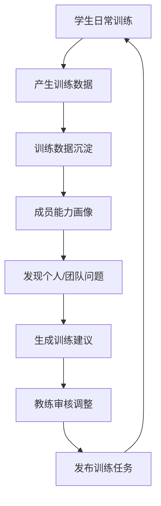
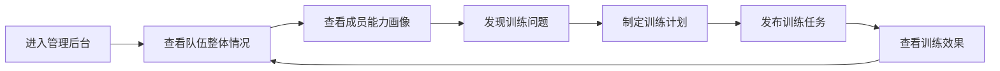
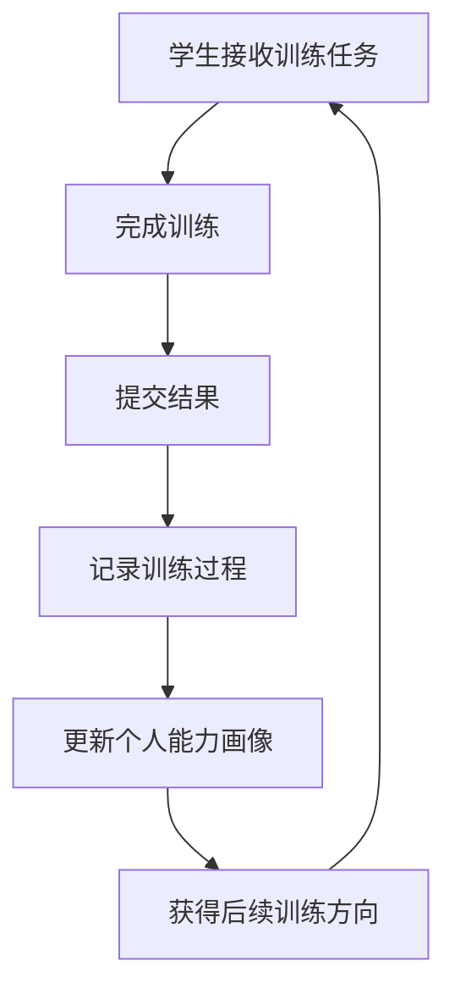
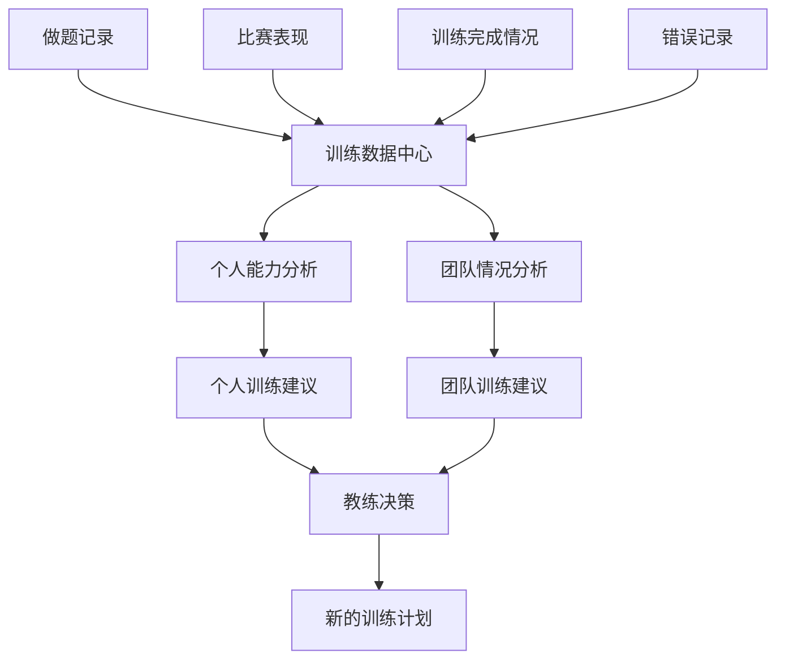
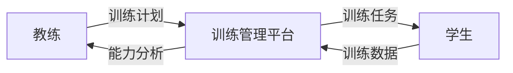

# ACM集训队智能训练管理平台 PRD

## 1. 产品定位

### 产品名称

ACM集训队智能训练管理平台

### 产品定义

面向高校 ACM 集训队，帮助教练管理成员训练过程，通过训练数据沉淀和分析，让训练安排从经验驱动转向数据辅助决策，实现集训队精细化管理。

---

# 2. 核心用户

## 2.1 教练

产品第一服务对象。

核心需求：

- 查看整个集训队训练情况
- 了解成员能力水平
- 发现个人和团队问题
- 制定针对性训练计划
- 跟踪训练效果


## 2.2 学生

训练数据产生者。

核心需求：

- 查看个人训练情况
- 执行训练任务
- 查看自身能力变化
- 获取训练反馈

---

# 3. 用户痛点

## 3.1 无法掌握成员真实训练状态

当前主要依赖：

- 比赛成绩
- 日常交流
- 教练经验判断

问题：

- 无法持续了解成员训练状态
- 难以及时发现掉队成员


## 3.2 无法进行个性化训练

当前模式：

统一训练计划。

问题：

- 不同基础学生使用同一训练内容
- 训练效果无法最大化


## 3.3 训练数据无法产生价值

已有数据：

- OJ记录
- 比赛成绩
- 做题情况
- 错题记录

问题：

数据只是记录，没有形成训练决策。

---

# 4. 产品目标

帮助教练解决三个核心问题：

1. 我的队员当前水平如何？

2. 队伍当前主要问题是什么？

3. 下一阶段应该如何安排训练？

---

# 5. 产品核心方法

## 5.1 产品闭环



核心逻辑：

训练数据产生价值，通过分析辅助教练优化训练。

---

# 6. 用户流程

## 6.1 教练使用流程



目标：

降低教练整理数据和分析成员情况的成本。

---

## 6.2 学生训练流程



目标：

学生负责训练执行，系统负责沉淀训练过程。

---

# 7. 核心功能

# 7.1 教练端

## 队伍训练看板

展示：

- 当前成员数量
- 训练活跃情况
- 任务完成情况
- 团队薄弱方向


示例：

```
团队情况：

成员：50人

训练状态：
正常训练 35人
低活跃 10人
长期未训练 5人

主要问题：
动态规划能力不足
```

---

## 成员能力画像

展示：

```
学生：

训练量：
120题

优势：
搜索、模拟

薄弱：
动态规划

近期状态：
下降

建议：
增加DP专项训练
```

---

## 训练分析

输入：

- 做题记录
- 比赛表现
- 错误情况
- 训练频率


输出：

- 能力分析
- 薄弱方向
- 训练建议


---

## 训练计划管理

功能：

- 创建训练计划
- 发布训练任务
- 调整训练方向
- 查看完成情况

---

# 7.2 学生端

## 个人训练主页

展示：

- 当前任务
- 完成情况
- 能力变化


## 训练记录

记录：

- 做题记录
- 比赛记录
- 训练反馈
- 成长变化

---

# 8. 数据价值流转



---

# 9. 产品角色关系



---

# 10. 产品边界

当前不做：

- AI Agent
- 自动教学
- 自动解题
- 自动生成完整训练体系
- 面向所有编程学习者
- 考研/面试等扩展场景


原因：

这些不是当前核心问题。

---

# 11. 核心竞争力

## 1. 面向ACM训练管理场景

深入匹配高校集训队训练流程。

## 2. 将训练数据转化为管理信息

从：

记录数据

变成：

训练决策依据。

## 3. 服务教练，而不是替代教练

系统辅助判断，教练负责最终决策。

---

# 12. 产品一句话介绍

> 一个帮助高校ACM集训队教练进行训练管理和成员分析的平台，通过沉淀学生训练数据，形成能力画像，辅助教练制定更加精准的训练方案。
