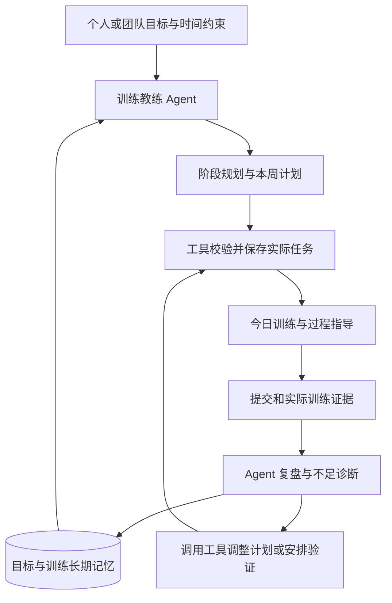
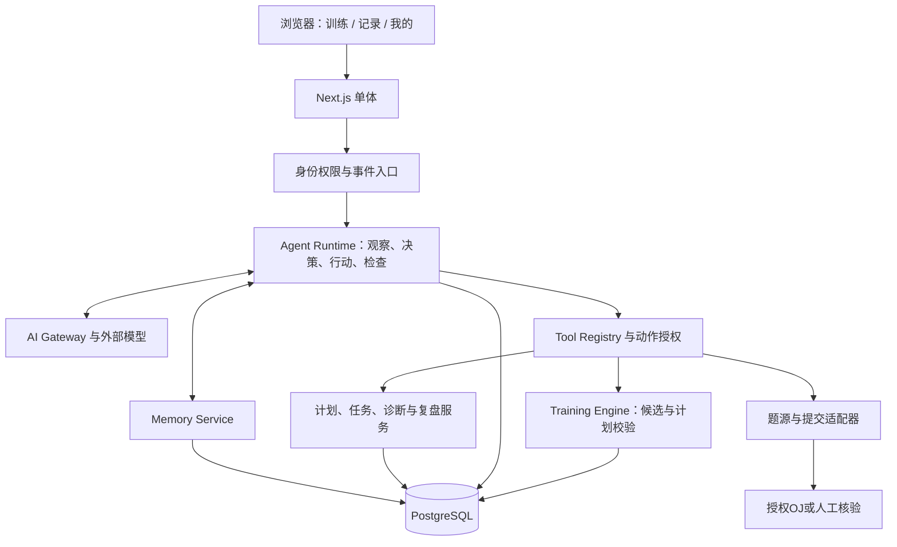

# 练序 CodePath：嵌入式训练教练 Agent 实施方案

版本：2026-09-27 修订版；性质：以训练教练 Agent 为核心的产品与工程实施方案。

**交付边界：只维护本文。** 已只读检查规划 Prompt、当前源码、部署与测试配置、已有产品和调研材料，并以只读方式打开原始 Excel 核对结构与哈希。本次修订根据项目负责人的定位澄清，重写 Agent 的产品职责与实施路径；没有改动应用、配置、原始问卷或既有报告，没有开展产品开发或联系任何人。Demo 审计以源代码为依据，未重新做浏览器运行验证；历史交付记录中的测试通过不等于本轮重新通过。

文中区分三种证据：**仓库事实**是当前源码/文件中可核对的实现或样本内自报结果；**产品假设**是本方案建议验证的行为和学习收益；**未来假设**是尚未验证的场景、商业与规模化能力。下文所有容量、周期、阈值和默认值，除明确引用原始数据外，均为实施建议，不是实测成效。

阅读路径：产品定位见第1–9节；Agent运行、工具与记忆重点看第10、15、24、27节；个人/团队交付与验收看第36–41节；创新主线看第45节；排期与行动看第47–50节。50个章节保留原要求的主题，共用一套Agent与训练模型。

## 1. Executive Summary

**项目要开发的核心产品是一款嵌入程序设计平台的训练教练 Agent。** 平台提供训练环境、题目与工具、记录和执行界面，Agent 持续理解目标、制定计划、组织训练、发现不足并调整下一阶段。对外仍可简洁表达为“程序训练 + Agent 辅助”，其中 Agent 贯穿整个训练过程。工作名称沿用“练序 CodePath”。

用户应感受到平台在履行教练职责：知道我要达到什么目标，记得我做过什么，解释为什么这样安排，观察训练是否有效，并采取下一步行动。Agent 的核心闭环为：**目标 → 读取状态与长期记忆 → 规划 → 调用训练工具执行 → 收集结果 → 诊断不足 → 调整计划**。卡题提示是这一闭环中的一种教学动作。

首版就必须包含可运行的 Agent：能跨场次使用记忆、调用工具生成实际任务、根据新证据修改计划，并留下可核查的行动记录。Training Engine 负责候选题、先修、时间预算和计划校验；Agent 使用这些工具作训练决策。规则模板可作基线和故障回退，不能作为已交付 Agent 的替代证明。

个人、集训队、考研与面试等是同一教练能力的不同训练目标和作用范围。一级导航保持“训练、记录、我的”，默认进入 Agent 安排的今天训练；阶段规划、薄弱点和计划协商在这一流程中可见。首批从可触达的新生场景验证，但 Agent 架构从开始就包含目标、里程碑和长期状态。

个人 MVP 包含三组完整能力：**目标与记忆驱动的规划、训练中的工具协作与教学、证据驱动的诊断与重规划**。个人无需加入团队、等待真人教练或配置自己的 API Key。Team/Coach 升级将同一 Agent 扩展到团队目标、成员分层和教练协作，真人教练负责团队发布及重要教学判断。

第一阶段建议 12–18 人、约两周，先验证 Agent 是否真正完成上述工作，再评估相对普通 AI 的学习、规划负担和持续训练收益。长期效果与商业价值尚未证明。第一版缩小的是题源、训练专题和自动化范围；目标、记忆、工具执行和反馈调整属于必须交付的核心。

## 2. 当前仓库与 Demo 现状

### 2.1 已有实现与应保留的资产

技术栈为 TypeScript、Next.js 16.3.6 App Router、React 19.3.0、普通 CSS、Lucide、本地 SVG 图表；Node 24、Next standalone、Docker 多阶段镜像、GHCR 工作流已有配置。没有数据库、真实登录、服务端用户/团队授权、真实 LLM 接口或判题执行服务。依据：[package.json](../package.json)、[README](../README.md)、[交付记录](../DELIVERY.md)。

| 当前资产 | 源码证据 | 保留/演进决策 |
| --- | --- | --- |
| 首页已有“开始今天的练习”、下一题预览 | [learning-home.tsx](../src/components/learning-home.tsx) 第 38–97 行 | 保留下一步与推荐理由；不是重做营销首页 |
| 训练室有题面、代码草稿、计时、笔记、“我卡住了”、逐级 Hint 和复盘确认 | [training-session.tsx](../src/components/training-session.tsx) 第 90–132、312–423 行 | 保留交互骨架，换为服务器状态和真实帮助接口 |
| 不默认透露完整解析；未完成可继续 | 同文件第 384–399、478–487 行 | 保留用户控制；把门控从 UI 升级为服务端内容分发 |
| 规则生成题单、推荐理由和下一步 | [training/index.ts](../src/lib/training/index.ts)、[learning.ts](../src/lib/learning.ts) | 保留纯函数/可解释规则思路，重做输入与证据口径 |
| 个人导出、清除、默认不分享进度、键盘导航和减少动效 | [account-store.ts](../src/lib/account-store.ts)、[account-center.tsx](../src/components/account-center.tsx)、[app-shell.tsx](../src/components/app-shell.tsx) | 保留体验原则，服务端重新实现数据权限；本地开关不是安全边界 |
| 单元测试、浏览器测试与容器发布配置 | [tests](../tests)、[Dockerfile](../Dockerfile)、[工作流](../.github/workflows/docker.yml) | 后续调整验收契约，复用工程流程；本轮不运行或修改 |

### 2.2 按要求审计十个产品问题

| 问题 | 代码结论 | 后续处置 |
| --- | --- | --- |
| 是否过度强调 ACM | 品牌已拓展为 CodePath，不能说首页仍是纯 ACM；但模型仍依赖 `cfRating`、六维竞赛技能和 DP 阈值 | 外部文案统一；竞赛参数迁入策略适配层 |
| 功能页是否过多 | 主导航 5 项：学习空间、开始练习、教学工作台、个人中心、学习方法 | 收敛为训练/记录/我的 |
| Dashboard 是否重复 | `/`、`/student`、账户概览均承担部分进度与下一步展示 | 训练只管当前任务，记录管历史，我的管设置 |
| 图表是否过多 | 学生页有雷达、六维变化、8 周趋势；教练页有指标与热图 | 个人首屏不展示；确有决策用途时在记录详情或团队页按需展开 |
| 营销创新是否过重 | 首页方法说明已折叠，但 `/innovation` 仍是一级导航，包含数据飞轮、未来多 OJ、出题概念 | 从普通主导航移走，作为帮助/产品说明或团队演示资料 |
| 是否提前展示未来能力 | 未来功能有规划标记，并非全部伪装上线；仍与当前使用路径并置 | 将“已可用”和“研究方向”分开，训练页只出现可执行能力 |
| 普通用户是否看到教练功能 | 公共导航、首页教师卡片、训练复盘后均有 `/coach` 链接 | 个人界面移除；团队权限满足后从我的进入 |
| 是否有重复信息 | 方向选择在首页、学生页、个人偏好重复；进度分散于多个位置 | 目标配置集中，训练页只显示简短目标摘要 |
| Agent 是否是独立聊天 | **不是**：当前已嵌入训练室，只是静态 Hint 展开，没有真实上下文诊断 | 保留嵌入方式，补完整教练 Agent：目标、记忆、规划、工具执行与反馈调整 |
| 是否缺少开始入口 | **不缺**：首页和学生页均有明显开始/继续按钮 | 统一当前任务状态，减少入口竞争，不把已有优点写成缺失 |

导航证据：[app-shell.tsx](../src/components/app-shell.tsx) 第 31–42 行；首页方向与教师卡片：[learning-home.tsx](../src/components/learning-home.tsx) 第 159–173、281–293 行；图表与模拟学员切换：[student-dashboard.tsx](../src/components/student-dashboard.tsx) 第 95–118、285 行起。

### 2.3 比页面精简更优先的五个结构问题

1. **时间预算没有进入选题。** `dailyMinutes` 默认 30 分钟，但 `generateLearningPlan` 不接收该参数，仍返回固定 5 题。默认日常题单预计 130 分钟；“编程入门”题单预计 110 分钟，含前缀和、BFS、贪心、DP。依据：[learning-tracks.ts](../src/data/learning-tracks.ts)、[problems.ts](../src/data/problems.ts)、[learning.ts](../src/lib/learning.ts)。这些是演示估时，不是实际耗时；它们已足以暴露预算与任务不一致。
2. **自报过题不能直接更新能力。** `evaluateTrainingSession` 根据 AC 与 Hint 等级给技能加 4/2/1 分，训练代码不参与核验；页面明确标为模拟，但生产版不能沿用该测量方式。
3. **同一人同一题只保留一个结果。** `demoActions.saveResult` 用 `studentId:problemId` 覆盖记录，无法区别第一次尝试、复习、跨目标练习和答案暴露史。生产版必须有独立的任务、训练场次与提交记录。
4. **当前答案门控只适合演示。** 服务端把含全部 `hints` 的 Problem 传入客户端组件，UI 再按级截取；未展开不等于内容未下发。题面还直接展示算法标签。生产版需控制响应字段，并按策略隐藏会泄题的方法标签。
5. **研究资料不应进入构建上下文。** 当前 `.dockerignore` 未排除 `data/`、`artifacts/`、`planning/`，而 builder 执行 `COPY . .`；目录存在时可能进入本地构建阶段/缓存。没有据此认定最终 runner 已含问卷。后续发布必须先审查构建上下文与镜像内容，原始调研不进产品镜像。本轮不改配置。

### 2.4 既有规划如何继承

当前还缺少核心产品层：没有 Agent Runtime、工具调用循环、持久训练记忆、目标到阶段计划的推演和计划调整记录。补齐这些能力是本次实施的中心工作；菜单精简与数据库改造为其提供承载。

[个人 Agent 规划](product/personal-acm-agent-plan.md)提出“小题单、提示、错误定位/迁移”，可作为训练内容和评测依据。该文将 LLM 限于提示、把动态计划后置，不足以覆盖本项目明确要求的教练 Agent。本方案将目标规划、结构化记忆和反馈重规划纳入首版；原研究中的规则题单保留为对照与降级路径。

[V2 答辩规划](../planning/ppt-master交接/03_项目事实与逐页内容.md)将“按短板原创出题”作为首月重点，同时明确尚未实现、未证明效果。根据本轮定位和问卷，本方案将其调整为 P2 后台内容实验：优先准备小规模授权题或人工原创题来验证学习闭环，生成题还需承担题意、标程、测例、难度和版权验证成本。保留原创方向，不以其上线作为个人 MVP 前提；不改写旧答辩文件。

仓库的带队观察属于项目负责人陈述；既有服务器费用、客户/收入测算属于历史陈述或规划，均不能代替当前生产能力、真实客户或产品成本。本文不复制人员身份、联系方式或财务预测。

## 3. 调研证据

原始文件位于 `data/user-research/freshman-training-2026/`，本轮只读核对为 1 个 Sheet、78 份答卷、31 列。源文件 SHA-256 与已有分析清单一致：`451f87eb45403ba2021420d447cbd33ad1c63905b55a33d931600c6fa1a2ec87`。

主统计保留 78 份：73 份 valid，5 份互斥答案并选的 suspected，0 份判为 invalid。AI 使用细节 Q13–17 只有 71 人适用，另 7 人结构性跳过。5 份疑似剔除后，各闭合选项比例最大变化约 3.48 个百分点，主要排序稳定。

| 证据 | 样本内结果 | 支持的产品动作 | 不能据此声称 |
| --- | --- | --- | --- |
| E01 基础 | 53/78（67.9%）语法及以下；75/78 无竞赛经历 | 首批任务覆盖输入输出、分支、循环、数组前置；不强求 Rating | 所有用户都是零基础 |
| E02 直接困难 | 基础 43/78、算法选择 37/78、Bug 29/78；前三项按人去重覆盖 68/78 | 小任务、解释连接、错误证据 | 三个功能可解决 87.2% 的全部困难 |
| E03 学习断点 | 53/78 看懂题解却写不出；39/78 不知卡在哪里 | 诊断卡点、继续尝试、陌生相近题复测 | 已测得客观能力提升空间 |
| E04 求助 | 61/78 经常/偶尔想问但没问；49/78 嫌问题基础；33/78 不会描述 | 低压力求助、上下文整理；需要时自主找真人 | 教练可以被替代 |
| E05 已有 AI | 63/78 卡题时会用 AI；71 名适用者中知识讲解 44、题意解释 40、完整代码生成 6 | 对照普通 AI 的既有能力，而非假定用户没用过 AI | 受访者主要用 AI 抄代码 |
| E06 AI 问题 | 错答 30/71（42.3%）；过题未掌握 27/71（38.0%）；过早给答案 20/71 | 可验证反馈、分级帮助、答案暴露记录 | 高频 AI 使用导致能力下降 |
| E07 需求偏好 | 按水平推荐 57/78；自动计划 38/78；提示或提问引导去重 52/78 | 验证 Agent 的选题、计划和训练引导职责 | 已证明 Agent 优于规则题单，或高票即留存/付费 |
| E08 唯一优先 | 推荐题目 17/78，提问引导 16/78，传统 Hint 2/78 | 分开试验“提问诊断”与“递进提示” | 两个措辞测得同一功能的转化率 |
| E09 记录偏好 | 错误知识点 65/78；AI 对话 19/78 | 默认结构化记录、全文另行选择 | 已取得保存数据的授权 |
| E10 培训反馈 | Q24 有 38 份实质文本，节奏/讲解/讲练各 11 条，多标签可重叠 | 课程分层、讲评与课内练习同步改进 | 33 个不同人提出三种需求 |
| E11 意愿 | 65/78 愿意或非常愿意试用 | 可以准备自愿招募 | 已有 65 个客户或活跃用户 |

来源：[研究报告](research/freshman-survey-analysis-2026.md)、[统计总表](../artifacts/survey/survey_summary.csv)、[质量摘要](../artifacts/survey/quality_summary.csv)、[主题编码](../artifacts/survey/open_question_topics.csv)、[偏好一致性](../artifacts/survey/feature_preference_consistency.csv)。编号 E01–E11 是本文索引，与原证据台账编号不完全等同。

边界：便利样本、自报、没有对照或学习前后测；3 道开放题有实质文本分别为 32/38/41，采用单分析者审阅编码。Q5/Q18可能有最多5选限制，配置尚未确认；19 人的唯一优先项不在本人多选列表中。11 项探索检验经 BH 校正均未达到 0.05；只作为线索。**训练是否难以持续、教练是否无法掌握个人状态、面试或 408 用户是否需要本产品，尚无直接行为或教练样本验证。**

## 4. 新产品定位

外部定位：**程序训练 + Agent 辅助——嵌入平台、持续陪你训练的智能教练。** 一句话价值：“围绕你的目标规划训练，记住训练表现、发现不足，并持续调整下一步。”

| 产品组成 | 明确职责 |
| --- | --- |
| 程序设计训练平台 | 提供目标/计划/任务界面、题目资源、提交与记录、权限、模型和工具接入，是教练服务的实际载体 |
| Training Coach Agent | 承担目标理解、长期规划、日常安排、过程指导、诊断复盘和适应性调整；能调用平台工具完成动作 |
| Training Engine | 给 Agent 提供知识先修、候选筛选、估时、计划约束和证据计算等可靠工具，保证方案可执行 |
| 真人教练/用户 | 决定目标和授权范围，纠正判断；团队教练审核团队安排，个人用户可独立使用 |

首批使用经审核的 C++ 入门任务验证同一 Agent 内核。后续适配个人提升、集训队阶段训练、考研规划中的数据结构/算法及相关实践、课程和面试目标。目标与期限是 Agent 的规划输入，不能全部压缩成“今天推荐一题”。完整考研学科的内容与评价需要逐项准备；可以先记录跨科时间约束与用户自己的里程碑，不对尚未接入的学科编造学习内容或诊断。

创新主张是**将持续训练决策与工具执行结合，让教练式反馈真正改变平台中的计划和任务**。长期记忆、工具调用等是实现方法；项目需要通过自己的训练工作流与效果证明价值，不将通用 Agent 技术宣称为独创。

## 5. 核心用户问题

| 共同问题 | 当前证据/空白 | 产品响应 |
| --- | --- | --- |
| 不知道练什么、为什么练 | 推荐偏好强，直接“不知刷什么”仅 11/78，根因可能是难度或路线 | 一项当前任务、一句理由；允许反馈太难/太易 |
| 路线不清楚 | 缺计划 26/78；不知道学习顺序 14/78 | Agent 将目标拆成阶段里程碑、本周计划和今日任务，随证据滚动调整 |
| 卡住不会描述 | 33/78 不知如何描述，39/78 不知卡点 | 先选卡点或填“还说不清”，再问一个诊断问题 |
| AI 给得过多或不可靠 | E06 | 限定帮助层级、给验证办法、未知就说明 |
| 不知道自己哪里薄弱 | 判断薄弱点偏好 29/78；客观薄弱点尚未测得 | Agent 结合跨题记录提出不足假设、安排验证，再决定补练什么 |
| 训练无法持续 | 无固定时间 13/78；缺连续行为数据 | 尊重实际时间、暂停续练、压缩任务；不先上打卡惩罚 |
| 缺少有效反馈 | E03、E10 | Agent 用本次结果修订训练记忆与后续计划，说明调整依据 |

这些是共享任务问题；不为 ACM、面试或 408 各写一套用户系统。

## 6. 核心训练闭环



Agent 的规划要落成平台中可开始的任务；诊断要关联证据和补练；复盘要解释计划发生了什么变化。展示一段周计划文字、输出一份总结或更换推荐理由，都不能单独视为闭环完成。

关键约束：完成任务、自报 AC、OJ 接受、无辅助完成、迁移验证是不同事件。用户结束尝试后可以退出，不强制补完全部环节；中断保存草稿和帮助暴露，不将其自动诊断为懒惰或能力差。

触发来自首次目标设置、用户提出调整、任务结束、新结果到达、周复盘到期。P0 在用户进入/结束训练时检查待处理事件；有明确需求后再加后台定时运行。计划与诊断可以主动发生，解题提示默认按需提供，二者有不同的打扰与授权规则。

冷启动先了解目标并给短基础任务。已有未结束场次优先恢复；改目标只影响后续未开始任务。重复结果和重复触发必须幂等，同题再次练习建立新场次。每次 Agent 运行有触发事件、读取版本、工具结果、行动摘要及终止状态。

## 7. 产品信息架构

| 一级入口 | 唯一职责 | 不承载的内容 |
| --- | --- | --- |
| 训练 `/` | Agent 的当前安排；阶段/本周计划简览、今天任务、调整计划、训练内求助 | 多场景并列门户、团队经营、无关创新说明 |
| 记录 `/records` | 训练轨迹、证据支持的不足、复盘和 Agent 调整历史；可进入相关补练 | 无依据的综合分、跨用户排行榜 |
| 我的 `/account` | 目标/时间/语言、Agent 记忆与自动调整设置、数据控制、账户；条件团队入口 | 第二个训练 Dashboard、默认教练入口 |

任务详情沿用一套页面，拟采用 `/training/tasks/[taskId]`；用 taskId 绑定用户任务与版本，不能仅用 problemId 代表一次练习。进入时服务端核对所属用户。

迁移方案：`/student` 未来重定向到训练；旧 `/student/session/[id]` 经过登录和题目映射后提示创建/恢复自己的任务，不信任 URL 中的学员身份；`/coach` 改为团队作用域路由的兼容入口，无权限时不返回数据；`/innovation` 降为可从帮助访问的产品说明或不进入生产导航。演示学员切换和重置演示按钮退出真实产品。

手机保持相同三个入口。Agent 的交互贯穿“制定/调整计划”“为什么这样安排”“训练中求助”“复盘与补练”，使用当前目标和任务上下文；不另建脱离训练的通用聊天主页。前台可见 Agent 的教练职责与执行结果，不展示策略 JSON、模型路由等实现细节。

## 8. 首页 / 首屏设计原则

首屏让用户直接感受到 Agent 在带训：一条有依据的安排说明、一个当前任务，附轻量的计划与调整入口。

```text
你的训练教练                    今天约 30 分钟
当前目标：四周内独立完成基础数组题
本周重点：循环边界与数组遍历      查看阶段计划

Agent：上次边界检查未通过，今天先补一次短练习，
再继续原计划；不会额外增加今天的训练时间。

[开始今天训练]
调整计划 · 为什么这样安排

训练                记录                我的
```

目标、诊断和时间只是布局示意，不是样本结果。Agent 说明必须引用真实记录，没有历史就说明“先了解你的基础”。一个主要按钮保持行动清楚；展开即可协商本周计划、查看薄弱点依据，不把 Agent 隐藏到卡题按钮里。展示安排依据不必泄露当前题解法。

空状态可直接体验一份无个人记录的静态样例，再选择账户保存；不要求先选学校或身份。当天预算完成后显示“今天到这里也可以”，继续加练需主动选择，不自动追加挑战。

保留当前白底、轻边框、响应式、清晰焦点与减少动态效果。要求手机 390px 宽无横向滚动、键盘可完整操作、进度不只靠颜色、保存与请求失败可理解。既有 UI 风格可复用，核心改造是信息优先级。

## 9. 用户 Onboarding

首次由 Agent 通过简短对话或表单了解：想达到的目标、当前基础、可用时间；有比赛/考试等期限时补充日期。示例：“我想四周后能独立做基础数组题，每周四天，每次30分钟。”Agent 提取可编辑的目标卡与时间约束，必要时只追问影响计划的一项。语言默认首批支持的 C++。

主流程约 60–90 秒是待验证目标。用户确认目标后，Agent 给出粗粒度阶段路线、具体本周计划和第一项诊断/训练任务；远期安排保留不确定性，只滚动细化近期。自评可选“不确定”，首项任务兼作诊断。可用时间建议15/30/45/60分钟及自定义，并支持每周训练日和仅本次缩短。

不收学校、Rating、QQ、手机号、年级作为个人开练条件；认证信息另行最小化。加入团队属于后续邀请流程。Agent 可以理解自由目标并规划，但只对已有内容与评价能力范围给出可执行承诺；范围外目标明确待接入资源或由用户提供自己的安排。

## 10. Training Engine

### 10.1 Agent 与 Engine 的职责

**Agent 负责训练决策和行动编排，Engine 负责领域计算与约束。** Agent 判断此时应该诊断、补练、复习还是推进目标，调用工具取得证据和候选任务，形成并执行计划。Engine 判断题目是否存在、先修是否满足、时间能否容纳、操作是否符合策略。大模型从首版就参与规划与反馈决策，规则保障动作可执行。

输入包括 `UserGoal` 及期限/里程碑、可用时间、证据型 `TrainingProfile`、长期记忆、历史结果/帮助暴露、当前计划和冻结版本的 `TrainingPolicy`。输出包含阶段路线、本周计划、今日1–3项任务、依据、待验证的不足、计划差异及下一次检查条件。远期里程碑保持粗粒度，近期任务必须关联真实可用内容。

### 10.2 Agent Runtime：有边界的运行循环

一次 `AgentRun` 的工作顺序：

1. **感知**：接受目标变更、训练完成、用户请求或复盘到期事件，确认用户/团队范围和预算。
2. **取证**：调用工具读取相关目标、长期记忆、最近记录和已有计划，区分事实、用户自评与 Agent 假设。
3. **决策**：选择本次教练动作；信息不足则询问或安排诊断，不凭空宣布薄弱点。
4. **行动**：检索候选、调用计划校验、保存草案或按授权应用调整；教学时按允许层级调用提示工具。
5. **检查**：读取工具结果，确认动作真正成功；校验失败可在预算内修订，不能用自然语言假装已保存。
6. **记忆与交付**：保存必要的结构化记忆、证据引用和计划差异，向用户说明发生了什么、依据是什么、下一步做什么。

运行状态为 `queued / running / waiting_user / succeeded / failed / cancelled`。P0 可先设最多4次模型决策、8次工具调用和1次校验修复，作为待压测的上限；不同动作有独立时间/token预算，触限即保存进度并返回明确状态。外部服务超时或数据版本变化时停止错误提交，允许幂等恢复。

使用一个 Agent Runtime 和几种任务流程即可：规划、训练指导、诊断复盘、计划调整；不必先部署多个相互对话的 Agent。流程限定状态转移，模型在允许范围内选择工具和教学动作。

### 10.3 首版工具契约

| 工具 | Agent 实际能做的事 | 服务端约束 |
| --- | --- | --- |
| `get_training_context` | 读取目标、当前计划、相关记忆和训练证据 | 服务端绑定用户/团队，不由模型任意指定身份 |
| `query_training_evidence` | 按知识点/窗口查提交、错误和帮助暴露 | 返回来源及缺失，不把自报转换为核验 |
| `search_training_tasks` | 获取审核题、先修与估时等候选 | 过滤内容权限、语言、任务版本和解法暴露 |
| `validate_training_plan` | 检查先修、时间、任务可用性和冲突 | 确定性校验，返回具体错误；模型不能绕过 |
| `save_plan_draft` | 将阶段/本周安排保存为可预览草案 | 带目标版本、证据引用、幂等键；不能自动发布团队任务 |
| `apply_plan_revision` | 将获准的计划或变更落实为平台任务 | 校验授权方式、当前版本、操作范围；保留差异与撤销路径 |
| `record_learning_memory` | 保存目标偏好、训练摘要或不足假设 | 记忆类型/来源/有效期分开；假设不能冒充事实 |
| `schedule_followup_check` | 在预算内安排补练、复习或迁移检查 | 使用审核任务；不得重复占用同一时间预算 |
| `get_teaching_context` | 获取当前允许层级的教学材料和已知错误 | 不向未解锁学生响应下发完整解法 |

工具调用有schema、调用者、资源范围、版本、幂等键和返回状态；写操作通过应用服务执行，模型没有任意SQL或终端权限。Agent可以修改计划和写入有来源的记忆，这是必要行动能力；核验结果由可信数据路径生成。

### 10.4 自动化与用户控制

| 动作 | 默认处理 |
| --- | --- |
| 查询历史、分析不足、生成草案/复盘 | 在已告知的数据范围内自动完成 |
| 首次目标与阶段计划、显著改变方向/总时长 | 预览后由用户确认；已有明确请求可直接执行对应范围 |
| 微调未开始任务、移动复习顺序 | 用户开启“在当前目标与预算内自动调整”后可执行；否则提供一键采纳 |
| 改动当前训练、增加预算、公开/发消息、发布团队安排 | 不继承个人自动调整授权；分别获取相应明确操作或教练确认 |

小调整不必每次弹窗，但要展示变化依据并可撤销。撤销恢复未开始任务的计划版本，不能抹掉已发生训练与答案暴露。重放事件使用旧版本校验，防止较晚到达的运行覆盖较新的决定。

### 10.5 Engine 演进路线

| 阶段 | Engine 的演进 | Agent 如何使用 |
| --- | --- | --- |
| V0 规则驱动 | 先修/预算/内容过滤、计划校验、固定基线 | 首版即可调用这些工具规划、执行与调整；规则题单仅作基线/回退 |
| V1 数据驱动 | 用真实记录校准估时、先修和难度 | Agent 使用更可靠的证据和候选，解释为何改计划 |
| V2 个性化推荐 | 数据足够时优化候选排序，防止未来信息泄露 | 推荐分是参考，不能覆盖硬约束或冒充掌握事实 |
| V3 更强 AI 决策 | 实验支持后扩展长周期策略比较与效果预测 | 提高规划质量与主动性；并非等到V3才引入Agent |

硬约束优先级为：授权/活动规则 > 可用时间与前置条件 > 已接受团队任务 > 个人偏好 > 排序。每次变化评估对不同基础用户的影响；没有可靠增益的排序模型不必上线，但训练 Agent 的目标—记忆—行动闭环仍需保留。

## 11. 今日训练

今日训练是 Agent 把阶段目标落实为行动的一层。规划分为“目标/期限 → 阶段里程碑 → 本周计划 → 今日任务”；首版保留粗粒度阶段路线，详细排程只覆盖近期，避免生成几个月不变的课表。用户可以告诉 Agent “这周少两天”“先补数组”“近期参加比赛”，它应更新实际计划并显示差异。

默认**1个核心任务＋可选短热身/检查＋短复盘**，总计1–3项学习任务；复盘可并入任务结束页。任务数是预算约束下的默认值，不是 Agent 唯一规划能力。

| 可用时间示例 | 任务安排 | 范围说明 |
| --- | --- | --- |
| 15 分钟 | 约10分钟微任务＋约2分钟复盘，留缓冲 | 可以是读小代码、补一处循环、验证反例，不必完整竞赛题 |
| 30 分钟 | 约20分钟核心＋约5分钟检查＋约3分钟复盘 | 预算由审核估时起步，后续校准 |
| 60 分钟 | 短热身＋核心＋迁移/调试任务，仍保留休息缓冲 | 不把“时长更多”直接等于题数翻倍 |

任务类型共享 `kind`：实现、理解/推演、调试、迁移检查、复习。首版只实现当前题库确实支持的类型；系统实验等未来类型另验收。

任务状态建议 `planned / active / paused / submitted / awaiting_verification / completed / deferred / cancelled`；“是否达到掌握证据要求”是独立状态，不混在任务完成字段里。每个任务显示目的、预计范围、开始/继续和一次反馈入口。

结果核验、用户缩短时间、前置缺口确认、资源不可访问及阶段复盘可触发 Agent 重规划；在第10节授权范围内只调整未开始任务并说明原因。当天余量不足可以推迟复测，不生成积欠惩罚。无合适题时返回内容缺口和候选替代，不能用编造题目填满计划。

## 12. Agent 求助

本节是训练教练 Agent 的过程指导能力。它同时支持训练前协商计划、训练中求助、训练后解释诊断；共享目标与记忆，但每次只获取当前工作需要的上下文。

解题帮助默认按用户请求出现，不根据计时器自动弹出解法。“我卡住了”先给少量可选卡点：题意、不知开始、有思路不会写、编译错误、结果不对、超时、想确认思路、还说不清；允许直接用一句话描述。进度/计划到期提醒可以主动显示在训练页，与自动给解法分开设置。

上下文包括当前任务及相关授权证据：题面/约束版本、阶段目标、已确认基础、相关历史卡点、用户说明、主动附上的代码片段、实际错误/输出、已展示帮助、剩余时间。Agent可查询与当前问题相关的历史，不把全量训练和聊天每次打包发送。草稿不连续上传；未附带代码时，不声称已经分析代码。

每次输出尽量只有一个可行动问题或步骤，提供“我试过了”“换个说法”“再给一点提示”“结束独立尝试，查看解释”。两轮无进展时尝试补前置、换任务或整理真人求助材料，不无休止追问。

代码分析区分三部分：**已观察事实、可能原因、如何验证**。没有运行/判题证据就明说“这是静态判断”；给最小反例检查或局部修改方向，不直接替换整份代码。模型不能把“看起来正确”写入提交状态。

一轮指导后，Agent 可提出需验证的不足并调用工具安排后续任务，遵循计划授权。帮助内容、观察证据和是否学会分别存储，不能因为自己解释过就记录“已掌握”。个人没有真人教练时仍能由 Agent 完成规划与带训；无法解决时提供审核解释、替代任务或可复制求助摘要，由用户选择是否发给别人。

## 13. Agent 教学 Policy

| 层级 | 可以做什么 | 内容边界与前台表现 |
| --- | --- | --- |
| L0 确认卡点 | 复述目标、确认预期与实际、询问当前尝试 | 不要求用户会写复杂Prompt；允许“不知道” |
| L1 方向引导 | 请用户观察小例子、提出一个关键问题 | 默认不直接揭示解法名称和关键结构 |
| L2 关键提示 | 给重要性质、可尝试的方法方向 | 一次一条，与前面尝试有关 |
| L3 结构辅助 | 给步骤、状态含义或有限伪代码框架 | 标注已使用结构帮助，不能算无辅助完成 |
| L4 结束独立尝试后的讲解 | 经明确选择给完整推导，必要时参考代码 | 记录答案暴露；随后独立迁移另起任务 |

L0–L4是内部规则，前台用自然语言按钮，不要求用户理解等级体系。不是每题必须经过所有层级，用户可要求换解释或结束尝试；不能用强制等待15分钟或反复答问惩罚求助。

| 模式/条件 | 规则 |
| --- | --- |
| 普通训练 | 用户控制求助时机；默认不直接给完整代码 |
| 新手 | 更小例子、更少术语；语法补全可以比算法透露更早，但只帮助当前微步骤 |
| 熟练用户 | 允许直接选卡点/核查复杂度，减少重复基础问答；仍保留答案暴露记录 |
| 无辅助迁移检查 | 测验期间关闭本系统的解题帮助；申请讲解后结束该次无辅助测验，结果按原分配规则保留 |
| 比赛/考核 | 依据明确活动规则决定是否提供帮助；规则未知则暂停解题帮助，提供设置说明；无自动参赛或绕过限制功能 |
| 不确定/冲突 | 说明未知，给可验证检查或回退审核提示；不编造测试结果和来源 |

**技术门控**：服务端只返回允许层级的内容，未解锁解释和受保护参考解不进入客户端载荷。算法标签若会直接泄题，同样受Policy控制。模型输出先完整缓冲、做结构和泄露校验，再展示；首版不直接把未经检查的流式token推给学生。

主模型、重试和备用模型使用同一策略快照。单次预算、最多一次有理由的重试及静态提示回退均由服务端执行。不能通过切换模型、购买Pro、重新开场次或修改客户端字段绕过限制；跨场次保留必要的答案暴露证据。该设计控制产品提供的帮助，不宣称能监控用户所有外部AI使用。

## 14. 训练记录

默认展示最近一次与最近一周的简短条目：练了什么、卡在哪里、用了哪种帮助、结果如何核验、下一步是什么。每条可展开证据，避免首屏十几张统计卡。

示例：“练习了循环计数；样例通过，边界尚待检查；看过一次方向提示；下一步验证空集合。”这些文案只能从实际事件生成，不把缺记录写成能力不足。

当前题的草稿、笔记和复盘集中在任务记录。增加“Agent 如何调整了训练”：触发证据、原计划与新计划差异、执行状态、用户纠正/撤销入口；能从不足条目直接进入对应补练。提供自己的数据导出/删除；更换目标不删除过去记录，也不重复计一次提交。图表用于回答具体训练问题，默认先给结论与依据。

## 15. 用户能力状态

能力状态是 Agent 长期记忆的一部分。内部采用“知识点＋证据＋不确定性”：目标版本、阶段、先修状态、最近任务、错误主题、帮助暴露、独立完成证据、迁移/延迟检查、有效训练时间、训练连续性。错误标签允许用户或审核者纠正，留修订来源。

### 15.1 必须从首版存在的长期记忆

| 记忆类型 | 例子 | 更新与使用规则 |
| --- | --- | --- |
| 目标与偏好 | 比赛/考试日期、每周可训练时间、解释偏好 | 用户输入/确认，带版本；变更后触发计划检查 |
| 事实与训练经历 | 某题结果、实际求助、某次检查未通过 | 引用原始事件及核验来源，不能被模型改写成更强证据 |
| 诊断假设 | 两次边界错误，可能尚未掌握循环终止条件 | 带证据、反例、置信分档与验证任务；可撤销、可过期 |
| 规划与行动 | 为什么推迟专题、哪些任务已分配、复测何时安排 | 关联计划版本和工具执行结果，避免每次会话重新规划一切 |

结构化记忆先存 PostgreSQL，按目标/知识点/时间检索，首版不必引入向量数据库。会话摘要是可重建的辅助材料，原始对话不等于长期记忆；更换模型也应保留同一组训练事实。用户能查看、纠正、删除记忆，删除后使相关摘要和待执行计划重新校验。

### 15.2 从不足假设到训练行动

Agent先读取错误与独立完成证据，区分知识缺口、思路到代码的转换、调试方法、时间安排、题目本身或外部故障等可能原因。证据不足则安排小检查；验证后提出补练，再看之后是否改善。超时、少登录、一次失败不能直接解释为能力不足或不努力。

建议知识状态为 `unknown / learning / needs_check / observed_independent / corroborated`。一次自报AC最多记录为待核实的完成；经核验的新任务独立完成才形成观察证据；不同任务/延迟检查进一步佐证。具体次数与窗口须试点校准，不声称精确测得掌握概率。

| 后台使用 | 前台展示 |
| --- | --- |
| 任务/提交/提示/策略版本、证据来源、缺失原因、重规划记录 | “下一步练什么”和一句依据 |
| 知识点证据、是否暴露答案、不同任务上的反例 | “当前建议加强什么、依据与补练安排”，可纠正判断 |
| 估时偏差、重复错误机会、待核验与延迟窗口 | 最近实际完成与待验证事项 |
| 置信分档、规则命中、实验条件 | 默认不展示模型分数或试验实现细节 |

提示使用是学习路径信息，不是扣分依据。没有帮助日志不等于绝对独立，只有在定义清楚的核验条件下才使用“无辅助”指标。用户自评和场外训练可以补充，但保留来源标签。

## 16. 多场景适配策略

共享同一个训练教练 Agent、目标/记忆模型、任务状态和计划接口。Agent 接受各自的目标、期限与训练约束；通过 `Training Policy / Task Source / Difficulty Policy / Evaluation` 四类配置适配内容与评价，团队再增加作用范围和发布流程。

| 适配场景 | Training Policy | Task Source | Difficulty Policy | Evaluation |
| --- | --- | --- | --- | --- |
| 首批新生/普通入门 | 前置知识、微任务、低压力反馈 | 审核的自有题/授权校内题 | 基础阶段与任务跨度；无Rating也可选题 | 独立实现、边界理解、陌生相近题 |
| ACM/ICPC与集训队 | Agent拆解阶段/比赛目标、安排专题与补题、识别个人和团队共性不足 | 授权题目元数据与原站 | 平台内难度参考＋自身证据，Rating非必填 | 正确性、复杂度、迁移、团队训练执行；赛后复盘 |
| 算法面试/求职笔试 | 限时、方法比较、表达思路 | 授权题单或原站链接 | 按技能/题型/时间跨度，不能线性换算CF分 | 正确性、复杂度、解释与边界；表达评价需单独验证 |
| 程序设计课程 | 课程前置、练习和讲评衔接 | 教师授权题/自有任务 | 按课程阶段、可执行技能 | 实现与理解证据；课程成绩规则由教师明确 |
| 考研目标/408相关训练 | Agent结合考试日期、每周预算和已有进度规划阶段；先执行数据结构/算法任务，其他学科保留用户自设里程碑 | 审核的大纲映射、练习、用户计划；资源需逐项接入 | 按目标知识与先修依赖安排复习，不能用竞赛Rating替代 | 实现、推演、知识检查与阶段进度；完整408评价须另行建设 |

不同平台的“中等”“1400”等原始难度必须保留来源；内部统一阶段为可修订映射，不能直接互换。系统/网络实验会引入新的执行和评价能力，属于后续验证；不能仅换一个训练目标文案就称已支持。

考研可以作为个人长期目标被记录和规划，首版需明确哪些子目标有训练内容、哪些只是用户自己的安排；不能把尚未建设的学科宣称为自动带训能力。目标切换修改 Agent 的计划约束、资源和评价，前台保持同一个教练服务。

## 17. 教练 / 团队升级服务

Team/Coach 作为 P1 升级能力，核心是把 Agent 的带训范围从一个人扩展到集训队。它读取团队目标与获授权的成员状态，生成团队阶段安排、分层任务和共性不足诊断，向真人教练提出调整建议；每个成员仍由同一训练内核获得个人安排。

试点可以人工开通服务资格，不依赖先开发支付；创建者获得明确的 TeamAdmin 成员关系，受邀教师需被授予该团队 Coach 角色。普通个人用户无此资格或角色时，“我的”不显示“管理团队”；普通团队成员只看到自己的已接受任务和共享范围。这里的 Coach 是组织管理角色，所有个人用户都能使用核心训练教练 Agent。

最小管理页围绕四件事：Agent拟定团队计划、教练审核发布、根据训练诊断不足、共同调整后续安排。默认显示需要决定的动作，例如“建议本周增加一次循环边界练习，并将后续专题延后一节”，附人数、分母、依据、工作量与方案差异；求助队列作为其中一个入口。

团队题单仍产生同一类型 `TrainingTask`，增加 assignment 来源；个人练习与团队任务出现在同一“训练”页，用户知道哪些是自己选择、哪些来自团队。发布前预览工作量，变更只作用于未开始任务并通知影响，不覆盖正在进行的任务。

共同卡点采用获得授权的错误/完成汇总，样本过小时不公布细分分布；建议最小聚合组为5人，但这不是不可再识别保证。个体人工介入必须基于其主动求助或明确的团队任务授权，不能因“低能力排名”擅自读取私人历史。

Team模式增加 `get_team_context / draft_team_plan / summarize_team_gaps / preview_assignments` 等工具；获教练发布确认后，通过应用服务落实任务。个人计划授权不能用来批量改全队安排。Training Policy 先使用审核模板和少量参数，保留版本和负责人。当前问卷只询问学生，团队 Agent 的诊断与教练采纳价值仍须专门验证。

## 18. 商业层级

| 层级 | 内部服务结构 | UI与权限边界 |
| --- | --- | --- |
| Free / Personal | 有限额度的核心教练Agent：目标、必要长期记忆、计划、训练指导与复盘 | 能完整走通个人闭环；额度用完保留现有任务/审核提示，标明实时Agent暂停 |
| Pro（待验证） | 更高运行额度、更长周期规划分析、更丰富资源与已验证个性化 | 基本记忆与自动调整不是只给付费者的独占能力；不出售解除教学边界 |
| Team / Coach（待验证） | 团队Agent、分层计划、共性诊断、教练审核与协作 | 服务权益控制开通，团队角色和授权控制数据及动作 |

不虚构价格、转化率或收入。不把复杂计费、多个订阅卡片放在训练首屏。个人化的基本选题是核心功能，不应为了卖 Pro 把 Personal 退化成无关随机题。

## 19. 题目来源

优先采用**元数据＋原站跳转**；有题面/解释使用权时才本地显示对应内容。账号可访问某题、拥有提交记录、题目公开，都不自动意味着允许复制题面/题解、商用或发送给第三方模型。

| 来源 | 首版处理 | 后续接入前提 |
| --- | --- | --- |
| 自有/人工原创 | 优先制作有限基础题及提示、参考解、边界检查、匹配迁移题 | 记录作者、审定者、版本和测试证据；模拟题不自动视为已审定 |
| 校内 OJ | 经负责人授权的题目链接/小题单，结果可人工核验 | 获得题目与提交数据接口授权；学校部署环境实测，不假定已有权限 |
| Codeforces | 可做元数据与原站链接候选 | 实现时核对官方接口、速率限制、数据使用规则与访问可用性；不能把常用平台当已接入 |
| AtCoder | 可做人工审核链接候选 | 明确官方/第三方数据来源、许可和更新稳定性，不能混称官方API |
| 洛谷 | 尊重原站题单、团队等既有替代能力，以链接为主 | 核对开放接口与版权、反自动化约束；无授权不抓取登录数据 |
| 牛客 | 链接到适合目标的训练资源 | 区分公开练习、企业笔试、付费/专有内容；不导入保密考题 |
| LeetCode | 原站链接与获许可的元数据 | 核对接口/题目授权及会员边界，不绕过访问限制 |

本轮未联网核查上述平台的最新接口/条款，因此没有承诺任何同步能力或接口配额。首批不同时实现六个平台适配器，只有一个明确授权来源足以试点；授权未取得时使用自有小题集。

原站不可达时提供已审核的替代任务或推迟，不能无授权镜像原文。仅有URL而没有题目上下文时，Agent先说明无法针对题目可靠判断，不假装读过网页。后续服务端抓取只允许登记域名/固定接口，防止任意URL导致SSRF。

## 20. 统一 Problem 模型

| 字段 | 定义与约束 |
| --- | --- |
| `id` | 内部稳定UUID；旧数字ID仅作为兼容映射 |
| `platformInstanceId`、`externalId` | 平台及实例内标识；校内多个OJ分别建实例；二者构成外部题唯一键 |
| `canonicalUrl` | 原站规范链接，允许为空（纯自有题）；不含登录令牌 |
| `title`、`languageSupport` | 可展示元数据；不承诺未经审核的语言支持 |
| `sourceType`、`ownerScope` | self_authored / licensed / external_link；公共/组织内容范围 |
| `rawDifficulty`、`rawDifficultyScale` | 保留原平台值及量纲，未知为null |
| `trainingStage`、`mappingVersion` | 内部阶段映射、依据和修订版本；不是跨站统一Rating |
| `tags`、`prerequisites` | 知识点与先修要求；解法标签另标可能泄题，不默认展示 |
| `trainingPurpose`、`estimatedMinutesRange` | 为什么练及估时区间，附人工估计/日志校准来源 |
| `rightsStatus`、`allowedUses` | 能否存题面、展示、生成解释、向模型提供、用于评测，分别记录 |
| `contentVersion`、`reviewStatus` | 草案/已审核/撤回；当前任务固定使用审核时的版本 |
| `statementRef`、`solutionRef`、`hintBundleRef` | 内容分离存储和授权分发；完整解法不进入初始客户端载荷 |
| `evaluationSpecRef` | 有权使用的校验标准/测试，或原站结果核验方式 |

Problem 是内容资源；TrainingTask 是安排给一个用户的一次训练意图。相同 Problem 可支持不同目的与场次，但不能把见过答案的重做当成全新无辅助题。题面撤回/修订时标记受影响任务，保留历史版本与原因。

## 21. Submission 模型

每条提交至少包含 `id / userId / problemId / taskId? / sessionId? / platformInstanceId / externalSubmissionId? / languageRaw / languageNormalized / verdictRaw / verdictNormalized / executionTimeMs? / memoryKiB? / submittedAt / fetchedAt / evidenceSource / verificationStatus / sourceRevision`。

标准状态可含 `PENDING / AC / WA / CE / TLE / RE / MLE / OLE / PE / PARTIAL / UNKNOWN`；未知原站结果保留原文并标UNKNOWN，不映射成失败或AC。时间区分执行耗时、用户训练耗时与提交发生时间；内存保留原单位并明确换算，缺数据为null，不填0。

`evidenceSource` 至少区分用户自报、用户导入文件、官方/授权接口、人工核验。粘贴结果或填写他人提交链接不能直接成为已核验个人证据；自动关联需要平台账号绑定或可靠核验，截图也只是一种受限证据。

外部提交按平台实例＋外部提交ID去重；同一题多次提交完整保留；重判更新当前结果并保留修订记录，不伪造新尝试。来源归属冲突进入复核队列，不静默转移给另一用户。无taskId的合法历史提交可作为历史背景，但不倒填当前实验任务结果。

首版优先原站链接＋结果申报＋有限人工核验；用户不必等待人工核验才能继续训练，但界面和统计保留“待核验”。真实核验路径在个人使用中可由外部OJ完成，不能依赖一位指定教练实时在线。

## 22. 数据模型

### 22.1 核心实体与关系

| 实体 | 核心字段 | 关系/阶段 |
| --- | --- | --- |
| User | id、认证引用、显示名、时区、状态 | P0；无全局teacher字段决定团队权限 |
| UserGoal | id、userId、目标类型/说明、目标日期、成功标准、语言、每周时段/本次预算、版本 | P0；User 1:N，当前主要目标明确，保留历史 |
| TrainingProfile | id、userId、知识状态摘要、证据水位、规则版本、updatedAt | P0；可从证据重建，不能仅保留不可追溯总分 |
| TrainingPlan | id、userId、goalVersion、policyVersion、horizon、parentPlanId?、日期/时区、预算、版本、状态、agentRunId? | P0；阶段/周/日计划关联，版本替换有原因 |
| TrainingTask | id、planId、problemId?、contentVersion、kind、purpose、budget、order、state、assignmentId? | P0；任务不能由客户端指定另一用户所属计划 |
| Problem | 第20节字段 | P0；内容与个人任务分离 |
| TrainingSession | id、taskId、userId、start/end、暂停、mode、完成来源、幂等键 | P0新增；Task 1:N，支持重做/中断恢复 |
| Submission | 第21节字段 | P0；Problem/User 1:N，场次关联可空但来源不可缺 |
| HelpSession | id、sessionId、userId、卡点、授权上下文范围、policyVersion、状态 | P0；训练场次内求助，不是全站聊天记录 |
| HintRecord | id、helpSessionId、requestId、level、action、source、暴露内容级别、版本、usageRef | P0；只对成功展示的内容记录展示事件 |
| TrainingReflection | id、sessionId、用户确认错误、已完成/待验证/下一步、生成来源 | P0；用户可修订，LLM摘要不冒充确认事实 |
| TrainingPolicy | id、scope、version、约束、允许帮助、阶段规则、审核状态、effectiveAt | P0只用系统模板；P1再支持团队配置 |
| SkillEvidence | id、userId、知识点、task/session、证据类型/来源、结果、答案暴露、修订状态 | P0新增；TrainingProfile的可追溯依据 |
| TransferCheck | id、userId、目标知识/错误、源场次、匹配任务、分配条件、无辅助标记、核验结果 | P0新增；简单结构即可，不需要完整实验平台 |
| Consent | id、userId、用途、数据种类、版本、授予/撤回时间、范围 | P0；产品必需数据与可选全文/研究同意分开 |
| ModelUsage | id、requestId、用户/可选team、provider/model、token、价格版本、状态、成本估计 | P0；不能把全文Prompt写入计费日志 |
| GoalMilestone | id、goalId、目标知识/成果、时间窗口、达成证据标准、状态 | P0；阶段路线的最小结构，可先作为目标子记录 |
| AgentMemory | id、ownerScope、type、结构化内容、sourceRefs、有效期、确认/假设状态、版本 | P0；检索、纠正、删除有明确边界 |
| WeaknessHypothesis | id、userId、知识/过程问题、evidenceRefs、反例、confidenceBand、待验证任务、状态 | P0；可先作为AgentMemory的诊断类型，不必单建表 |
| AgentRun | id、triggerEventId、用户/团队范围、purpose、读入版本、预算、状态、actionSummary、时间 | P0；同一事件去重，支持等待确认/失败恢复 |
| AgentToolCall | id、runId、tool、scope、幂等键、输入版本、结果引用、耗时、状态 | P0；记录可观察动作，不持久化隐藏推理或敏感全文 |
| PlanRevision | id、planId、runId、baseVersion、diff、evidenceRefs、approvalMode、appliedAt、revertedAt | P0；说明Agent如何改变计划，控制并发与撤销 |
| Team | id、name、serviceStatus、owner、status | P1，首版预留关联，不实现组织树 |
| TeamMember | teamId、userId、role、status、joinedAt | P1；唯一(teamId,userId)，角色为团队作用域 |
| TeamAssignment | id、teamId、policyVersion、任务集、发布版本、目标成员、时长、发布人 | P1；生成/关联个人任务，不能复制一套训练系统 |
| CoachIntervention | id、teamId、userId、授权/求助引用、证据摘要、负责人、动作、状态 | P1；提交→接手→回应→确认/关闭 |
| AuditEvent | actor、action、resource、team?、time、result、requestId | P0保留最小关键操作；不放代码/对话原文 |

关系主线：`User → UserGoal / GoalMilestone → TrainingPlan → TrainingTask → TrainingSession → Submission / HelpSession / TrainingReflection → SkillEvidence → TrainingProfile`。`AgentRun → AgentToolCall / PlanRevision / AgentMemory` 记录一次教练行为；输入引用前述目标与证据。`HelpSession → HintRecord`；团队实体通过作用范围关联同一内核。

以上是逻辑模型，不要求首月建出同数量独立表。里程碑、诊断假设、部分运行步骤可用有schema和版本的JSON结构承载；计划、任务、证据、运行与写操作记录需要清晰可查询。避免为简化工程而把所有记忆压成无法修订的一段聊天摘要。

### 22.2 约束、事务与删除

同一活跃任务同一用户最多一个未结束场次；用事务和唯一约束实现。Agent运行携带触发事件幂等键；应用计划修订检查goal/profile/plan版本，防止较旧运行覆盖新状态。完成场次时在一个短事务内写结果事件和待处理标记，模型调用放在事务外；费用、工具执行与运行恢复各有幂等依据。

删除账户时删除或按明确保留依据处理私有内容、可选原文、授权和派生状态；团队汇总重新计算，小样本应隐藏；历史审计只保留最小必要信息，不通过日志恢复已删对话。备份有明确到期，恢复时重放删除清单，不能让已删除数据重新上线。

Demo 的localStorage不会静默上传：新账户从空历史开始；如果未来提供迁移，先预览范围和同意，排除模拟学员/模拟技能分，用户自报内容标为未核验。既有匿名问卷永不导入真实User/Profile，也不用于识别招募人选。

## 23. 技术栈

保留 TypeScript、Next.js App Router、React、现有CSS体系与Node 24。新增 PostgreSQL，推荐 Prisma 管理类型化访问与版本化迁移；采用维护中的兼容版本，在实际开发时核对支持矩阵，不借规划强制升级当前依赖。

服务端分成 **Agent Runtime、Memory Service、Tool Registry、Training Engine、AI Gateway** 及账户/内容/数据服务，保持一个可部署应用。Runtime负责运行状态、模型决策和工具循环；Engine中的校验与计算保持纯函数；领域类型不直接依赖React或某个模型SDK。

首版用TypeScript实现小型显式状态机与工具注册表，选择支持结构化工具调用的模型接口。不以安装某个Agent框架代替工作流设计；只有框架能减少持久运行、工具校验等实际工作且可评测时再采用。记忆使用PostgreSQL，不先搭建独立RAG平台或多Agent集群。

认证使用成熟的可自托管组件，首轮通过邀请激活的个人账号进入；不依赖学校SSO。优先提供可在部署环境使用的邮箱/密码方案，密码散列、重置和会话由成熟实现承担；邮件服务不可用时先解决邀请/恢复通道，不能因此上线明文密码或共享账户。公开自助注册后置，核心个人功能不依赖团队。

**第一阶段不引入Redis。** 单实例小试点可用PostgreSQL保存持久配额、幂等记录和少量任务；进程内缓存只能优化，不能作为权限或硬预算的唯一依据。向量库、Kafka、独立Python AI服务、Kubernetes均没有当前必要性。

题目代码在外部OJ或已有授权评测服务运行，不在Next.js进程直接执行。若没有安全核验渠道，缩小到静态理解/人工核验试点，并保持结果来源清楚。

## 24. AI Gateway

Agent Runtime通过统一 `LLMProvider` 调用模型；Gateway负责协议、结构化工具调用、用量与故障，Runtime决定工作流并执行工具。两者职责分开，不能把一个文本聊天接口等同于Agent。首版实现一个可用provider，支持替换；静态规则/提示仅作明确标注的降级路径。

| 输入 | 处理与输出 |
| --- | --- |
| runId、requestId、目的、最小上下文、可用工具schema、允许帮助层级、预算与策略版本 | 检查范围/额度；调用模型；用户或团队身份由服务端固定 |
| provider能力表 | 工具调用、结构化输出、token计量、取消/超时；兼容接口仍须行为评测 |
| 模型响应 | 返回工具请求或用户可见结果；Gateway解析结构，Runtime验证并执行工具，再把实际工具结果交给模型继续 |
| 最终交付 | 计划/修订/诊断的结构化结果和简短说明，附依据与执行状态；不能把未执行草案说成已生效 |

失败类型至少区分限额、超时、拒绝、输出结构不合法、内容越级、上下文不足与provider不可用。用户看到可执行的解释和回退，不看到API密钥、原始堆栈或数据库字段。

Prompt与题目/代码分层处理：代码注释、题面、外部资料都是不可信数据，不能改变Policy、授予权限、检索他人数据或读取环境变量。模型拥有第10节明确的业务工具，包括获授权的计划与记忆写操作；没有终端、任意网络或任意SQL权限。权限在工具执行时校验，不能依赖模型自行遵守。

Agent通过工具维护诊断假设、规划记忆并推进任务；掌握事实来自证据服务，判题由授权评测路径完成。题目发布、团队通知等另有审批边界。模型故障时仍可练现有任务，界面标明“使用已有计划/审核提示，新的Agent调整暂不可用”；不能计作Agent成功运行。

## 25. API Key 策略

| 方案 | 优点 | 代价/风险 | 本方案选择 |
| --- | --- | --- | --- |
| 平台统一提供 | 新生无需开户/付费/选模型；额度、质量和回退可统一 | 平台承担费用、可用性与数据处理责任 | **MVP默认**，先有限额试点 |
| 用户自带Key | 部分熟练用户希望自行承担费用/指定模型 | 配置门槛、Secret保管、任意endpoint风险、支持成本及能力不一致 | 后续可选高级能力，不是开始训练前提 |
| 团队提供Key | 有组织采购/预算控制需求时可考虑 | 密钥所有权、撤销、费用和成员数据边界复杂 | 有真实Team需求后单独设计 |

平台Key仅存服务器Secret管理/受限运行时配置，不放浏览器、localStorage、`NEXT_PUBLIC_*`、镜像层、源码或日志。生产/测试Key分开，限制权限和支出，支持轮换与撤销；备份和故障报告也做脱敏。

如将来支持BYOK，密钥用服务端密钥管理加密保存、不回显明文，支持删除和使用范围；禁止任意内网endpoint，provider域名白名单与出站限制防止SSRF。加密主密钥与数据库分离。

provider选择按学校服务器能否稳定访问、中文代码解释质量、数据处理条款、成本和故障回退评测决定，不按问卷里聊天App品牌直接推断API供应商。国内环境先测试合法可用的访问路径，不将代理/绕过限制作为默认部署条件。

## 26. AI 成本模型

成本覆盖规划、过程求助、诊断复盘、重规划与周期检查，不能只计算聊天次数。按动作分别估算 `用户数 × 人均触发次数 × 每次运行的模型调用数 × 每次token`；团队计划单独统计，避免对同一成员重复全量分析。实际分输入、输出和模型，并纳入重试/失败费用：

```text
每日模型成本 = Σ模型 m [
  输入token_m / 1,000,000 × 输入单价_m
  + 输出token_m / 1,000,000 × 输出单价_m
  + 实际存在的缓存/工具等计费项_m
]
月总成本 = 模型调用 + 主机 + 数据库/备份 + 网络 + 内容审核 + 运维支持
```

只作预算示例：20名日训练者，每人每天1次规划（2次模型调用）、3次帮助（各1次）、1次复盘调整（2次），共140次模型调用。若每次平均1800输入/300输出token且无重试，则为252,000输入、42,000输出token，成本为 `0.252×输入百万token单价 + 0.042×输出百万token单价`。这是待测的假设，不含团队运行与额外后台检查；实际按目的记录调用数、token、价格日期/币种/版本。

上下文检索只携带本次规划/指导所需目标、记忆和证据。一次Agent运行的预算覆盖所有决策轮次、工具返回与修复；按用户/团队/全局预留并结算，并发不能突破限额。相同事件去重，普通翻页不触发全量重规划，周期复盘有明确频率。

额度用完保留现有任务和审核提示，明确哪些Agent动作暂停、何时恢复。成本同时看每次有效教练动作、每位持续训练者和每次核验迁移成功；分母为0或未核验要如实报告。便宜模型须通过规划/工具/教学共同评测再替换。

## 27. 系统架构



Agent Runtime是核心编排层，Gateway只是模型适配层；数据库保存目标、记忆、任务、运行和证据。浏览器只发出训练意图与确认，不直接调用内部工具或携带模型Key。普通记录读取不必经过Agent，避免每个操作都产生模型调用。

建议API按资源与工作流划分：

| API设计 | 用途/关键约束 |
| --- | --- |
| `GET /api/me`；更新目标/同意 | 从服务端会话取得用户；不信任请求体中的角色 |
| `GET /api/training/today` | 返回当前有效计划/当前任务，读取不暗中生成多个计划 |
| `POST /api/agent/runs` | 触发规划/诊断/调整；purpose、幂等键、范围与状态版本由服务端校验 |
| `GET /api/agent/runs/:id` | 返回本人运行状态与行动摘要，不暴露隐私上下文和隐藏推理 |
| `POST /api/training/plans` | 发起实际规划流程，返回Agent运行/草案引用；不是直接返回自由文本 |
| `POST /api/plan-revisions/:id/apply`或`/revert` | 按确认/既有授权应用或撤销未开始任务修订，检查版本 |
| `GET /api/agent/memories`及纠正/删除接口 | 查看自身记忆与来源；修订后使依赖状态重新校验 |
| `POST /api/tasks/:id/sessions` | 开始/恢复自己的场次；外键与状态校验 |
| `POST /api/sessions/:id/help` | 卡点、可选代码、明确求助；服务端决定允许层级 |
| `POST /api/sessions/:id/review-unlock` | 明确结束独立尝试，冻结答案暴露事件 |
| `POST /api/sessions/:id/submissions` | 申报/导入结果，默认未核验，不接受客户端直接设置 verified |
| `POST /api/sessions/:id/finish` | 写简短复盘与结果；可核验状态异步更新 |
| `GET /api/records`；导出/删除请求 | 严格当前用户范围；导出有审计与速率限制 |
| `POST /api/teams/:id/assignments`等 | P1；权益、成员角色、资源范围同时校验 |

首版短流程可在请求内有界执行，但运行状态必须持久化；超过时间预算返回可恢复状态，不能发送响应后依赖无人管理的后台Promise继续执行。需要后台周期运行时，由单一调度入口读取数据库待办并加租约防重复；持续长任务再拆worker。外部模型调用不占数据库长事务。

## 28. 为什么暂时不做微服务

当前是一个开发者借助AI推进、小规模真实验证、共享一套用户/任务/权限模型。拆服务会先增加认证传递、分布式事务、环境管理、日志串联和部署回滚成本，而没有证据表明单体性能不足。

Next.js单体配清晰模块边界足够承载首轮试点。模型调用通常是外部API，先治理超时/预算/排队，而不是把同样调用搬到另一个服务就宣称更可扩展。Python可继续用于离线研究，不必进入线上请求链路。

## 29. 未来拆分条件

| 观察到的实际问题 | 首先采取的较小动作 | 才考虑的拆分 |
| --- | --- | --- |
| 同步请求频繁超时，有明确长任务 | 持久任务状态与可重试worker，共享代码和DB | 独立后台worker/队列，不先拆所有业务 |
| 真实需要多实例，配额/会话协调成为瓶颈 | 验证DB锁、连接池、限流策略 | Redis/专门配额服务，先有测量依据 |
| 提交同步/分析影响交互延迟 | 定时批量、索引、限制查询、离线聚合 | 独立导入/分析任务服务 |
| 需自托管推理、GPU或专用推理SLO | 明确模型收益与资源预算 | 独立推理服务；仅接多个外部API并不足以拆分 |
| 必须运行不可信代码/生成题验证 | 优先复用合格评测服务 | 独立受限执行沙箱；绝不与Web/数据库同权限运行 |
| 多团队规模与可用性目标超过单实例能力 | 负载测试、慢查询与容量计划 | 有数据依据的多实例、服务拆分或托管组件 |

拆分决策写清性能/可靠性证据、责任人和回退方案。Kubernetes、数据仓库、专用推荐服务不是“未来一定要有”的里程碑。

## 30. Docker 部署

复用现有Node 24多阶段构建、非root runner和Next standalone，后续在Compose加入PostgreSQL与持久卷。开发、测试、生产使用独立数据库/密钥；生产拉取不可变镜像，不在学校服务器临时安装npm依赖或现场编译。

| 组件 | 拟定生产职责 |
| --- | --- |
| web | 单体服务，限定资源和日志轮转，必要运行时Secret只读注入 |
| postgres | 私有网络，不向公网暴露端口；命名卷持久化；最小权限应用账号 |
| migration一次性任务 | 发布前执行经审查的兼容迁移，只有单个迁移执行者 |
| reverse proxy | 已有Nginx/Caddy等负责TLS、请求大小/超时、访问日志脱敏 |
| backup | 加密备份到异机/独立介质，保留轮转；卷不等于备份 |

将健康检查区分为存活与就绪：存活仅确认进程响应，就绪确认必要数据库连接/迁移兼容；外部模型故障应降级到固定提示，不能导致所有实例反复重启。现有 `/api/health` 只返回固定服务状态，不证明数据库或LLM可用。

部署前优先审查构建上下文：排除原始问卷、去标识微数据、申报材料、环境文件与研究产物；检查最终镜像层和构建日志。备份的初始设计目标可设RPO≤24小时、RTO≤4小时，必须通过恢复演练确认再对外承诺。

## 31. GitHub Actions + GHCR

现有工作流在main/tag推送或手动触发时先lint、单元测试、构建、浏览器测试，再发布amd64/arm64镜像，带latest、commit SHA及tag。**配置存在不代表本轮已发布或服务器已部署。**

建议未来流程：PR校验 → 合并后构建并检查镜像/Secret → GHCR发布不可变digest → 学校测试环境拉取 → 数据库备份与兼容迁移 → 健康/关键路径烟测 → 人工批准生产更新。PR来自外部来源时不提供生产Secret。

在既有检查基础上补Agent工具契约、跨场次记忆、计划修订/撤销、重复事件与失败恢复、作用域隔离、费用预算和帮助门控。模型输出不要求逐字相同，必须通过场景评测：选题可执行、行动符合授权、依据存在、失败不伪报成功。保留固定输入与预期约束的小评测集，区分模拟provider测试和实际模型评测。

发布使用最小 `packages:write` 权限，生产拉取凭据只有read权限；标记模型/Prompt/工具schema/内容/策略版本，保证问题可定位。

回退优先切回前一个已验证镜像digest；DB采用先扩展后收缩的兼容迁移，禁止默认“应用回退＝数据库倒退”。破坏性迁移须另设维护窗口和恢复计划，不在自动推送时静默执行。

## 32. 学校服务器部署

先形成一页环境检查记录：操作系统/CPU架构、内存/磁盘、Docker版本、域名/TLS、出口DNS、GHCR/Docker Hub、模型API、题源/校内OJ、备份去向和管理权限。学校能访问聊天App不等于服务器能访问对应API。

| 情况 | 方案 |
| --- | --- |
| GHCR可达 | CI构建，服务器按digest拉取，校验架构/版本后Compose更新 |
| GHCR受限但允许受控镜像仓库 | 经批准同步到学校可用仓库，保留digest/来源记录 |
| 只能离线交付 | 在可信联网环境导出匹配架构的应用/数据库镜像，附SHA-256清单，受控传输后load并核验；不夹带Secret与研究数据 |
| Docker Hub或npm不可达 | 依赖安装/构建在CI完成，基础镜像按学校允许渠道准备；生产运行不依赖npm registry |
| LLM出口不稳定 | 先测TLS/DNS/代理配置和服务条款；设置超时、断路与静态提示回退，不绕过访问限制 |
| HTTPS入口 | 反向代理终止TLS，安全cookie、可信代理配置；数据库仅内部可见 |

若服务器不允许外部模型调用，先验证允许的模型部署/访问方案；暂时可以用固定提示与记录做界面走查，但Agent准入仍未通过。正式试验记录实际运行来源，不能把规则回退计为Agent规划或诊断成功。

## 33. 数据隐私

首版需要个人任务和事件才能持续调整，但不需要永久保存全部代码/对话。草稿可先保留本机；用户请求分析时明确选择附带内容，服务端只临时处理必要上下文。确需跨设备保存代码时另行开启。

| 数据 | 默认处理建议 | 团队可见性 |
| --- | --- | --- |
| 目标、任务、结果来源、提示层级、确认错误主题 | 为个人训练保存；可导出/删除 | 仅约定的团队任务范围与授权字段 |
| Agent长期记忆、诊断假设与计划调整 | 保存最小结构化内容、来源和有效期；用户能查看纠正/删除 | 私人记忆不因加入团队自动共享 |
| Agent运行与工具记录 | 保存作用范围、执行结果、版本和计量；不保存隐藏推理 | 团队只见其作用范围内获授权的行动摘要 |
| 原始代码 | 默认不长期保存；用户主动发送供本次帮助 | 默认不可见；具体求助时单独附带 |
| 完整AI对话 | 默认不长期保存，只保留最小帮助摘要/暴露事件 | 默认不可见 |
| 研究事件与访谈 | 研究同意单列，去标识导出 | 研究团队按职责访问，不自动交教练 |
| 认证与计费/安全日志 | 最小必要字段、独立权限和保留期 | 不作为教练学情材料 |

研究试点事件观察窗口可设30天、可选调试原文不超过7天；产品长期目标、必要训练证据与结构化记忆则按用户持续使用需要单独说明保留期，不能一方面承诺长期带训，另一方面无提示地删除支撑记忆的全部证据。用户可随时请求删除；过期假设降级/复核，避免陈旧诊断长期影响计划。这些是方案参数，须先告知并按实际流程确认。

问卷中的65人愿记录错误主题、19人愿保存对话只是偏好，不构成新产品授权。原始Excel含IP、精确时间等，不进应用数据库、模型上下文、公开仓库发布物或镜像。去标识微数据也不保证不可再识别，不直接公开。

用户撤回分享后，后续查询与缓存立即失效，历史团队汇总重算；说明已有合法导出无法靠技术自动收回，限制导出并留下记录。模型供应商数据处理/日志保存规则须在选型时核查，不能把“API”当成自动隐私保证。

## 34. 权限模型

权限判断采用“身份＋服务权益＋团队成员关系/角色＋资源所属＋授权用途”，不是只看菜单是否显示。

| 角色 | 允许 | 不允许默认获得 |
| --- | --- | --- |
| User | 自己的任务、记录、目标、授权、导出/删除 | 他人训练、团队管理、模拟切换真实身份 |
| Coach（团队内） | 管理获授团队的训练任务，查看允许共享的证据，回应介入 | 他队数据、成员私人历史/代码/全文对话、角色任命权限 |
| TeamAdmin（团队内） | 邀请/移除成员、分配教练角色、管理服务资格/策略发布权限 | 因为管团队就可读所有私人内容 |
| SystemAdmin | 服务运行、配额、必要审计、故障处理 | 日常无限浏览代码和对话；特殊支持访问需理由、时限、审计 |

同一人可在A队是教练、B队是普通成员，同时拥有个人空间。团队成员离开后终止该团队访问，个人训练继续可用；Team订阅失效不删除个人历史或锁住数据导出。角色变化与服务资格变化分别审计。

所有API/服务器动作校验权限，特别是通过ID取任务、导出、帮助上下文与团队聚合；数据库查询必须带资源边界，跨用户关联用外键/应用校验双重约束。客户端 `teacher` 偏好和 `shareProgress` 开关仅是表达，不是服务器授权凭据。

Agent不是一个拥有全部权限的超级用户。每次运行携带发起者、当前个人/团队范围和授权动作集合；工具执行取这些服务端上下文。用户文本或模型参数中的“我是教练”不能提高权限，跨用户长期记忆不能进入同一检索上下文。

## 35. 安全

### MVP上线前必须具备

| 领域 | 最小措施与验收 |
| --- | --- |
| Auth | 成熟会话实现，安全/HttpOnly/SameSite cookie、HTTPS、会话撤销和账号恢复；不得共享试点账户 |
| RBAC/越权 | 用户/团队资源作用域；篡改taskId/userId不能读写他人记录；管理入口隐藏之外还要服务端拒绝 |
| Secret | Key不出现在浏览器、仓库、镜像和日志；分环境、轮换、最小权限 |
| Rate Limit/费用 | 用户与全局请求/token硬限额、并发预算预留；模型故障不无限重试 |
| Prompt Injection | 题目/代码是不可信输入；模型无高权限工具；不能靠一句系统Prompt作为唯一防线 |
| Agent行动边界 | 所有写工具校验作用范围、授权与版本；重试幂等；过时计划不得覆盖新计划；可撤销未开始任务调整 |
| 记忆污染 | 用户输入、核验事实和Agent假设分型；外部资料不能写成个人事实；纠正/删除后失效相关摘要 |
| 答案门控 | 未解锁内容不下发；直接调用高层级接口仍被服务端限制；备用provider也遵守Policy |
| XSS | 代码/Markdown作为文本或经白名单净化；拒绝原始HTML/危险URL执行，不渲染模型生成脚本 |
| CSRF | Cookie认证的写请求检查Origin并按框架/认证方案实施CSRF防护；GET不触发状态变更 |
| SQL Injection | 参数化ORM查询、输入schema和长度限制；动态排序/字段白名单 |
| 上传/外部链接 | 仅支持必要文件类型与大小；不自动执行；URL白名单，避免任意服务端抓取 |
| Backup/删除 | 加密独立备份、实际恢复演练、删除清单重放；数据卷不当备份 |
| 依赖与发布 | 锁文件、依赖/镜像漏洞检查、最小运行用户、日志轮转和故障回退 |

后续按风险引入学校SSO、管理员MFA强化、数据库RLS纵深防御、专用Secret服务、更完整供应链证明和安全评估。不是等到规模化才做基本身份与数据隔离。

若日后运行学生代码，使用专门隔离沙箱、无网、非特权、只读基础镜像、CPU/内存/时间/输出限制、临时文件生命周期与安全更新；这项能力不能通过Docker里执行普通子进程就宣布完成。P0优先外部已验证的评测渠道。

## 36. P0 / P1 / P2 / Not Now

| 级别 | 用户可见范围 | 对应依据/前提 |
| --- | --- | --- |
| P0-1 目标与记忆驱动规划 | Agent理解目标/期限/时间，读取结构化记忆，生成阶段路线、本周计划和真实任务 | E01/E02/E07支持需求探索；首版必须有模型决策与工具执行 |
| P0-2 嵌入式训练指导 | 结合当前任务和相关历史诊断卡点、分级帮助、有限代码分析、记录实际结果 | E03/E04/E06/E08；使用同一Agent上下文与工具体系 |
| P0-3 不足诊断与持续调整 | Agent跨任务复盘、形成有依据的不足假设、安排验证/补练，调用工具调整计划并说明差异 | E03/E06/E09；长期记忆和基本重规划即在P0，不后置 |
| P0基础保障 | AgentRuntime/Memory/工具契约，身份、版本、幂等、配额、数据控制及部署 | 支撑真正可运行的Agent，逻辑模型按最小物理实现落地 |
| P1个性化增强 | 更长观察窗口、后台周期复盘、数据校准、一个授权来源的可靠同步 | 在已有Agent闭环上增强，不把基本个性化留到此时才做 |
| P1 Team/Coach | 团队目标、Agent分层计划/共性诊断、教练确认发布、跟踪调整与介入 | 复用个人内核；团队工作流与权限另验收 |
| P2 | 更多目标内容/语言、长期策略优化、受控原创题草案、更多平台与评价 | 逐项准备考研/面试等内容和效果证据 |
| Not Now | 全量题库复制、全国多场景同时上线、大社区/排行榜、复杂BI、自研模型、多Agent自治、微服务/Kubernetes、自动参赛、完整408理论平台 | 当前缺证据，偏离首版训练闭环 |

P0不要求做满所有后台：Team等先预留边界，收费、复杂实验台和规则编辑器后置。可以人工审核题目与核验部分试点结果，限制题源和运行频率；**不能把Agent的规划、记忆或计划执行改成人工操作后，仍称完成本项目MVP。**

旧研究规划把复杂教练后台列P2；本方案将**团队Agent的规划、分层与诊断，加上最小发布/协作流程**作为P1升级服务，复杂热图/经营分析继续后置。团队价值由带训行动验证。

## 37. 个人 MVP

### 37.1 无教练依赖的最小范围

用户提出目标 → Agent确认约束并建立记忆 → 调用工具生成阶段/本周计划 → 用户开始实际任务 → Agent按需指导 → 获取训练证据 → Agent诊断不足、安排检查或补练 → 在授权范围调整下一计划 → 下次进入时沿用记忆。全过程无需加入团队、等真人选题或自带模型Key。

首批只承诺C++基础训练，覆盖1–2条明确的入门知识链。准备20–30个候选任务，先发布10–20个通过审核的基础任务/匹配练习，其余未通过的不凑数；这是计划规模，不是现有题库成果。少量人工内容工作由研发前准备承担，而非每位用户必须等待教练操作。

包含普通练习与少量无辅助迁移任务；后者用于验证训练效果。辅助Debug限定当前题与常见CE/WA。阶段路线可以覆盖数周，近期可执行安排只覆盖内容供应允许的窗口；无需先建设巨型题库才能体现长期教练能力。

一个完整验收演示可使用合成情境：用户提出“四周完成基础数组训练” → Agent保存目标并生成首周任务 → 两次练习出现有证据的边界错误 → Agent查询记录，提出待验证假设并安排短检查 → 结果确认缺口后调用工具调整未开始任务 → 用户次日重新进入时看到修订与依据。演示必须能查到真实的工具结果、计划版本和跨会话记忆；这些合成数据不计入用户效果研究。

### 37.2 用户流程验收

| 验收情境 | 必须出现的结果 |
| --- | --- |
| 新用户没有学校、Rating、历史和个人API Key | 能在支持的目标范围内开始一项基础任务 |
| 用户用自然语言提出目标/期限/每周时间 | Agent提取可编辑目标，调用候选与校验工具，生成可开始的阶段/周/日计划 |
| 用户在新会话询问“为什么继续练这个” | Agent检索相关长期记忆与证据解释，不要求重述全部历史，不编造经历 |
| 新结果支持一个不足假设，用户已授权预算内自动调整 | Agent安排验证或补练并实际更新未开始任务，显示依据、差异和撤销入口 |
| 用户纠正记忆或撤销尚未开始的计划修改 | 记忆更新、相关假设重新校验，计划恢复合法版本，既有训练证据保留 |
| 相同训练完成事件重复触发或两个运行并发 | 不重复创建任务/记忆或扣减产品额度；过时修订被拒绝；已发送的外部模型请求按实际账单对账 |
| 工具失败或Agent达到迭代预算 | 返回可恢复的失败/待处理状态，保留原计划，不声称动作已完成 |
| 用户把今日预算由30改为15分钟 | 未开始任务重新装入预算；已开始任务保留并允许暂停，不仍给固定5题 |
| 中途刷新/断网后恢复 | 自己的场次和已保存内容恢复，帮助暴露不重置；保存失败有明确提示 |
| 用户请求L1方向帮助 | 返回允许范围内容，响应里不藏完整解法；改请求参数不能越级 |
| 用户主动结束独立尝试 | 可进入解释模式，记录暴露；之后过题不写成无辅助成功 |
| 用户点击“我通过了” | 保存自报待核验结果，不立刻加能力分或计入已核验迁移指标 |
| 同题第二次训练、重复提交请求 | 新训练有新场次；网络重试不重复记账/计数，不覆盖第一次记录 |
| LLM超时或额度不足 | 可继续任务，看到审核提示或有用的降级说明；不丢草稿 |
| 完成今日任务 | 显示已完成与待验证事项、可选下一步；不突然出现教练/付费/新场景入口 |
| 普通用户尝试他人taskId或团队管理URL | 服务端拒绝；响应/模型上下文不包含他人数据 |

### 37.3 后续代码改造落点

| 现有位置 | 拟进行的改造 | 不能只做表面替换 |
| --- | --- | --- |
| `app-shell.tsx`、`learning-home.tsx` | 统一导航与当前任务，移除公开角色/方向入口 | 不能仅改菜单名仍保留多入口冲突 |
| `student-dashboard.tsx`、`account-center.tsx` | 记录和偏好各归其位；删除生产版模拟学员切换 | 不能保留客户端选择任意学生的真实数据通路 |
| `training-session.tsx` | 绑定task/session，按需上下文、服务端Hint、结果来源 | 不能只把静态Hint换成一个无约束聊天框 |
| `lib/training`、`lib/learning.ts` | 抽出Agent可调用的候选、预算、先修、计划验证工具 | 固定规则可提供约束与回退，不能取代Agent决策闭环 |
| 新增Agent运行/记忆/工具模块（后续开发） | 实现状态机、模型工具调用、持久记忆、计划应用与复盘重规划 | 接一个聊天API或让LLM改写静态Hint不满足验收 |
| `demo-store.ts`、`account-store.ts` | 服务器持久化＋本地草稿缓存；可控迁移 | 不能把localStorage所有模拟资料直接上传 |
| `types/training.ts`、`data/problems.ts` | 内容/任务/场次/提交分离；内容审核和权利状态 | 不能把原型Problem直接当跨平台生产模型 |
| API/数据库/测试/部署 | 分阶段增加真实认证、配额、迁移、权限与验收 | 本文只是实施安排，本轮不创建这些文件 |

## 38. 团队 MVP

在个人MVP之上增加团队作用范围：目标与成员授权、Agent团队规划、分层任务、共性不足和真人教练审核。复用同一个Runtime、记忆规范、任务与核验工具；不重写一套训练平台。

最小工作流：TeamAdmin开通并邀请 → Coach输入阶段目标、训练日和约束 → Agent读取授权成员状态并生成分层计划 → Coach预览工作量/依据后发布 → 成员在同一训练页练习 → Agent分析执行与共性不足，提出下一轮调整 → Coach确认后工具落实。真人介入处理Agent无法判断的教学问题与学生主动求助。

团队成员不自动共享个人加练历史。付费TeamAdmin不自动成为Coach；Coach也不自动拥有角色管理权限。一个学生加入两个团队时，任务显示来源，系统提示总预算冲突，不偷偷累加成超时日程。

团队验收：同一目标下能根据有证据的成员差异形成不同可执行安排；诊断可追溯到授权记录；教练确认后工具真正发布任务。另检查跨队隔离、离队撤权、发布幂等、版本冲突与小样本展示。团队Agent不能只是汇总图表，也不能让团队目标覆盖个人全部隐私和时间预算。

## 39. 第一阶段试点

首批可从现有ACM新生场景自愿招募12–18人，约两周，覆盖尚未接触、语法入门、数组及以上及AI使用不同频度。人数与时间是可行性计划，不是已招募结果。问卷匿名，另设招募与产品/研究同意，不尝试从答案推断身份。

| 时间 | 任务 | 产出/判定 |
| --- | --- | --- |
| 试点前 | 内容/题组审定；完成Agent与安全准入；确认实验口径 | 冻结任务、Prompt/工具/模型/评分版本，验证目标到实际任务的执行链 |
| 第1–2天 | 目标协商、短基线任务、初始计划与记忆建立 | 计划是否可执行、符合目标和时间；记录用户纠正 |
| 第3–7天 | 正常训练、指导、诊断、至少一次基于新证据的计划调整 | 工具执行结果、记忆命中/错误、调整是否解决实际问题 |
| 第8–14天 | 继续训练、迁移/延迟检查、短访谈与教练反馈 | D7、学习证据、规划负担、调整价值、错误与完整Agent运行成本 |

先选一个主要比较：完整训练Agent相对“同等内容资源＋普通AI＋明确学习/规划提示词”。记录普通AI对照实际具有的历史记忆、计划与工具能力，以及用户需要手工维护的工作，避免把对照人为弱化。固定题单/固定提示可作后续组件比较；十几人的首轮不同时验证所有组件贡献。

后续可分别关闭长期记忆或自动重规划，检验它们对计划适配、维护负担和迁移结果的贡献；这些消融不是首轮同时展开的多臂研究。采用率和操作成功率只能证明工作流可用，学习收益仍需独立评价。

为控制难度和练习量，使用教练/内容专家审定的不同但等价任务，统一可用时间与允许资源；不要同一人先看答案再做同题。小样本可做平衡顺序的交叉可行性实验，但学习不能真正洗脱，必须记录题组和顺序；正式效果实验根据先导数据选择参与者平行分组或适当配对设计。

主要学习终点为预定陌生迁移任务的无辅助完成。评分者尽可能不知道帮助条件；结果包含全部分配者，未参与的主要口径按未成功处理，同时提供完成者与缺失原因/最好最坏情形分析。以人或配对的人内汇总为分析单位，不把一人多条提示当多名样本。

教学节奏、作业讲评等非AI改进应在各条件同样提供，或明确记录其发生。模型回退、外部帮助和技术故障也记录，不能把实际接受固定提示的场次全部归为成功AI干预。产品无法保证观察用户所有站外行为，独立性证据强度必须说明。

通过条件首先是Agent端到端工作流真实执行、数据链可测、用户能继续训练、关键权限与帮助边界有效；学习收益需效应大小与区间支持。两周可验证跨场次与一次周计划调整，不能证明长期规划有效。十几人只能提示方向，不能凭无显著性判无效，也不能凭几个成功案例判普遍有效。更多方法参考[下一轮研究计划](research/next-research-plan.md)，本项目增加规划、记忆和工具行动的评价。

## 40. 第二阶段试点

只在第一阶段流程稳定、问题边界清楚后，选择一个相邻群体，建议先普通个人算法学习者；后续在考研相关训练与面试准备者中按可获得的用户和资源选择，不同时展开所有目标。

普通个人验证没有课程/真人教练支持时，Agent能否持续维护目标、适应时间变化并帮助发现不足。下一相邻目标可根据实际用户选择考研数据结构/算法或面试准备，分别验证期限规划、知识覆盖与评价；不能用新生问卷替代新群体需求。

每次扩展先做5–8个具体案例访谈与小规模任务观察是建议值；通过后再确定试点人数。共用UI、账户、场次、记录与Agent接口，只交付一份新策略/内容/评价配置。若必须把首页改成新门户才能说明价值，先检查目标是否已偏离同一训练问题。

跨校验证也单独进行：采集课程/资源/组织差异、迁移表现与适配成本，逐校报告，不把合并大样本掩盖某校失败。第二阶段仍不证明付费和市场规模。

## 41. 成功指标

### 41.1 Agent 是否完成了教练工作

| 指标 | 定义与核验 |
| --- | --- |
| 目标到任务的执行成功率 | 在所有需规划的合格运行中，生成经校验且能实际启动的任务的比例；等待用户确认单列，失败与超时保留 |
| 计划适配质量 | 抽查计划是否符合目标、先修、时间与当前不足；记录用户/教练因失配而修改或拒绝的原因，不能只看采纳按钮 |
| 记忆与诊断有据率 | 抽查可见的历史事实/诊断结论是否有有效来源、是否区分假设、是否存在反例；按记忆错误和诊断错误分别报告 |
| 有效调整与维护负担 | 已应用修订中，解决预先标明冲突/不足且用户能继续执行的比例；同时比较用户整理历史、排程和改计划所花时间 |
| 工具行动可靠性 | 写操作实际成功/失败、重复执行、版本冲突、错误权限动作和运行耗时；不能用模型自评代替检查数据库状态 |

工程门槛要求身份越权、无授权发布和伪报执行成功等关键场景全部通过验收。真实模型在有限评测集通过，不等于在所有输入上保证正确；具体质量阈值在试点前约定。

### 41.2 学习与持续使用的五个核心指标

| 指标 | 精确定义与窗口 | 解释限制 |
| --- | --- | --- |
| **无辅助迁移完成率：北极星** | 预定陌生等价任务中，在规定无辅助协议下经核验成功的任务数 / 全部预定迁移任务数；主要按初始分配分析 | 同时报每人汇总、缺失和证据来源；未看到系统Hint不自动等于绝对独立 |
| Agent后有效继续尝试率 | 获得帮助后，在同场次内出现与任务相关的代码修改、推演或测试证据的求助场次数 / 全部成功展示帮助的场次数 | 预先规定时间窗，例如10分钟；不把页面停留/复制答案称独立思考；抽查证据 |
| 下一任务启动率 | 当前任务结束且收到可执行下一任务的用户中，24小时内开始下一任务者 / 拥有完整24小时观察窗的合格用户 | 包括没启动者；无任务可选单列为内容供应问题，不能静默排除美化 |
| D7持续训练率 | 激活后第6–8天有至少一次有效尝试证据者 / 拥有完整窗口的激活用户 | 激活定义为开始首次核心任务；不是打开页面或领取计划 |
| 单位学习结果支持成本 | 模型＋内容核验/支持人时等成本 / 经核验迁移成功次数 | 同时报总成本/人时/分母；分母0不报低成本比值 |

学习结果是Agent价值的最终证据之一；规划是否减轻用户负担、能否适应实际安排也要单独验证。工具成功和计划被采用不自动证明学得更好。

辅助指标保留：按发布时冻结任务口径的训练完成率、提示后的独立实现率、WA→AC、当天/次日继续、同类错误机会下的重复率、缺失/中断原因、用户能否不经解释说出下一步。不能通过删掉失败任务、减少计划题数或隐藏高帮助者来提高成功率。

保护指标：未经明确请求的完整答案泄露率、被证据否定的诊断比例、权限/数据事故、严重错误提示、任务失配和用户负担。满意度只作补充，错误提示减少答疑次数也可能是用户放弃，必须结合尝试与访谈解释。

示例管理目标可沿用迁移提升至少10个百分点、D7≥50%、抽查提前答案泄露≤5%；**这些是预注册前待确认的业务门槛，不是本次调查的预测，更不是点估计过线就自动扩张的规则。** 出现权限泄漏/不可信代码执行等严重问题，无论留存如何都先停止相关功能修复。

日志中的本页可见时间不等于学习时间：原站训练时本应用可能在后台。原站跳转需有任务开始/返回/暂停、自报耗时与来源区分；预算用于安排，不伪称精确有效学习分钟数。正式时间比较统一记录方式，避免某个条件因站外作答被系统少计。

## 42. 教练指标

| 指标 | 定义/观察方式 | 不应误读 |
| --- | --- | --- |
| 共性问题发现效率 | 给定同一批授权记录，从开始查看到提出可执行、经复核成立的教学动作所需时间；与原有表格方法比较 | 更快浏览不等于诊断更准确 |
| 团队规划维护负担 | 使用Agent前后，教练为同等规模/目标编排分层题单、跟进结果和修改计划的人时；记录Agent运行与审核时间 | 任务难度和成员结构变化时不能直接归因于Agent |
| 建议转成教学动作的比例 | 被明确采用且实际发布/讲评的建议 / 已审阅建议，附不采用原因 | 点击“接受”不能代替实际动作 |
| 求助处理质量 | 已获授权求助的首次响应、解决/仍卡住、用户是否继续尝试 | 答疑越少不一定越好，原来不敢问的人可能开始提问 |
| 重复问题变化 | 相同知识点、相近机会和周期下重复求助/错误情况 | 学生数量/任务难度不同不能直接比绝对次数 |
| 教练持续使用 | 有可处理任务的教练中，连续周主动查看并行动的人数/比例 | 没有任务的空周单列，不把强制登录算采纳 |

阶段进入条件是这些指标对实际工作有帮助、成本可承担、数据授权清楚，不是做出热力图。若教练仍偏好一页汇总，保留简单交付形式。

## 43. 商业模式

Personal提供个人训练教练Agent，Pro提供更高额度和经验证的深度规划服务，Team/Coach提供团队Agent与真人教练协作。用户价值包含计划维护、针对性带训和不足跟踪，不只是一份模型聊天额度；能否为这些价值付费仍需验证。

先验证使用与收益，再访谈预算/采购责任、合法采购流程、替代方案成本，最后进行透明的小规模真实支付测试。愿意试用、教师表示感兴趣、学校人数和竞赛人数均不等于收入或可服务市场。

商业判断至少包括每位持续训练者的模型与支持成本、内容制作/审核时间、退款/退出原因和团队交付成本。不能只算一笔服务器租金就宣布高毛利，也不能把匿名研究数据售卖或作为用户无法带走的资产。

训练页不展示套餐矩阵、商业BI或广告；只有额度确实影响某次AI调用时解释限制，并保留非付费的训练/审核提示路径。Pro不豁免教学Policy，Team费用不突破数据授权。

仓库许可声明存在实际不一致：[README](../README.md)写AGPL-3.0，[LICENSE](../LICENSE)正文为GNU GPL v3。正式服务/分发前应由项目权利人确认适用许可并统一声明，再落实相应源码提供义务；本文不替权利人选择或修改许可。无论适用哪种开源许可，都不自动取得第三方题目或私有问卷的使用权。

## 44. 产品扩展路线

建议顺序：可运行的个人训练教练Agent → 新生场景验证 → 强化长期规划与不足跟踪 → 复用内核试点集训队服务 → 按实际需求逐个适配考研相关训练、面试或更广程序实践。

这是验证顺序，不是首页模块清单。个人独立使用与团队带训都是产品目标，首版先做个人闭环便于验证共享内核；团队内容可同步做访谈与流程准备。不同分支竞争有限研发时间，不在一个季度同时实现全部目标内容。

每次扩展必须交付四项适配物：审核内容来源、训练策略、难度/估时规则、独立评价标准；外加一份效果与风险结果。改变宣传词、添加学习方向按钮或接入新模型不算场景验证完成。

## 45. 壁垒

### 项目的创新主线

1. **教练行为可执行**：Agent把目标理解落实为真实计划/任务，把复盘落实为下一次安排，平台提供工具与运行环境。
2. **长期训练记忆可追溯**：持续积累目标、表现、错误与计划效果，能纠正判断并跨场次使用，而不是每次重新询问全部背景。
3. **不足诊断连接验证与干预**：提出假设、安排检查、针对性补练、观察改善，形成教学反馈闭环。
4. **同一Agent支持个人与团队**：在不同目标、期限和授权范围内调整教练策略，集训队与考研等适配共享训练机制。

这些是本项目应实现和展示的产品创新方向，不宣称通用Agent、长期记忆或工具调用技术为本项目原创，也不声称仓库已实现。可形成的长期优势来自具体训练工作流、审定内容、可靠工具、教练经验、获授权的连续证据与效果评测集。

与普通AI、OJ学习计划和真人教练比较时，应回答“哪些教练动作更可靠、维护负担减少多少、哪些不足得到改善”。如果某个自动化组件没有增益，简化或重新设计该组件；不能把未证实的Agent价值写成结果，也不能用静态提示演示冒充Agent交付。用户仍应能导出自己的目标与训练记录。

## 46. 风险分析

| 风险 | 早期信号 | 应对/停止条件 |
| --- | --- | --- |
| 产品复杂化 | 开练前需要选多个场景/角色，用户找不到当前任务 | 三入口、一个主行动；新功能先证明可增强闭环 |
| Agent仅停留在展示 | 会输出计划文字，但平台没有任务、记忆或调整记录 | 将跨场次记忆、工具执行和真实计划变化列入P0验收 |
| 错误规划或过度重排 | 反复改计划、覆盖已开始任务、忽略考试日期/时间预算 | 版本检查、硬约束、变化阈值、用户纠正与撤销；比较调整后实际结果 |
| 记忆污染/陈旧 | 把推测写成事实、跨人混用、长期重复过时诊断 | 来源分型、作用域、有效期、反例更新和可删除机制 |
| 运行循环与重试失控 | 同一事件多次执行、一直调用工具、操作已成功却重复提交 | 有界迭代、预算、事件与工具幂等、状态恢复 |
| 帮助过多/答案依赖 | 提示越级、原题AC增而迁移不升 | 服务端门控、等价新题、检查对照；暂停泄露严重的内容/模型版本 |
| 帮助过少/追问负担 | 用户不断点跳过、求助后弃做 | 允许换解释/直接结束尝试，降低互动负担，不奖励拒答 |
| 错答与假核验 | 模型凭空说测试通过，给不存在的反例 | 判题与LLM分离，观察/假设区分，回退审核内容 |
| 成本失控 | 长上下文、重试、并发使配额失效 | 最坏预算预留、计量对账、限额与静态回退 |
| 题源/API不稳定 | 403/配额/条款改变，外部题失效 | 先单授权来源，自有小题集回退，不绕限制抓取 |
| 内容版权/生成题质量 | 题面用途不清、参考解错、难度未审定 | rights/review双状态；未通过不发布，生成题后置 |
| 隐私/越权 | 团队看见私人历史、原文进日志/镜像 | 对象级授权、构建排除、删除/导出测试，严重事件立即限制访问 |
| 不持续训练 | 初次觉得新鲜，次周无实际尝试 | 案例访谈、减少负担与任务失配，不急加打卡/社交 |
| 教练不采用 | 只看图不改安排，支持时间变长 | 回到真实工作任务；必要时停做看板，只给一页汇总 |
| 场景扩展过早 | 基础题尚不合适就宣称面试/408全覆盖 | 每次只选一个新群体，单独内容与评价门槛 |
| 错误归因 | 课程改善/更简单题/更多练习导致效果变化 | 等价任务、等量时间、统一教学条件、记录混杂 |
| 一人开发超载 | 同时做判题、原创出题、多模型、多组织 | 三项P0，成熟组件、授权服务、人工审核；优先缩量而非删安全与验证 |

未知项单列：CK职责/可投入时间、试点参与者、题源权限、学校部署权限、模型出口与预算、教练投入均需实际确认。文档给出默认实施路径，但没有把这些资源写成已获授权或已到位。

## 47. 开发 Roadmap

所有阶段均是本轮之后的建议；日期按正式启动日起算。以一位开发者投入约20–30小时/周、有人可审核教学内容为排期假设；可用时间更少则延长，不以AI生成代码量折算交付速度。

| 阶段 | 主要交付 | 依赖与验收门槛 | 失败时收缩 |
| --- | --- | --- | --- |
| 0–1月 | 最小教练Agent贯通：目标/记忆→工具规划→训练指导→诊断/重规划，有限内容与私有记录 | 第37节Agent行为先以合成记录验证，再通过真实用户准入；模型出口/题源可用 | 减题量、自动导入和后台调度；未完成准入就延后外测，不以静态提示替代Agent |
| 1–3月 | 12–18人可行性试点、修正记忆与规划失配、迭代评测；可演示连续带训 | 跨场次状态可追溯，计划真正执行；报告学习/负担/持续使用和完整运行成本 | 对无增益组件调整策略与范围，不预设效果成立；外测时间服从质量 |
| 3–6月 | 加强长期规划与周期复盘；最小团队Agent、一个授权数据适配器 | 个人闭环稳定；团队目标→分层任务→共性诊断→教练确认流程通过 | 不扩大型看板；复杂推荐无增益则继续使用规则候选工具 |
| 6–12月 | 按资源逐个验证考研相关训练、面试、跨校或更广目标；研究原创题工具 | 每项有可执行内容、规划策略与独立评价，复用Agent内核 | 不因月份到来就承诺完整学科或拆微服务 |

首月建议工作包顺序：

1. **W1 定义并验证最小Agent契约**：确认教练工作流、题目链、目标/记忆模型与工具schema；实现后续开发中的第一条实际模型工具调用，验证“读取目标→查询候选→保存计划草案”。同周准备账号/范围隔离。
2. **W2 计划真正落地**：实现Runtime状态与持久化、计划校验/应用、目标与结构化记忆、阶段/周/日界面及可开始任务。用户能与Agent协商时间并看到实际修订。
3. **W3 闭合训练反馈**：接入任务内指导、结果证据、不足假设、检查安排和计划更新；实现跨场次记忆、纠正/撤销、版本与重试处理。
4. **W4 评测与试点准入**：跑通Agent行为评测、权限/预算/故障恢复、备份恢复和用户走查。未通过时延长开发窗口；具备准入后再开始两周观察。

安全准入、测量准入和学习效果是三个不同关口：能上线不等于有效，短期可行不等于可收费或可跨校推广。

## 48. 一人 + AI Agent 开发方案

本节的AI开发助手是研发工具，面向用户的训练教练Agent是本项目要开发的产品，两者分别验收。开发助手可实现Runtime状态机、工具schema/适配、记忆检索、计划版本、UI/API/DB、Docker/CI与测试；人审查这些能力是否符合教学目标。每次任务给出具体教练行为、权限范围和可观察结果，使用小变更逐次验证。

人必须负责：研究目标与用户访谈、内容/教学规则正确性、帮助强度、需求优先级、题目许可、数据同意、真实评分与上线/发布判断。AI可提出备选，不能以自己的生成内容证明用户需要或已经学会。

建议迭代从完整但狭窄的Agent行为开始：输入目标→工具读取/选择→保存计划→执行任务→根据结果修订。先用可控provider响应检查工具/状态，再用真实模型评测同一场景；不以模拟输出通过代替模型实际运行。逐步扩展记忆纠正、工具失败、过时版本和范围隔离。Prompt的改变也有版本与回归检查。

开发时用合成记录或经批准的最小去标识样本，不把原始匿名问卷、申报材料、Key或全量对话作为编码助手上下文。示例技能分与模拟成员不得混入真实试点。代码生成不减免人类对合并、教学内容、部署和数据处理的责任。

## 49. 第一周行动

以下是后续启动的具体日程，**本轮没有发送沟通消息、招募、开通服务或编写产品代码**。CK仅在规划Prompt中被点名，其角色、可用时间和授权范围未在源码/调研里得到验证，第一天先确认。

| 天 | 具体动作 | 当天应得到的可评审结果 | 无法满足时 |
| --- | --- | --- | --- |
| D1 | 与CK/实际负责人确认首批目标，梳理真人教练如何了解基础、排计划、发现不足和改安排 | 选出一条完整教练工作流，明确题源、审核人与试点条件 | 使用自有内容验证内核，不假定已获OJ权限 |
| D2 | 观察3–5名学习者的目标/排程/卡题实例，演练Agent应该如何介入 | 用户目标、约束与证据样例；个人和团队共享/不同职责 | 不把全部问题归为缺少提示 |
| D3 | 审定一条知识链与首批小题集；定义阶段目标和不足验证方式 | 至少能支撑一次规划、训练和补练的内容；更大题集继续准备 | 缩小内容覆盖，保留完整Agent链 |
| D4 | 定义目标/记忆/AgentRun与核心工具；演练提示层级、计划修改、失败和纠正 | Runtime状态图、工具schema、初始场景评测与自动化边界 | 减少工具数量，不省略真实执行/反馈 |
| D5 | 后续开发启动时，接一个真实模型，以合成记录贯通读取目标→候选→校验→保存草案 | 能查到模型工具调用和真实草案；测试账号与权限边界清楚 | 模型不可达则先解决部署条件；模拟调用单列 |
| D6 | 验证新会话读取记忆、时间变化触发草案修订；确认研究口径、环境预算与招募安排 | 第一条跨场次Agent演示和剩余缺口；自愿招募状态据实记录 | 不把演示当学习收益；未满足准入不对外试验 |
| D7 | 评审Agent工作流、内容质量、验收与首月工作量，确定W2实现范围 | 个人P0明确含规划/记忆/工具/诊断/调整；后续负责人与验收可评审 | 延长排期或缩资源覆盖，保留项目核心 |

两周研究与一个月开发的日历并不自动同时启动：只在最小路径和安全/测量准入通过后开始真实试点；早期人工走查可先行但须与产品效果实验分开。

## 50. 最终推荐

| 决策 | 推荐 |
| --- | --- |
| 产品名称工作定义 | **练序 CodePath：嵌入式训练教练 Agent**，由程序设计平台承载完整训练服务 |
| 一句话定位 | **程序训练 + Agent 辅助：围绕你的目标规划训练，记住表现、发现不足，持续调整下一步。** |
| 第一阶段唯一主界面 | 默认Agent安排的今天训练，可展开阶段/本周计划、协商调整；主导航训练、记录、我的 |
| 第一阶段P0 | 目标理解与长期记忆、工具驱动的计划/任务、过程指导、不足诊断和反馈重规划；必须跨场次真实运行 |
| 场景处理 | 同一Agent服务个人提升、集训队、考研相关训练和面试等目标；先验证新生内容，再逐项接入资源与评价 |
| Team/Coach为何是升级服务 | 团队目标、成员分层、教练审核和协作增加组织能力；核心智能教练能力从个人版本就存在 |
| 最值得验证的假设 | Agent把记忆、规划、执行和诊断结合后，能否比普通AI降低计划维护负担、改善持续训练与独立实现 |
| 当前最大的实施优先项 | AgentRuntime、结构化Memory、业务工具、计划版本与证据闭环；让每项教练判断能落到实际训练动作 |
| 3个月目标 | 有可演示且真实可用的个人教练Agent；完成跨场次/跨周带训试点，报告执行质量、学习、负担与成本；形成团队复用方案 |

三个月的交付应能证明“这个Agent确实在履行规划、记忆、执行和调整职责”；学习效果、长期持续使用和商业成立仍需相应证据，不能因为具备Agent架构就自动成立。

仓库事实是当前Demo的实现与缺口，以及78份问卷中的自报需求。**开发嵌入式训练教练Agent是明确的产品目标；Agent能否改善学习、降低规划负担、支持团队与考研等目标，是要通过实施和试点验证的产品假设。** 平台提供训练场所与工具，Agent持续组织和改进训练，共同形成教练式服务。
