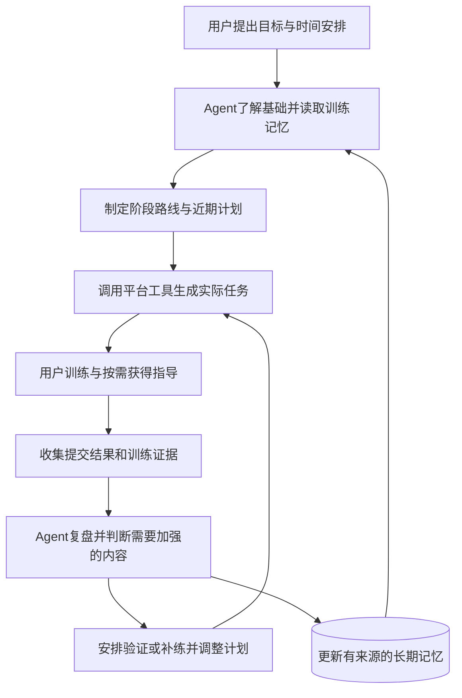
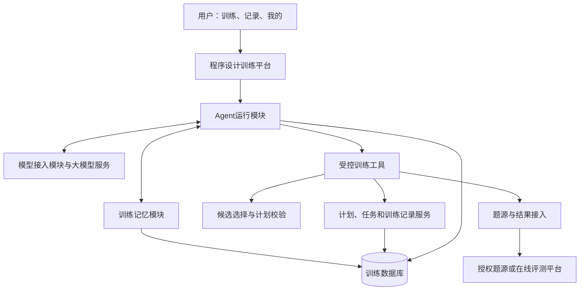

# 练序 CodePath：嵌入式训练教练 Agent 项目说明

> **项目定位：程序训练 + Agent 辅助。围绕个人或团队的学习目标，持续规划训练、记录表现、诊断不足，并调整下一步安排。**

文档版本：2026-09-27。适用对象：项目评委、团队成员、AI 协作者及需要了解项目的合作方。

本文依据[《嵌入式训练教练 Agent 实施方案》](PROGRAMMING_TRAINING_AGENT_IMPLEMENTATION_PLAN.md)编写，介绍项目的价值、工作方式、技术思路和建设路径。具体接口、数据字段与开发验收以实施方案为参照，后续任务以项目负责人最新确认的要求为准。

**当前阶段：已有训练平台演示原型和需求调研，正在规划完整训练教练 Agent 的实现。** 文中“拟实现”“首版要求”“设计示例”均指建设目标；现有能力单列于第十三节。学习效果、长期使用和商业价值仍需真实试点验证。

阅读建议：评委可重点阅读第一至五节、第十一、十三、十六和二十节；团队成员可重点阅读第六至十节、第十四至十八节；AI 协作者应先阅读项目定位、当前状态和第十九节，再结合实施方案开展具体任务。

## 一、项目概述

练序 CodePath 计划开发一款**嵌入程序设计训练平台的智能教练 Agent**。这里的 Agent，是能够围绕目标持续了解情况、制定方案、调用工具执行任务，并根据结果调整行动的智能体。

平台提供题目资源、训练任务、代码草稿、提交记录、训练历史和团队协作等基础环境；Agent 在其中承担教练式工作：了解学习者想达到什么水平，判断当前基础，制定阶段计划，组织日常训练，在遇到困难时提供指导，并根据训练表现发现不足、安排补练和调整进度。

项目希望使一个人也能获得连续、具体、可调整的训练支持。对于集训队，Agent 将进一步协助真人教练制定分层计划、识别共性问题和跟进训练结果。考研、竞赛、课程学习、面试准备等目标可以通过不同的内容资源和训练策略适配，共用同一套训练过程。

项目的核心建设任务是让 Agent 的判断能够进入实际训练：生成的计划成为可开始的任务，识别的不足对应后续练习，训练结果反过来改变下一轮安排。用户应当能够看见、理解和纠正这些变化。

首版将以可触达的新生程序设计训练场景验证这一机制，内容规模保持有限，但从开始就包含目标管理、长期记忆、工具执行和反馈调整。个人版本可以独立使用；团队服务在同一基础上扩展。

## 二、项目背景与需求依据

### 2.1 程序设计学习中的连续训练问题

程序设计学习需要经历理解知识、形成思路、写出代码、检查错误、独立应用等多个步骤。题目、教程和答案可以帮助其中某一步，学习者仍需要把这些资源组织成适合自己的训练过程。

本项目重点处理以下问题：

| 问题 | 训练中的具体表现 | 项目准备提供的支持 |
| --- | --- | --- |
| 目标难以转化为行动 | 知道想提升编程或准备考试，但不清楚本周和今天练什么 | 将目标拆成阶段任务，结合基础和时间安排训练 |
| 练习与当前基础不匹配 | 题目太难、跨度太大，或反复做已经熟悉的内容 | 根据先修知识和训练证据选择任务，并接受用户反馈 |
| 遇到困难时难以获得合适帮助 | 不知道卡在哪里、不会描述问题，或不好意思提问 | 结合当前任务帮助定位问题，逐步给出可尝试的方向 |
| 完成题目后不清楚是否掌握 | 看懂解释或修改后通过，但换题仍然写不出来 | 安排相近的新任务，检查能否独立应用所学内容 |
| 训练计划缺少后续维护 | 时间变化、进度滞后或新问题出现后，原计划没有调整 | 持续读取训练结果，修改未开始的任务并说明依据 |
| 团队训练难以兼顾差异 | 同一题单中，有人缺基础，有人需要提高，教练需反复整理情况 | 汇总获授权的训练证据，提出分层安排和共性问题建议 |

其中，新生学习与求助问题已有问卷线索；长期计划维护、团队管理负担和其他人群需求还需要进一步访谈与行为观察。

### 2.2 已有问卷提供的线索

仓库已有一份新生培训及 AI 使用调查，共 **78 份答卷**。AI 使用细节题适用人数为 **71 人**。以下数据引用已有研究成果，本说明文档不重新改变统计口径。

| 调研发现 | 样本内结果 | 对项目设计的启发 |
| --- | --- | --- |
| 当前基础较弱 | 53/78 自评处于语法及以下水平 | 首批训练需要照顾基础和知识衔接 |
| 理解解释后仍难以实现 | 53/78 表示看懂题解却写不出 | 训练应包含实现与独立应用的检查 |
| 不容易定位自己的问题 | 39/78 不知道具体卡在哪里 | Agent需要帮助诊断，而不只等待用户提出完整问题 |
| 求助存在心理或表达障碍 | 61/78 经常或偶尔想问但没问；33/78 不会描述问题 | 提供低压力、结合当前训练的求助方式 |
| AI 已进入学习过程 | 63/78 卡题时会使用 AI | 需要与用户已经使用的普通 AI 方法比较价值 |
| AI 帮助仍有质量问题 | 30/71 遇到错误回答；27/71 表示过题但未掌握；20/71 认为过早给出答案 | 需要有依据的反馈、适量帮助和后续验证 |
| 用户对适配与规划有需求 | 57/78 选择按水平推荐题目；38/78 选择自动训练计划 | 值得验证 Agent 的规划与选题能力 |
| 更关注错误信息的记录 | 65/78 愿记录常错知识点，19/78 愿记录 AI 对话 | 长期记忆优先保存有用的训练事实与错误主题 |

来源：[新生问卷研究报告](research/freshman-survey-analysis-2026.md)、[统计汇总](../artifacts/survey/survey_summary.csv)。表中多选项目可以重叠，不能相加解释为不同人数。

这些结果来自特定新生样本的自报回答，支持识别问题和设计试点。它们尚不能证明 Agent 能提高成绩、提升留存或带来付费。已有分析保留全部78份答卷，并标记5份疑似互斥选项冲突；不同题目的适用人数也不同。面向评委或外部合作方引用时，应同时保留样本范围和统计分母。

## 三、产品定位与服务对象

### 3.1 平台、Agent 与真人教练的关系

平台和 Agent 共同提供教练式训练服务，各部分分工如下。

| 组成 | 主要职责 | 用户能够感受到的价值 |
| --- | --- | --- |
| 程序设计训练平台 | 承载目标、计划、题目、训练过程、结果和团队协作 | 有明确的训练场所，任务可以实际开始，记录能够持续保存 |
| 训练教练 Agent | 理解目标、读取历史、制定计划、指导训练、分析不足并执行调整 | 获得围绕自身情况持续变化的训练安排 |
| 训练规则与工具 | 检查题目可用性、知识前置条件、时间预算、权限和计划冲突 | Agent的安排能够执行，重要约束得到落实 |
| 学习者 | 确定目标、实际训练、提供反馈，决定重要调整 | 保持学习主动权，能够纠正系统判断 |
| 真人教练 | 审核团队安排、把握教学方向、处理复杂问题 | 将部分重复整理与跟进工作交给Agent，集中处理需要经验的事项 |

个人使用时不要求先加入学校或团队，也不需要等待真人教练逐题安排。团队使用时，真人教练与 Agent 共同组织训练，团队管理能力通过 Team/Coach 服务开放。

### 3.2 同一训练机制适配不同目标

| 服务对象或目标 | Agent关注的主要内容 | 需要适配的资源与评价 |
| --- | --- | --- |
| 个人程序设计学习者 | 基础、可用时间、学习顺序、错误与独立实现能力 | 基础知识链、练习、实现和理解检查 |
| ACM/ICPC集训队 | 阶段目标、成员差异、专题安排、赛后补题和共性不足 | 竞赛题源、专题策略、比赛规则、团队训练评价 |
| 考研准备者 | 目标日期、阶段进度、数据结构与算法薄弱项、复习安排 | 经审核的知识范围、相关任务和阶段检查 |
| 面试与求职笔试准备者 | 目标时间、常见题型、限时实现、复杂度与表达 | 合法题源、训练策略与相应评价标准 |
| 程序设计课程学习者 | 课程进度、先修知识、课后练习和讲评衔接 | 教师授权内容、课程目标与任务要求 |

这些目标进入 Agent 的规划条件。用户仍围绕“训练、记录、我的”使用产品，不需要在多个独立平台之间切换。

场景支持程度取决于实际建设的内容、工具与评价能力。首批优先验证新生 C++ 基础训练。考研可以作为长期目标被管理；完整学科教学与评价则需要逐项补齐资源，不能仅凭一个目标选项就宣称已经覆盖。

## 四、项目的完整工作流程

项目围绕以下连续过程运行：



这一过程中的每个环节都有实际产物：

| 环节 | 主要输入 | 应产生的结果 |
| --- | --- | --- |
| 目标理解 | 用户描述、期限、可用时间、自评基础 | 用户能确认和修改的目标卡 |
| 初始判断 | 自评、已有记录、必要的短任务 | 已了解的基础与仍需确认的部分 |
| 训练规划 | 目标、阶段状态、任务资源与约束 | 阶段路线、本周安排、今日任务 |
| 训练执行 | 已确认计划与题目资源 | 可以开始、暂停、继续的实际任务 |
| 过程指导 | 当前问题、用户尝试、相关训练历史 | 一个诊断问题、提示或可验证的下一步 |
| 结果记录 | 提交状态、来源、帮助使用情况和用户复盘 | 有来源的训练事实，保留不确定之处 |
| 不足诊断 | 多次训练事实、错误、检查结果 | 有依据的不足判断或待验证假设 |
| 后续调整 | 诊断、进度、时间变化和用户反馈 | 实际更新的计划及简短调整说明 |

用户完成一道题后，平台要能回答：这次做了什么、得到过什么帮助、结果如何确认、还需检查什么、下一步为何改变。所有能力都围绕这条训练过程组织。

## 五、训练教练 Agent 的核心能力

### 5.1 理解目标，建立个人训练档案

用户可以用自然语言描述目标，例如：“四周后能独立完成基础数组题，每周练四天，每次半小时。”Agent提取目标、期限、时间和基础信息，呈现为可编辑的目标卡。

当信息不足时，Agent优先追问会影响训练安排的内容，也可以通过一个简短任务了解当前基础。系统保留“不确定”状态，避免把用户的自评当作精确能力测量。

### 5.2 制定分层次、可执行的训练计划

计划分为四个层次：

| 层次 | 回答的问题 | 示例 |
| --- | --- | --- |
| 长期目标 | 希望达到什么结果 | 能独立完成一类基础程序设计任务 |
| 阶段里程碑 | 这一阶段应完成什么 | 建立循环与数组遍历的基本实现能力 |
| 本周计划 | 近期重点和节奏是什么 | 练习遍历、边界处理，并安排一次检查 |
| 今日任务 | 现在具体做什么 | 完成一项核心练习和一项短检查 |

Agent根据可用资源和训练表现细化近期安排，远期计划保持可调整。每个今日任务需要关联真实题目或练习内容，说明目的、预计时间和完成要求。

时间变化也应反映到任务中。用户说“今天只有15分钟”，Agent需要缩减或移动未开始的任务，并保留已经进行的训练。计划调整不能只停留在回复文字上。

### 5.3 保留对后续训练有用的长期记忆

长期记忆使Agent能够在用户下次进入时继续带训。其内容以结构化信息为主，避免依赖不断增长的完整聊天记录。

| 记忆内容 | 具体示例 | 使用方式 |
| --- | --- | --- |
| 目标与偏好 | 目标日期、每周可训练时间、偏好的解释方式 | 决定计划节奏与指导方式 |
| 训练事实 | 完成过哪些任务、提交来源、使用过哪些帮助 | 判断已有经历，避免重复安排或误判独立完成 |
| 不足假设 | 多次出现边界错误，可能需要加强循环终止条件 | 安排有针对性的验证，得到新证据后修正 |
| 计划与行动 | 为什么调整某个专题、哪些检查已经安排 | 保持计划连续，避免反复生成相互冲突的任务 |

事实、用户自评和Agent推测分别记录。用户能够查看、纠正和删除记忆；过时判断要重新检查。对“理解不够”“能力较差”等宽泛标签，系统应给出更具体、可检验的解释。

### 5.4 在训练过程中提供适量指导

Agent结合当前题目、用户思路、主动提供的代码或错误信息，帮助定位卡点。指导可从确认题意、观察小例子开始，逐步进入关键提示、实现步骤和完整讲解。

指导强度需要适应学习阶段。对新手，可以解释局部语法和执行过程；对有经验的用户，可以更直接地讨论复杂度、边界和反例。用户可以要求换一种解释，也可以明确结束独立尝试后查看完整说明。

系统记录已经提供的帮助，以便正确解释后续结果。看过完整解答后通过原题，与独立完成一道新题，代表不同的学习证据。

### 5.5 诊断不足，并安排验证与补练

Agent应综合不同训练中的证据，分析问题可能出在知识基础、思路转化、代码实现、调试方法或时间安排等环节。

例如，连续出现数组下标越界时，可以提出“边界处理尚不稳定”的假设，再安排一个较小的边界检查任务。如果新结果不支持该判断，应修正诊断；如果支持，再安排针对性练习。

不足分析最终要连接到训练动作：补哪一部分、先练什么、什么时候检查是否改善。模型给出的自然语言评价不能直接变成“已掌握”或“能力提升”的事实。

### 5.6 根据反馈持续调整

调整可能由新提交结果、用户反馈、阶段复盘、时间变化或资源不可用触发。Agent先检查当前目标和计划，再提出或执行相应变化。

用户可以授权Agent在既定目标与时间预算内调整尚未开始的任务。改变主要方向、明显增加投入时间或发布团队任务等重要动作，需要相应确认。调整后要展示原因与差异，并提供适用的撤销方式。

这种持续调整使计划能够跟随学习过程变化。首版就应实现基本能力，后续再提高规划质量、增加更长时间范围的分析和后台周期检查。

## 六、个人使用案例：从目标到持续训练

以下为**设计示例**，用于说明预期产品行为，不代表已发生的真实试点或效果。

学习者提出：“我学过基本语法，希望四周内能独立完成基础数组题，每周四天，每次30分钟。”

| 阶段 | 用户行为 | Agent的处理 | 平台中应看到的结果 |
| --- | --- | --- | --- |
| 首次进入 | 描述目标与时间 | 整理目标，确认当前基础，必要时安排短任务 | 可编辑目标卡与首次训练 |
| 生成计划 | 确认目标 | 从审核任务中选择候选，检查先修与时间，生成阶段及本周安排 | 实际计划和可开始的任务 |
| 开始训练 | 编写循环与数组相关代码 | 保持当前任务上下文，记录必要训练状态 | 可暂停和恢复的训练过程 |
| 遇到问题 | 提交失败并请求帮助 | 询问预期与实际结果，给出检查边界的方向 | 用户继续尝试，而非被动阅读整份答案 |
| 发现重复问题 | 不同任务出现相近错误 | 检索历史证据，提出边界处理不足的假设 | 一条附依据、可纠正的诊断 |
| 验证与补练 | 完成一个短检查 | 根据结果确认或修正假设，安排适当练习 | 后续任务发生有解释的变化 |
| 时间变化 | 告知今天只有15分钟 | 重新安排未开始任务，不覆盖已做工作 | 今天任务缩短，剩余安排移至合适时间 |
| 再次进入 | 次日继续训练 | 读取目标、结果和调整记录 | 不必重述背景，直接看到当前重点与下一步 |

示例中的某次30分钟训练，可以安排约18分钟核心练习、5分钟检查、3分钟复盘，并预留缓冲。发现需要补基础后，Agent可以替换部分后续内容，而不是不断增加额外任务。所有估时均为待校准的安排值。

这一案例的验收重点是：计划确实保存为任务；新证据确实进入诊断；调整确实作用于未开始的任务；下次会话确实读取相关记忆。学习是否改善，还需要另行检查。

## 七、集训队与真人教练协作

团队场景在个人训练基础上增加团队目标、成员授权和统一发布流程。Agent可以协助教练将“本阶段完成某个专题”等目标，转化为适合不同基础成员的训练安排。

预期流程为：教练输入阶段目标与约束，Agent读取获授权的成员训练状态，生成分层计划和工作量预览；教练审核后发布，学生在自己的训练页接收任务；Agent根据执行结果归纳共性问题，并提出下一轮调整建议。

团队服务重点回答三个问题：

1. **这批成员目前需要加强什么？** 区分共性问题与个别问题，显示所依据的记录和有效人数。
2. **下一轮怎样安排更合适？** 给出任务分层、先修补充和工作量建议。
3. **哪些事项需要真人介入？** 包括学生主动求助、证据不足的复杂问题和可能有误的任务内容。

例如，同一专题中，基础尚不稳定的成员先完成前置练习，已有相应证据的成员进入提高任务。具体分层依据应能说明，也应允许教练修正。

Team/Coach属于团队升级服务，入口按成员角色显示。个人用户始终可以使用核心训练教练Agent。加入团队也不代表自动公开私人训练历史、代码和完整对话；团队分析只使用约定范围内的数据。

## 八、考研与其他目标如何适配

考研准备同时涉及目标日期、知识覆盖、时间分配和阶段复习。Agent可以将考试时间与用户当前进度纳入规划，在支持的知识范围内安排练习、检查薄弱项，并根据结果调整节奏。

首批可逐步适配数据结构、算法理解、代码实现及相关实践任务。其他学科可以先作为用户自设的里程碑和时间约束，帮助规划整体节奏；提供自动诊断与教学前，需要准备相应内容和评价标准。

面试准备、程序设计课程和个人算法提升采用同一方法：明确目标，接入合适资源，调整任务选择及评价方式。例如，面试任务可能增加限时表达与复杂度说明；课程任务需要符合教学进度；竞赛训练需要考虑比赛规则和赛后复盘。

扩展一个目标，至少要补齐四项内容：可合法使用的训练资源、目标对应的训练策略、难度与时间安排依据、结果评价方式。它们进入同一个Agent工作流程，前台继续保持统一。

## 九、Agent 的工作机制

### 9.1 一次训练决策怎样发生

Agent运行由具体事件触发，例如用户设置目标、完成任务、请求帮助或要求调整计划。一次运行可以分为以下步骤。

| 步骤 | Agent做什么 | 平台提供的保障 |
| --- | --- | --- |
| 了解当前任务 | 明确此次要规划、指导、诊断还是调整 | 固定用户身份、数据范围和运行预算 |
| 读取相关信息 | 查询目标、记忆、训练结果和已有计划 | 只返回有权限且与任务相关的数据 |
| 选择行动 | 判断是否需要追问、补练、检查或推进阶段 | 限定可调用的工具和业务规则 |
| 调用工具 | 搜索任务、校验计划、保存草案或应用调整 | 检查参数、权限、资源和计划版本 |
| 检查执行结果 | 根据工具返回判断成功、失败或需修订 | 返回真实状态，保留操作记录 |
| 更新并解释 | 保存必要记忆，说明依据、变化与下一步 | 用户可以查看结果并纠正重要判断 |

### 9.2 “调用工具”的实际含义

工具是平台开放给Agent的受控操作。例如，“查询训练历史”会读取允许访问的记录；“应用计划调整”会真实修改相应任务；“安排复测”会建立一个后续检查任务。

首版计划提供的工具包括：读取训练上下文、查询证据、查找候选任务、检查计划、保存计划草案、应用计划修订、记录学习记忆、安排后续检查，以及获取当前允许使用的教学材料。

这些工具使模型的判断与平台状态连接起来。工具执行失败时，Agent应说明具体结果并保持原有有效状态；不能把尚未执行的建议描述为已经完成。

### 9.3 模型决策与确定性规则如何配合

大模型适合理解自然语言目标、综合不同信息、提出诊断假设和选择教学动作。对于时间总量、题目是否存在、用户权限、数据版本和执行结果等事项，平台使用明确规则检查。

例如，Agent可以判断应该补一次边界练习；训练工具检查候选题是否已审核、是否满足先修条件、能否放入当前时间预算。通过后才能应用到计划中。

首版使用一个Agent执行几类明确流程即可：规划、过程指导、诊断复盘和计划调整。后续是否需要多个Agent协作，应由真实复杂度决定，不作为早期建设的前提。

### 9.4 主动性与用户控制

Agent可以在训练结束或复盘到期时主动整理情况，也可以在用户授权范围内微调后续任务。解题提示默认按需出现，以免打断思考或提前透露答案。

系统限制每次运行的步骤、耗时和费用；同一事件反复到达时，不应重复创建任务。旧计划上的判断不能覆盖更新后的安排。用户改变目标、纠正记忆或撤销调整后，相关后续动作需要重新检查。

## 十、技术架构与工程实现思路

### 10.1 整体结构

第一阶段拟沿用仓库已有的TypeScript、Next.js和React，增加服务端身份管理、PostgreSQL数据库及Agent运行能力。应用先作为一个整体部署，减少小团队的维护负担。



数据库保存目标、计划、训练事实、必要记忆和运行记录。大模型通过模型接入模块参与判断，实际读取和修改数据由受控工具完成。

### 10.2 核心模块的分工

| 模块 | 通俗解释 | 主要建设内容 |
| --- | --- | --- |
| Agent运行模块 | 负责一次教练工作从开始到结束 | 接收事件、组织模型和工具、处理等待确认、失败与恢复 |
| 训练记忆模块 | 保存并取回真正有用的历史信息 | 按目标和知识点检索，区分事实与假设，支持纠正和删除 |
| 训练工具模块 | 让Agent能够操作平台 | 查询、校验、保存和调整，检查范围、授权及重复执行 |
| 训练规则模块 | 确保安排符合基本条件 | 先修知识、候选题、时间预算、内容状态和计划冲突检查 |
| 模型接入模块 | 统一对接不同模型服务 | 解析工具请求、统计用量、设置超时和处理不可用情况 |
| 训练数据服务 | 维护任务和结果的真实状态 | 保存版本、提交来源、帮助使用情况及后续检查 |

首版不需要自行训练基础大模型，也不需要先建立复杂的分布式系统。开发重点是教练工作流程、记忆和工具之间的可靠配合。模型供应商可以替换，目标、训练记录和业务规则应保持独立。

### 10.3 数据需要保留什么关系

一个用户可以有目标和阶段里程碑；目标产生计划，计划包含任务，一项任务可以经历多次尝试。每次尝试分别记录结果、帮助和复盘，避免同一道题的新结果覆盖旧经历。

Agent运行记录关联它读取的证据、调用的工具和造成的计划变化。这样才能回答“为什么安排这道题”“为什么推迟这个专题”“系统依据什么判断需要补练”。

技术实现中的核心对象包括用户目标、训练计划、训练任务、训练场次、提交记录、帮助记录、学习证据、Agent记忆、Agent运行记录和计划修订。完整字段与接口见实施方案；项目说明关注它们如何支持持续带训。

### 10.4 部署与运行

仓库已有Docker和自动化构建发布配置，可以在后续开发中复用。正式训练服务还需完成数据库接入、权限、备份恢复、模型访问和故障处理。

学校服务器需要验证网络、域名、模型接口和题源是否可用。模型暂不可用时，用户仍可继续已有任务并使用已审核材料；界面应明确说明哪些Agent能力暂停。学生代码优先交由已有授权评测渠道运行，首版不在网站服务进程中直接执行任意代码。

## 十一、项目创新点与差异化价值

### 11.1 将教练判断连接到真实训练行动

项目拟将“理解目标、制定计划、观察训练、发现不足、修改安排”组织为可执行的Agent工作流程。平台提供具体工具，使一次判断能够转化为任务、检查或计划修订。

这一设计的验证方式也很具体：能否从一次Agent运行中找到实际生成的任务；结果出现后，后续计划是否有合理变化；用户能否理解并纠正这些变化。

### 11.2 以有来源的长期记忆支持持续带训

项目准备长期保存对训练有意义的目标、经历和判断依据，并区分事实与假设。Agent可以跨任务和跨会话使用这些信息，持续维护计划。

其价值需要通过实际行为衡量，例如用户是否减少了重复解释背景的时间，Agent是否减少了不合适的重复安排，错误记忆是否可以被发现和纠正。

### 11.3 让不足诊断与补练、验证连接起来

项目中的不足分析需要形成可验证的行动链：发现问题迹象，提出具体假设，安排检查，根据结果补练，再观察能否独立应用。

这使能力分析有机会从展示一个分数，发展为帮助用户决定下一步。评价重点是诊断是否有依据、安排是否合理、后续表现是否改善。

### 11.4 让个人与团队共享训练教练能力

同一个Agent内核可以根据目标、时间、训练内容和授权范围，分别服务个人与集训队。个人场景强调自主管理与持续支持，团队场景增加成员分层、共性诊断和教练审核。

这种结构为考研、面试和课程学习等目标扩展提供基础。每次扩展需要补齐资源和评价，但可以复用记忆、任务执行与反馈调整机制。

以上是项目计划实现的应用与工程创新方向。Agent、长期记忆和工具调用本身已有成熟研究和产品实践；本项目的贡献需要体现在具体训练场景中的组合设计、可靠实现和验证结果中。目前不提出未经检索证明的“首创”或“行业领先”结论。

### 11.5 与已有学习方式的关系

| 学习方式 | 已有价值 | 本项目需要证明的增量价值 |
| --- | --- | --- |
| 在线评测平台与题单 | 提供题目、提交结果和训练资源，部分已有推荐与学习路径 | 能否围绕个人目标持续维护计划、诊断不足并调整训练 |
| 普通AI学习助手 | 解释题意、分析代码、讨论计划；部分支持记忆和工具 | 与实际训练记录和任务深度结合后，是否更可靠、更省维护精力 |
| 课程与固定训练计划 | 提供系统内容、教学顺序和阶段要求 | 能否在课程框架内更好地适应个人进度与差异 |
| 真人教练和同伴 | 提供经验判断、情境理解、鼓励和复杂问题处理 | 能否减少重复整理与常规跟进，让人更有效地参与教学 |

后续比较要记录对照工具实际具备的功能，使用相近的内容、时间与评价条件。项目价值不能仅靠功能名称的差异来证明。

## 十二、产品界面与用户体验

产品前台统一为三个主要入口。

| 入口 | 用户主要做什么 | Agent如何参与 |
| --- | --- | --- |
| 训练 | 查看当前目标、开始或继续今天的任务、调整近期安排 | 解释为什么这样练，协商计划，提供过程指导 |
| 记录 | 查看训练经历、需要加强的内容、复盘与计划变化 | 说明诊断依据，给出对应补练，支持用户纠正 |
| 我的 | 管理目标、时间、个人设置、数据与自动调整范围 | 读取经确认的偏好，按授权执行后续动作 |

首页重点是当前任务，同时提供阶段计划的简要入口。用户既能立即开始，也能理解当前训练与长期目标的联系。

Agent可以通过对话、任务卡和调整预览与用户交互。比如，用户在训练页说“本周少练一天”，应看到调整后的具体安排；询问“为什么要补这一项”，应看到相关记录的解释。前台不需要展示模型路由、数据库字段或内部工具名称。

个人用户默认不会看到团队管理。具有相应资格和角色的用户，可从“我的”进入Team/Coach服务。ACM、考研、面试等目标也不会成为多个并列的产品首页。

## 十三、当前已有成果与建设状态

下表依据2026-09-27实施方案中的仓库审计。本文编写未重新进行应用运行验收，也未把规划功能视为现有成果。

| 领域 | 已有成果 | 仍需建设或验证 |
| --- | --- | --- |
| 需求研究 | 78份问卷及已有分析报告、产品规划 | 连续行为观察、教练访谈、不同目标用户研究 |
| 平台交互 | 首页开练入口、训练室、代码草稿、计时、笔记、复盘等演示流程 | 面向真实个人数据的统一训练流程 |
| 帮助体验 | 嵌入训练室的静态提示及解释展示 | 真实Agent对话、工具调用、上下文判断与服务端帮助边界 |
| 计划生成 | 基于演示数据的规则题单和推荐理由 | 目标驱动的阶段/周/日计划、时间约束和实际修订 |
| 训练状态 | 本地模拟数据、训练结果和展示图表 | 数据库、长期记忆、可追溯证据与多次尝试记录 |
| Agent核心 | 已明确产品职责与实施方案 | 模型接入、运行流程、工具执行、持久记忆和反馈调整 |
| 账户与团队 | 相关演示界面和本地偏好 | 真实身份认证、服务端授权、团队数据范围与发布流程 |
| 工程基础 | Next.js/React/TypeScript项目及测试、容器发布配置 | 新增Agent能力后的验收、数据库迁移、备份恢复与真实部署 |
| 产品效果 | 已有样本内需求线索 | 学习提升、持续使用、教练采纳、成本和付费意愿 |

现有Demo为交互验证和后续开发提供基础。实现完整Agent仍是当前核心建设工作，不能仅通过现有提示界面或模拟能力变化证明已经完成。

## 十四、首版范围、交付物与阶段路线

### 14.1 首版必须交付的能力

首版最小可用产品，也称MVP，应能让个人独立完成一条连续训练过程。其范围包含三组能力。

| 首版能力 | 具体交付物 | 核心验收方式 |
| --- | --- | --- |
| 目标与记忆驱动规划 | 目标卡、必要长期记忆、阶段路线、本周计划、可开始任务 | 新会话能读取相关历史；计划符合目标、先修与预算 |
| 嵌入式训练指导 | 当前任务上下文、按需提示、有限代码分析、实际结果记录 | 帮助与用户尝试相关，结果来源清楚，解释强度可控制 |
| 不足诊断与反馈调整 | 有依据的诊断或假设、后续检查、补练与计划修订 | 新证据能引起合理行动，用户能看到变化并纠正 |

账号、数据隔离、执行记录、费用限制和故障处理为这些能力提供必要保障。它们应随核心过程一起实现。

初始内容建议覆盖一至两条清晰的入门知识链，准备20—30个候选任务，先发布10—20个经过审核的任务或匹配练习。上述数量是实施建议，不是已经完成的题库规模。

首版可以限制题源、训练专题和自动运行频率，但不能删除规划、记忆、工具执行或反馈调整中的核心环节。固定提示和人工流程可用于对照与故障回退，不计作完整Agent交付。

### 14.2 团队与后续能力

个人内核稳定后，优先增加团队目标、Agent分层计划、共性诊断、教练确认发布和后续跟进。其他扩展包括更长周期的复盘、可靠题源接入，以及考研或面试等目标对应的内容与评价。

自动原创题目可以作为后续内容工具研究。其上线需要校验题意、参考解、测试数据、难度和使用权，当前不作为个人Agent首版的前提。

### 14.3 建议建设路线

| 阶段 | 主要目标 | 应形成的可评审成果 |
| --- | --- | --- |
| 启动后0—1个月 | 贯通最小个人Agent工作流程 | 目标到任务的真实工具执行、跨会话记忆、训练反馈与计划调整演示 |
| 1—3个月 | 开展小规模真实试点并迭代 | 可追溯运行记录、学习与使用结果、问题案例和成本分析 |
| 3—6个月 | 加强长期规划，试点团队协作 | 团队目标、分层安排、共性诊断与真人教练确认的完整过程 |
| 6—12个月 | 按资源逐个扩展目标与人群 | 新内容、新训练策略、相应评价和独立试点结果 |

这一路线沿用实施方案的一人开发、AI辅助及有人审核教学内容的假设，是工作安排参考。实际时间取决于可投入人时、模型可用性、内容准备和验收结果。阶段不能仅因时间到达而自动视为完成。

## 十五、内容质量、数据与可信运行

### 15.1 题目与训练资源

优先使用自有内容、明确授权的校内资源，以及允许使用的题目元数据和原站链接。题目公开可访问，不自动代表可以复制题面、题解或将其发送给第三方模型。

每项任务需要明确适用知识、先修要求、估时、评价方式和使用范围。存在歧义或参考解问题时，应暂停分发并说明影响。外部题源不可用时，优先使用经过审核的替代任务。

### 15.2 结果和能力判断

用户点击“我通过了”、模型认为代码正确、原站评测接受、用户独立完成新题，属于不同来源与强度的证据。系统分别记录，避免把一次自报过题直接变成能力提高。

代码分析应说明观察到的事实、可能原因和检查方法。未经实际执行或可靠核验，不应声称测试已经通过。Agent的不足判断也应保留反例和修订历史。

### 15.3 个人数据与团队范围

长期训练需要保存目标和必要经历，但不要求默认永久保存全部代码与对话。用户主动提交的分析材料按告知范围处理，私人记忆不会因加入团队而自动共享。

个人能够查看、纠正、导出和删除自己的相关数据。研究使用另外说明目的；问卷中的记录偏好不等同于新产品的数据授权。匿名问卷也不用于建立真实用户画像。

### 15.4 执行动作与故障处理

Agent通过受控工具操作平台，工具在服务端检查用户身份、资源归属、授权和当前版本。比赛、测验和团队发布等情境遵守对应规则。

执行失败时保留已有有效计划，并返回可理解的状态。反复触发同一个请求不应重复创建任务；旧运行不能覆盖新决定。重要变更需要适当确认，适用的调整可以撤销。

这些设计使用户可以理解和控制Agent的行为，也为团队发现问题、复现原因和改进系统提供基础。

## 十六、如何验证项目价值

验证分为两个层次：先确认Agent真正完成教练工作，再评价这些工作是否改善学习和训练管理。

### 16.1 功能与工程验收

| 验收事项 | 通过时应能看到的证据 |
| --- | --- |
| 目标转化为实际任务 | 模型调用工具后生成了真实任务，内容存在且符合预算 |
| 跨会话保持连续 | 用户再次进入时，Agent能依据相关记忆继续规划 |
| 新结果影响后续安排 | 诊断依据、计划差异及执行状态可以查询 |
| 用户能够纠正 | 记忆修订或计划撤销后，相关后续状态正确变化 |
| 工具失败如实反馈 | 未执行成功时不显示已经完成，可保留或恢复有效状态 |
| 数据范围正确 | 修改请求参数也无法读取他人记录或发布未授权团队任务 |

合成数据适合检查这些行为，但需要明确标识。真实模型评测与模拟响应测试分别记录，防止把预先写好的输出当作Agent表现。

### 16.2 首轮真实试点

实施方案建议自愿招募12—18名学习者，进行约两周的可行性试点。先完成内容与运行准入，再记录目标设置、训练、求助、诊断、计划变化和延迟检查。

试点可以将完整Agent与“同等内容资源＋普通AI＋明确学习和规划提示词”比较，并如实记录对照工具已有的记忆、规划和工具能力。题目难度、可用时间和允许资源尽量一致。

首轮规模适合发现工作流程的问题，观察可能的价值方向。长期规划、考试结果和大范围推广效果，需要更长观察及新的样本支持。

### 16.3 重点评价指标

| 评价维度 | 具体指标或观察方式 | 解释时需要注意 |
| --- | --- | --- |
| 规划执行 | 需要规划的运行中，生成可执行任务的比例 | 等待确认、失败、超时分别报告 |
| 计划适配 | 抽查目标、先修、时间是否匹配；记录拒绝或修改原因 | 点击接受不能单独证明安排合理 |
| 诊断质量 | 抽查不足判断的证据、反例和验证结果 | 假设与事实分开，不能让Agent自行给自己评分 |
| 规划维护负担 | 用户整理历史、排计划和改安排所花时间 | 同时计入审核Agent建议的时间 |
| 独立应用 | 预先安排的新任务中，经核验无辅助完成的比例 | 保留未参与和失败情况，说明如何判断独立性 |
| 指导后的尝试 | 获得帮助后出现相关代码修改、推演或测试的比例 | 停留页面或复制答案不自动算有效尝试 |
| 持续训练 | 首次训练后第6—8天仍有有效尝试的用户比例 | 只统计已有完整观察窗口者，打开页面不等于训练 |
| 团队协作 | 教练编排与跟进人时、建议转为实际教学动作的情况 | 问题变少也可能来自不再求助，需结合访谈 |
| 成本 | 每次有效教练动作、每位持续用户和每次核验成功所需成本 | 同时报模型、内容审核、人工支持及有效分母 |

后续还可以分别比较是否使用长期记忆、是否自动重规划，了解不同组件的贡献。小规模首轮不必同时展开所有实验。

## 十七、项目价值与可持续运行思路

### 17.1 预期价值

对个人，项目希望降低维护训练路线的负担，使目标、当天行动与后续改进保持联系。对集训队，项目希望减少重复整理和常规跟进，使真人教练更容易发现需要处理的问题。对教学研究，连续且有来源的训练记录可以支持检验具体教学策略何时有效、何时失效。

这些是需要验证的预期价值。项目当前没有足够证据承诺提分比例、训练效率提升幅度、付费转化或市场规模。

### 17.2 服务层级

| 层级 | 规划中的服务内容 |
| --- | --- |
| Personal | 基本目标管理、必要长期记忆、训练计划、过程指导和复盘调整，提供有限Agent运行额度 |
| Pro | 在效果成立后提供更高额度、更长周期分析与更多已验证能力 |
| Team/Coach | 团队目标、分层计划、共性诊断、教练审核和协作 |

基本教练能力在个人版本中成立，团队层级增加组织服务。定价、采购方式和实际付费需求需要另外验证，不能由问卷试用意愿直接推导。

### 17.3 成本管理

模型成本需要覆盖规划、训练求助、复盘、重规划和周期检查。一次Agent运行可能包含多次模型调用，不能只按用户发了几条消息计算。

基本估算方式为：各类运行次数，乘以每次运行的模型调用数、输入输出用量及对应单价，再加主机、数据库、备份、内容审核和人工支持费用。

首版建议由平台统一提供模型服务，减少用户自行配置密钥的门槛。按个人、团队和整个平台设置预算，统计实际用量，并限制无效重试与重复规划。额度不足时保留已有训练和审核材料，清楚说明哪些Agent能力暂时不可用。

## 十八、团队如何围绕项目协作

团队协作应围绕可以观察和验收的教练行为组织。每个工作包都应说明：用户处于什么情境，Agent需要读取什么、决定什么、调用什么工具，最终平台状态怎样变化。

| 工作职责 | 主要负责内容 | 可评审产物 |
| --- | --- | --- |
| 产品与教学设计 | 目标定义、训练路线、帮助程度、优先级和使用体验 | 用户情境、教学策略、验收条件 |
| Agent与服务端开发 | 运行流程、记忆、工具、身份范围和状态一致性 | 可运行流程、接口、执行记录和关键测试 |
| 平台与交互开发 | 目标/计划/任务界面、过程指导、复盘与调整预览 | 用户可完整操作的训练路径 |
| 内容与评价 | 任务审核、先修关系、参考解、匹配检查与评分标准 | 审核题集、评价依据与问题反馈 |
| 用户研究与效果验证 | 招募、访谈、行为观察、指标口径与结果分析 | 可追溯研究记录和改进建议 |
| 部署与运行 | 模型接入、费用、数据保护、备份恢复和发布 | 可部署环境、运行监控与恢复验证 |

上述是职责划分，不假设团队已经拥有同等数量成员；一人可以承担多项职责。教学内容、研究结论和重要发布决定需要人工审核，AI开发助手可以协助实现、检查和整理。

一次迭代可按“确定用户情境→形成最小实现→检查工具与状态→评测真实模型→用户走查→记录问题”推进。展示界面、模型回答和实际执行结果应一起检查。

前三个月的重点是做出能够连续带训的个人Agent，并取得一次真实、可解释的试点结果。团队扩展方案应复用已验证的内核，避免同时展开过多题源、场景和后台功能。

## 十九、提供给 AI 协作者的项目上下文

以下内容可以作为后续设计、开发、审查或文档任务的基础上下文。它用于统一理解，具体可修改哪些文件、是否开发或部署，仍以当次用户授权为准。

```text
项目名称：练序 CodePath。
项目类别：嵌入程序设计训练平台的训练教练 Agent。
外部定位：程序训练 + Agent 辅助。

核心目标：
开发一个围绕学习目标持续工作的 Agent，理解个人或团队目标，
读取长期训练记忆，制定阶段、本周和今日计划，调用平台工具落实任务，
在训练中提供指导，根据实际结果诊断不足，并调整后续安排。

产品关系：
平台承载资源、任务、记录和执行界面；Agent承担教练式决策与行动；
训练规则和工具检查先修、时间、内容、权限与状态；
用户决定目标，真人教练负责团队教学判断与重要发布。

首版要求：
必须具备目标理解、必要长期记忆、真实工具调用、可执行计划、
训练指导、不足诊断和反馈重规划。需要能跨会话持续工作。
首批采用有限、经审核的新生C++训练内容验证内核。

前台结构：
训练、记录、我的。默认进入今天训练，可查看阶段计划和调整依据。
ACM、集训队、考研、面试等通过目标、内容、策略和评价适配。
团队管理条件显示；个人无需加入团队即可使用核心教练Agent。

工程思路：
沿用现有TypeScript、Next.js和React，拟增加PostgreSQL、Agent运行模块、
结构化记忆和受控训练工具。模型提出工具请求，服务端检查并执行。
计划变更有版本、依据和适用的撤销方式；运行失败如实反馈。

当前事实：
仓库已有训练平台Demo、静态提示、规则题单、模拟数据和78份问卷研究。
依据2026-09-27实施方案审计，真实Agent运行、长期记忆、数据库、
真实模型接入和服务端用户/团队授权仍需建设。
后续任务开始前应核对仓库最新状态，不将这份状态快照永久视为现状。

验收重点：
检查真实任务、工具结果、跨会话记忆和计划调整；区分用户自报、
实际核验与Agent假设。合成演示不能充当真实学习收益。
效果比较应考虑普通AI已有的规划、记忆和工具能力。

执行依据：
先阅读 docs/PROGRAMMING_TRAINING_AGENT_IMPLEMENTATION_PLAN.md 及相关源码；
优先遵守项目负责人最新要求。
每项修改明确用户情境、作用范围和验收方法；没有数据的效果不写成事实。
编写本项目代码的AI助手，与本项目面向用户的训练教练Agent，是不同角色。
```

## 二十、面向评委的介绍与演示建议

### 20.1 项目简述

下面这段文字可用于项目介绍，描述建设目标时保留“正在开发”“计划实现”等阶段用语。

> 我们正在开发练序 CodePath，一款嵌入程序设计平台的训练教练 Agent。它围绕个人或集训队的目标，了解当前基础，制定阶段和日常训练计划，并通过平台工具把计划落实为任务。训练过程中，它提供适量指导，记录实际表现，分析需要加强的内容，再调整后续安排。项目的重点是让目标、记忆、规划、执行和反馈连成一个持续工作的过程。我们已经具备训练平台Demo和78份问卷的需求研究基础，下一步将完成真正的Agent运行与工具接入，先在新生训练中验证，再逐步扩展团队服务和考研等目标。我们将用真实任务执行、计划维护负担和独立完成新题的表现检验价值。

### 20.2 建议演示一条连续的教练工作过程

| 演示步骤 | 重点展示 | 对应证明的能力 |
| --- | --- | --- |
| 输入目标与时间 | 用户用自然语言描述期望 | Agent理解目标与约束 |
| 生成并开始任务 | 展示计划，同时实际进入一道任务 | 规划已通过工具落实 |
| 请求训练帮助 | 根据当前尝试得到相关指导 | Agent能够结合训练上下文教学 |
| 引入新的训练结果 | 展示错误记录或检查结果 | 判断有事实输入 |
| 调整后续安排 | 展示调整前后任务和依据 | Agent能根据反馈采取行动 |
| 重新进入训练 | 读取已有目标、记忆与修订 | 跨会话连续带训 |
| 展示执行记录 | 简要说明哪些工具成功、哪些需确认 | 执行过程可检查，结果可信 |

这些步骤是Agent完成后的目标演示。现阶段使用Demo展示时，应标明模拟学员、静态提示和预设数据；尚未实现的步骤用设计示意说明，不能暗示已真实运行。

### 20.3 介绍时应讲清的几个判断

**关于Agent的核心性。** 项目交付物需要包含持续目标、可用记忆、工具执行和反馈调整；这些能力从首版开始建设。评委可以通过平台中的实际任务和状态变化检验。

**关于项目可行性。** 已有Demo可以复用界面与训练流程；第一阶段限制题目范围和场景数量，集中完成一个完整的个人Agent过程。内容审核、模型访问和真实用户准入仍是必要条件。

**关于应用拓展。** 个人、集训队、考研和面试共享训练内核，但每个目标需要相应内容、策略和评价。架构支持扩展与场景已经验证，应分别说明。

**关于效果。** 问卷说明部分需求存在；工具成功说明功能能够执行；只有合适的训练比较和持续观察，才能说明学习或管理收益。三个层次的证据应分别展示。

## 二十一、术语说明与资料依据

### 21.1 关键术语

| 术语 | 本文中的含义 |
| --- | --- |
| Agent／智能体 | 能围绕目标读取信息、选择动作、调用工具并依据结果继续工作的系统 |
| 大模型 | 用于理解语言、分析信息和生成建议的模型，是Agent使用的一个能力来源 |
| Agent运行模块 | 组织一次教练工作，管理模型调用、工具执行、状态和结束条件的程序 |
| 工具调用 | Agent请求平台执行一项具体操作，例如读取历史或保存计划，由平台检查后执行 |
| 长期记忆 | 跨会话保留且对后续训练有用的目标、事实、假设与行动信息 |
| 训练策略 | 在某个目标下如何选任务、给帮助、调整进度和评价结果的规则与方法 |
| 训练引擎 | 为Agent提供候选、时间与先修校验等训练领域工具的模块 |
| 先修知识 | 完成某项训练前通常需要具备的知识或技能 |
| 迁移检查 | 换一道相关但未见过的新任务，检查学习者能否独立应用所学内容 |
| OJ／在线评测 | 接收程序提交并按测试数据返回结果的系统；AC通常表示提交被接受 |
| MVP／最小可用产品 | 范围有限但核心价值完整、能交给真实用户验证的首版产品 |
| 幂等 | 同一个请求重复执行时，不重复创建任务、扣减额度或造成其他重复影响 |
| 版本校验 | 应用变更前确认所依据的计划或状态仍然有效，避免旧决定覆盖新决定 |

### 21.2 资料依据与使用范围

| 资料 | 在本文中的作用 |
| --- | --- |
| [当前实施方案](PROGRAMMING_TRAINING_AGENT_IMPLEMENTATION_PLAN.md) | 项目定位、Agent职责、首版范围、架构、验收和路线的主要依据 |
| [新生问卷研究报告](research/freshman-survey-analysis-2026.md) | 样本内需求、AI使用情况及研究限制 |
| [问卷统计汇总](../artifacts/survey/survey_summary.csv) | 核对文中引用的人数与统计口径 |
| [下一轮研究计划](research/next-research-plan.md) | 学习验证、对照与数据收集的方法参考 |
| [项目README](../README.md)与[历史交付记录](../DELIVERY.md) | 理解现有Demo和工程基础，不能代替新增Agent能力的验收 |

本文用于统一项目理解与对外说明。后续实现完成后，应根据真实交付和试点结果更新第十三节的状态，并为新增效果结论补充来源、样本与验证方法。
