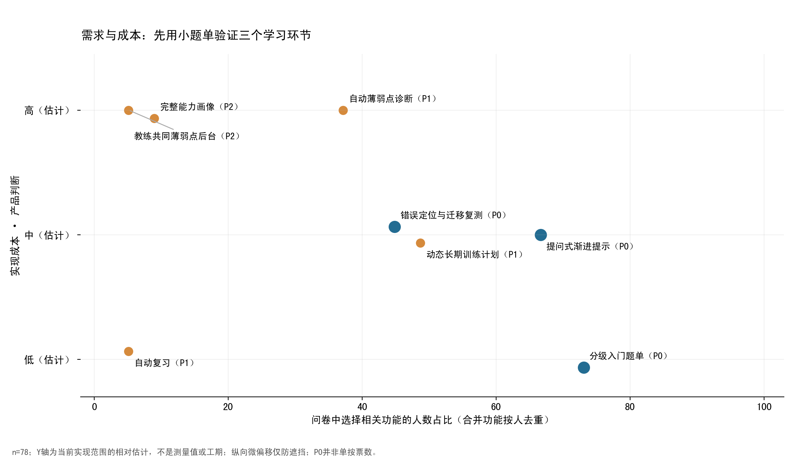

# Personal ACM Training Agent 产品规划

日期：2026-09-27。输入：[78份问卷研究](../research/freshman-survey-analysis-2026.md)。状态：**待验证产品方案，尚未证明学习效果、留存或市场成立**。证据索引见[evidence_ledger.csv](../../artifacts/survey/evidence_ledger.csv)。

## 1. 产品目标与首批用户

帮助处于“语法入门→独立解题”阶段的新生，用当前能承受的题目、适量提示和可验证反馈，逐渐具备独立实现能力。首批以本次培训中的基础薄弱学习者为主，保留数组及以上者作为分层比较对象。目标不是最大化AC数或对话时长。

E01：53/78处于语法及以下；E02：基础、算法选择、Bug是前三项直接困难；E03：53/78看完题解仍写不出；E04：27/71用AI过题却未掌握。产品价值主张应是“今天练什么，卡在哪里，得到帮助后是否真的能独立完成”，效果最终由复测验证。

三种使用情境，而非人格标签：尚未接触者需要基础语法和可完成任务；基础语法者需要题意→算法→代码的连接；数组及以上者需要更具体的错误解释和合适挑战。群体可随客观表现变化，不能把自评标签永久固化。

## 2. 替代方案与差异化的检验

| 替代方案 | 当前能提供什么 | 约束/不足 | MVP应承担的工作 |
| --- | --- | --- | --- |
| 自己思考、教材、网课、搜索/博客 | 知识学习，形成自己的思路，低成本 | 资料与阶段可能不匹配；反馈慢 | 明确前置知识、建议下一步；保留独立思考时间 |
| OJ、题单、题解 | 题目、样例、判题反馈，部分已有路径/解析 | AC本身不测独立掌握；不同OJ能力各异 | 复用OJ与精选题单；不重建平台 |
| 普通LLM/编程助手 | 本样本已大量用于题意、知识、思路和WA解释 | 受访者遇到错答/未掌握；通用工具也能做提示与记忆 | 必须比较“普通AI＋明确学习提示词”，不能设置弱对照 |
| 学长、同学、真人教练 | 情境判断、基础教学、课程组织、情感支持 | 有人不好意思问、不知如何描述，时间有限 | 先整理问题，由学生主动选择真人协助 |
| 专用训练Agent（假设） | 受控题单＋按需引导＋可验证错误＋迁移复测 | 仍可能错答、提示泄露、过度自动化，有实现和使用成本 | 用行为证据证明比上述组合更好，否则回到更简单方案 |

护城河不能只写“长期记忆、RAG或多Agent”。可检验的差异是：记得什么证据、据何改变下一题、怎样限制答案泄露、如何发现学生没有学会。若固定教练题单＋结构化提示取得同等效果，应优先交付这个低成本方案。

## 3. 优先级原则与范围冻结

不按投票简单排序，也不把主观权重算成精确ROI。依次检查：是否对应直接证据；是否能在两三周内形成可观察学习终点；是否有低成本替代；错误风险能否控制；是否依赖未具备的长期数据。需求频率是观察值，训练价值和成本是主观估计。

| 级别 | 范围 | 原因 |
| --- | --- | --- |
| P0 | 分级入门题单、提问式渐进提示、错误定位与迁移复测 | 对准“起点/卡住/不会复用”，三项可构成最小闭环 |
| P1 | 有连续证据的阶段计划、可解释薄弱点、复习调度、稳定求助摘要 | 先有真实记录，避免空想画像；复习可先人工 |
| P2 | 多训练方向、比赛复盘、经过教练验证的团队分析、跨校适配 | 需要新群体和长期数据 |
| Not Now | 自主参赛、开放式代码执行、全量OJ接入、自研模型、社交/排行榜、复杂商业化 | 当前证据不足、风险或成本过高，无法帮助首轮验证 |

57/78选择适配题目，但“不知道刷什么”仅11/78；因此先验证“选中的题是否合适”，不是开发推荐算法。自动计划38/78投票较高，V1只用规则给本周3题，动态计划作为后续能力。错题复习票数较低仍可作为学习效果测量环节；**实验测量不自动等于用户愿意长期使用的功能**。

## 4. MVP V1：只做三个用户能力

### 功能一：分级入门题单

| 项目 | 设计 |
| --- | --- |
| 痛点与证据 | E01/E02/E05：53/78语法及以下，57/78选择适配推荐；26/78缺训练计划 |
| 场景 | 初次进入不知道从何处开始；做题过难后需要更小的前置练习 |
| 输入 | 3–5道短诊断/代码阅读与补全题、用户自评、可用时间；总入口控制在10分钟内，可跳过并标记未知 |
| 处理 | 教练审定知识依赖与难度，按已证实/待验证技能分档；规则选择本周3题，提供降级/换题入口 |
| 输出 | 当前下一题、推荐理由、一个前置知识链接、做到什么程度算本次通过 |
| 技术难度 | 低；20–30题静态元数据＋规则即可，LLM不参与基础选题评分 |
| 验证 | 实际开始率、明显过易/过难/弃做比例、固定时段内无辅助完成和迁移表现 |
| 现在做的原因 | 高频、便于人工验证；能把个性化假设与AI本身的效果分开 |
| 范围限制 | 只做C++入门；不抓取全站OJ，不用赛级标签包装复杂能力画像 |

### 功能二：提问式渐进提示

| 项目 | 设计 |
| --- | --- |
| 痛点与证据 | E03/E06/E07：看懂写不出53/78；提示/提问引导去重52/78；不会描述问题33/78 |
| 场景 | 学生理解题面但不知道从哪一步开始；基础问题不愿当众问 |
| 输入 | 题面/知识点、当前思路或一小段代码、已经尝试什么、用户明确的求助请求 |
| 处理 | 优先询问一个能够区分卡点的问题；使用教练提示骨架，LLM只调整措辞或解释深度；每次保留可尝试的小步骤 |
| 输出 | 一个诊断问题或一条提示＋可执行下一步；用户选择继续、换解释、退出或查看完整解释 |
| 技术难度 | 中；提示层级状态、受控题目上下文、版本化提示、泄露检查与人工抽检 |
| 验证 | 无辅助迁移完成率；明确请求前的答案泄露率；用户反复卡住/拒绝引导的比例 |
| 现在做的原因 | 唯一优先提问引导16/78，仅次于推荐题目17/78；直接可做对照实验 |
| 范围限制 | 不强制6级Hint；默认最多3个可行动提示；无法继续时允许解释，不把拒绝给答案当教学成功 |

建议提示粒度：先确认题意/小例子，再提示关键性质，再给实现轮廓；用户明确选择后才给完整解释，并记录已暴露答案。不给自动弹窗设固定分钟阈值：Q20中21人希望尝试代码后、23人希望10–20分钟后，28人选择明确请求或自己决定，偏好分散。默认“随时可请求、不会主动打断”，允许个人设置。

基础问答作为该流程内的交互能力，而不是额外模块。错误提示应说清系统不确定之处，不把猜测当判题结果。发生题面歧义、超过两轮仍无进展、模型推断无法复核时，生成用户可编辑的“题目—尝试—预期—实际—已试方案”，由用户决定如何找真人。

### 功能三：错误定位与迁移复测

| 项目 | 设计 |
| --- | --- |
| 痛点与证据 | E02/E03/E04：Bug29/78、卡点不明39/78、AI后未掌握27/71；35/78选择检查代码或WA/TLE/RE分析（按人去重） |
| 场景 | OJ返回CE/WA，学生不知道错误根因；修复之后需要确认并非只照抄 |
| 输入 | 用户主动提供的代码片段、OJ状态、样例/反例、实际输出；只上传自己允许的内容 |
| 处理 | 对有限题库先查可复现证据，再生成错误假设/最小修复方向；学生自己修改；记录一条经确认的错误标签，指定相近迁移题 |
| 输出 | “观察事实/可能原因/验证办法”三部分，当前修复反馈与下一次无辅助检查 |
| 技术难度 | 中（限题库和外部OJ）；通用安全代码执行平台是另一项高成本能力，不纳入V1 |
| 验证 | 同类错误重复率、独立迁移成功、错误诊断被证据否定的比例；WA→AC仅作过程指标 |
| 现在做的原因 | 可以检验“过题不等于掌握”的核心风险，错误记录可由用户确认，数据负担小 |
| 范围限制 | CE/常见WA优先；TLE/RE可接受结果和解释，但不承诺所有类别自动诊断；MLE与复杂竞赛性能分析后置 |

“没有被证据支持”必须能成为输出。真实判题由现有OJ或人工受控检查完成，首轮不在应用服务器直接运行任意学生代码。学生点击“AC”仅算自报事件，不纳入经核验完成率。

## 5. 最小训练闭环与实现责任

| 环节 | V1怎么做 | 是否需要LLM/自动化 |
| --- | --- | --- |
| 首次进入、告知与同意 | 简短说明、可选记录项、研究单独同意、退出可行 | 常规表单，无需LLM |
| 初始检查与画像 | 自评＋3–5短任务；未知能力标未知，记录证据来源 | 教练规则；不生成六维精确分 |
| 周内任务 | 3题及理由，可调整；优先补前置缺口 | 人工题库＋规则 |
| 开始做题与卡住 | 自主计时/请求帮助，不依在线时长强行判断投入 | 常规事件记录；允许暂停 |
| 提示/解释 | 当前题的可行动引导，按需分层 | 教练骨架；LLM可选地调整措辞 |
| 提交与错误核验 | 使用原OJ，记录来源；对试点关键题人工检查 | OJ/受控测试，不由LLM裁定正确 |
| 修复 | 给证据与检查建议，用户改代码 | LLM提出假设，规则/真人验真 |
| AC之后 | 确认一条错误原因；“已得到完整解释”与“独立完成”分开 | 规则记录，用户可改、可删 |
| 迁移/复习 | 同难度新题不提供帮助；48–72小时安排一次保持检查 | 人工选题与盲评；这是试点初始窗口，不是遗忘规律 |
| 周末复盘/下一周 | 展示已做/待验证/反复错误，给一项下一步；可人工写 | 简单汇总先行；不需另建自动周报模块 |

“固定题单＋提示＋复测”即可走通闭环。禁止将相同题重复AC、看过完整解答后提交、模型自评理解良好直接写成“已掌握”。

## 6. 最小数据模型与隐私

| 实体 | 最小字段 | 边界 |
| --- | --- | --- |
| learner | 随机ID、当前规则层级、可用时段、帮助偏好、分项授权 | 不需要手机号/学号；研究招募联系方式分库存放，不关联本匿名问卷 |
| problem | 题ID、知识点、前置要求、阶段难度、来源、版本、审定状态 | 首批人工维护；获得题目使用许可或只存链接 |
| session | 学生ID、题ID、实验条件、开始/暂停/结束、完成来源 | 事件时间用于真实试验，研究导出按日期/时长分档；不要收设备指纹/IP画像 |
| assistance | 请求、提示层级、提示版本、是否完整解释、人工接管 | 默认不存对话全文；用户可查看记录含义 |
| attempt | 经核验状态、核验方式、错误主题、关联知识点、证据置信度 | 学生自报与OJ/人工核验分开；代码保存另行同意 |
| transfer_check | 匹配新题、无辅助状态、盲评分、延迟窗口、缺失原因 | 与训练AC分开；未参与不得静默当成功 |
| skill_evidence | 知识点、证据类型、最近独立成功/反例、待验证项 | 不编造智力/人格标签；可纠正或撤销 |

65/78愿记录常错知识点、19/78愿记录AI对话；这只是偏好。上线重新解释目的、保存期限、可访问者，并分别取得授权；1人同时选择拒绝与允许时按拒绝处理。试点建议默认保存派生研究数据30天；需要更长时重新说明，联系信息和原文尽早删除。保留多久是方案选择，不是问卷结论。

个人记录默认仅本人和获授权研究人员可见，教练仅见经授权且最小组规模≥5的聚合，不展示学生原始代码/对话。小组规模阈值是产品建议，不宣称完整匿名。未成年人招募按学校适用研究流程确认同意要求。退出不影响课程权益。

## 7. 技术建议与当前Demo差距

本仓库README描述的现状是Next.js/React前端、本地模拟学员/题目、localStorage、规则训练策略与演示Hint流程；没有真实账户隔离、服务端授权、实时判题或LLM调用。问卷分析没有修改应用代码，也没有验证这些模拟功能具备学习效果。

可复用训练页、题单呈现、按需Hint交互、结构化结果接口等界面。真实试点至少补齐：参加者隔离和服务端授权、事件落库、题库/提示版本、真实判题或人工核验来源、退出与删除、实验条件分配、最小审计。无需重构成微服务；单个应用服务＋轻量关系库即可。

规则承担分层、任务选取、权限、记录、提示层级与指标计算。成熟LLM接口只承担有限上下文解释/诊断建议；模型可替换，先用固定提示与人工服务验证，不做模型训练或embedding用户聚类。重试有预算上限，错误回退到专家提示或人工说明，不无限重试。

调用外部模型前明确告知输入范围；代码可能带姓名/注释，发送前提示用户检查，服务端执行最小化与脱敏。题面/代码是数据，不能让其中的指令改变系统权限、答案门控或数据访问。只检索已审定的题解与知识，引用可核查依据。

如后续必须自建执行环境，应是独立隔离沙箱、断网、非特权、资源/时间限额、只读基础镜像与临时文件清理；那是后续工程门槛，不能把Demo服务器上的普通子进程当安全判题服务。

## 8. 当前不开发

- 不拓展到全部竞赛算法、考研/面试多方向、跨校题目抓取：当前研究只覆盖该新生样本。
- 不做全国推广、收费预测、用户裂变和复杂商业化：问卷没有付费与获客证据。
- 不做社区、复杂排行、奖励积分：没有证据它们解决基础与迁移断点，还可能加强表现压力。
- 不做大型教练看板：学生投票不能代表教练需求；先每周一页汇总并访谈教练。
- 不做自动参赛、比赛中主动提示、未经确认的完整代码流：训练帮助与比赛规则分开。
- 不做全量永久对话记忆和模型生成的精确能力评分；先保存证据与用户确认标签。
- 不自研大模型、不上多Agent编排/复杂微服务；如果规则可达成同样效果，应选规则。

## 9. 五个MVP核心指标

以下定义先写入分析方案，再收结果；同时报告人数、分母、缺失和区间，不能只报百分比。北极星是第1项。

| 指标 | 操作定义 | 注意事项 |
| --- | --- | --- |
| **无辅助迁移完成率（北极星）** | 分配后的等价新题，在限定窗口内无AI/题解/真人帮助并达盲评合格标准的次数 ÷ 所有预定迁移任务 | 主要分析按分配组；未参加作为未成功，另给完成者分析与缺失原因；不以提示后AC替代 |
| 延迟保持/同类错误重复率 | 48–72小时检查中，在有机会触发同一错误的复测任务上重复该错误次数 ÷ 预定同类错误机会 | 同一人多题相关；报告每人汇总。未复测单列，不能当没有重复 |
| 7日持续训练率 | 首次核心练习后第6–8天内至少一次有效练习的激活用户 ÷ 拥有完整观察窗口的激活用户 | 有效练习须有代码/作答/有效尝试证据，非打开页面；未到窗口不入分母 |
| 提前完整答案泄露率 | 用户尚未明确请求完整解释时，人工判定泄露关键完整解法的抽查回复 ÷ 所有同条件抽查回复 | 按题/层级分层抽样，记录模型与提示版本；少量样本零事件也不能证明零风险 |
| 单次有效独立完成的支持成本 | 模型费用＋核验/客服/教练时间折算成本 ÷ 经核验独立迁移成功次数 | 同时报告总成本和分母；分母为0不计算比值，避免以增加人力美化效果 |

过程指标保留提示次数、完整解释请求、WA→AC、周任务完成、弃题原因、求助升级；它们是诊断工具，不能每项都称北极星。满意度/愿意试用只能补充，65/78愿意试用不能替代任何真实留存指标。

早期参考门槛属于**待预注册的管理选择**：迁移提升目标至少10个百分点、答案提前泄露抽查≤5%、7日持续训练≥50%；均需结合区间与样本数判断，不能因小样本点估计过线就扩张。先收可行性数据，再按基线和可接受成本确定正式门槛。

## 10. Phase 0–4路线图

| 阶段 | 目标与功能 | 关键指标/数据 | 主要风险 | 进入下一阶段条件 |
| --- | --- | --- | --- | --- |
| Phase 0：需求验证 | 复核问卷配置；8–12人案例访谈；教学改进与人工小题单；12–18人流程试点 | 近期做题/求助/验证实例、基线诊断、提示与复测日志；教练3–5人访谈 | 意愿替代行为、研究者迎合、样本自选 | 任务可理解、数据链路可靠；至少两轮试用能辨识卡点，已能实际完成无辅助复测；无关键隐私/答案门控故障 |
| Phase 1：本校新生MVP | 三项P0、有限题库、真实核验；普通AI/固定提示对照 | 北极星、保持、D7、泄露、成本；预注册效应目标与缺失处理 | 题目难度/老师/练习量混杂，短期新鲜感 | 相对简单替代方案的学习收益有重复证据，区间达到可接受范围；持续训练与成本可承受；不能仅凭“显著”晋级 |
| Phase 2：本校训练队 | 验证后加入老队员、阶段规则、复习；教练授权汇总 | 4–8周训练证据、能力层效果差异、教练实际使用/节省时间 | 新生需求误推广至老队员、看板无人用、标签固化 | 多基础组不出现系统性损害，教练主动使用并能解释价值；有稳定运行与授权流程 |
| Phase 3：其他学校测试 | 2–3所不同训练组织的小规模复现；题库/课程差异适配 | 校际差异、适配成本、独立迁移效果、招募/弃用原因 | 单校组织优势不可复制，题源和课程依赖 | 每校独立报告，效果方向与边界可解释；适配成本不高于可承受支持预算 |
| Phase 4：更广泛产品化 | 有需求的多方向、正式运营、适当收费试验 | 真实付费/续用、服务可靠性、单位经济、长期学习结果 | 市场外推、商业目标损害学习、数据管理扩张 | 前阶段均通过；付费试验本身有证据，不从当前问卷预测收入 |

前两个阶段可参考2周需求/流程验证、2–4周MVP与小样本试验，但它们是排期假设，实际按人员与题库准备调整。失败时的动作是缩小到题单/教练提示或停止投入，不以增加功能掩盖学习结果无改善。

## 11. 风险与下一步动作

主要风险：AI错答、提示伪装成完整答案、学生被迫接受苏格拉底式追问、迁移题泄露、时间负担导致弃用、真实课程变化与AI效果混杂、数据过度保存。对策必须能落到抽查/日志/对照中，不能只写“优化Prompt”。

明天可开始的顺序：与教练确认课程前置关系和20–30道候选题；选6–9组等价题检查难度；做一次10分钟新生走查；冻结三能力范围和事件字典；用人工版本先服务一小组；再决定哪些环节值得接入LLM。详情见[下一轮研究计划](../research/next-research-plan.md)。
