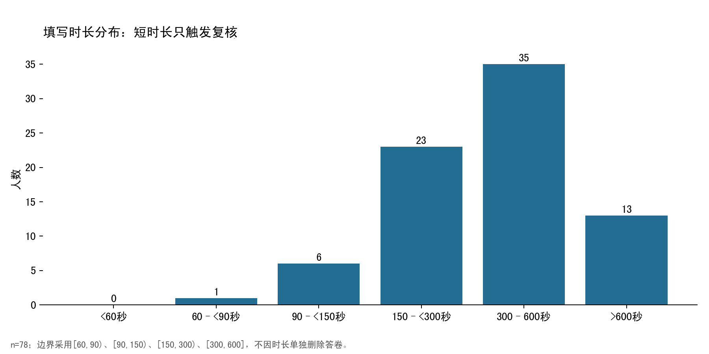
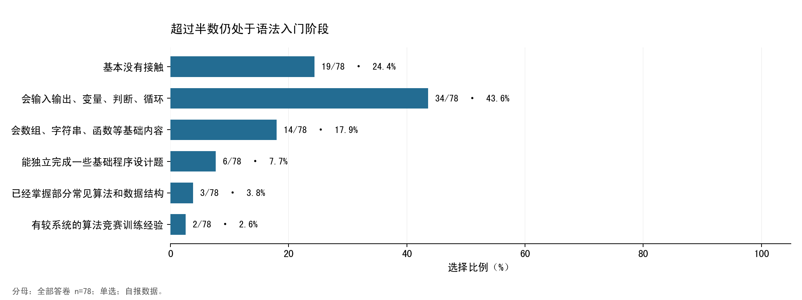
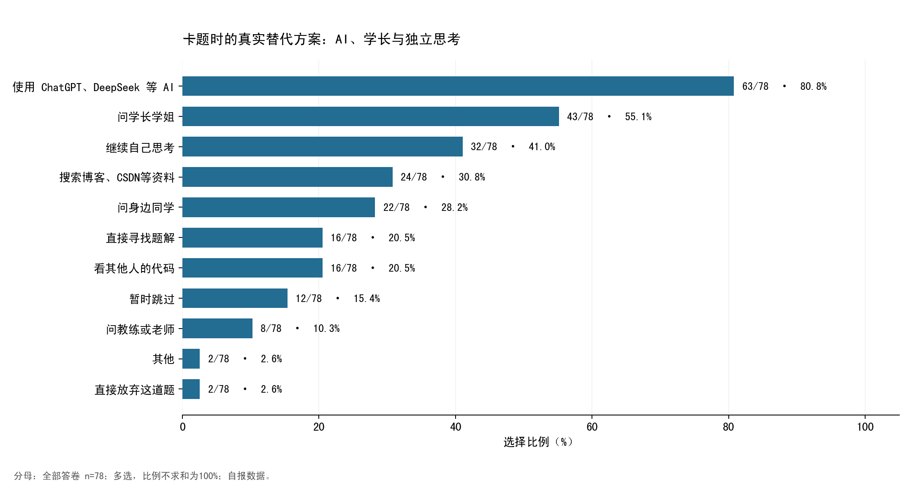
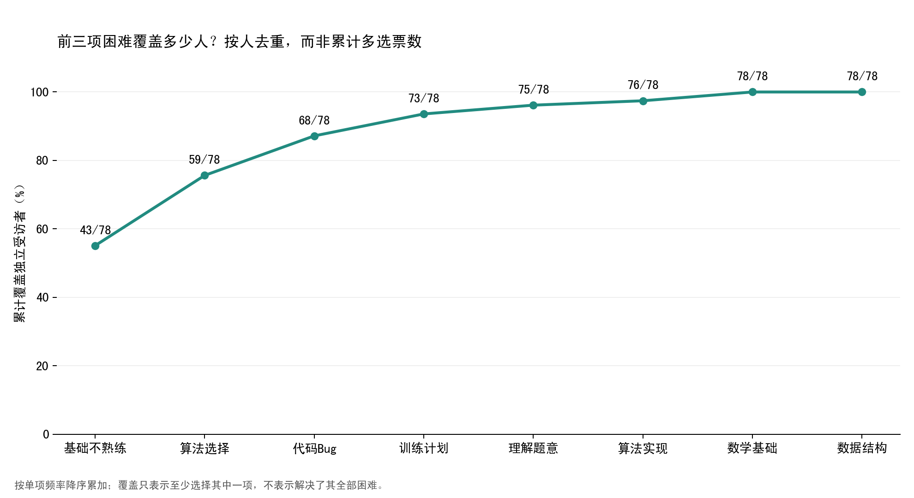
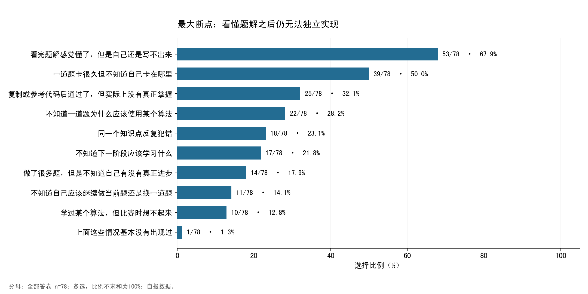
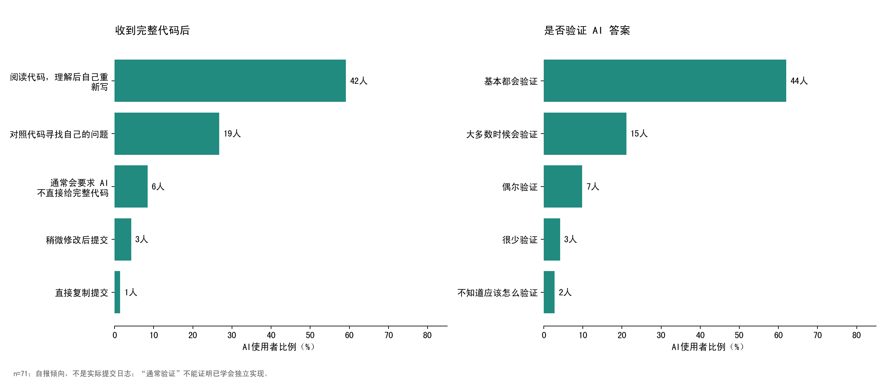
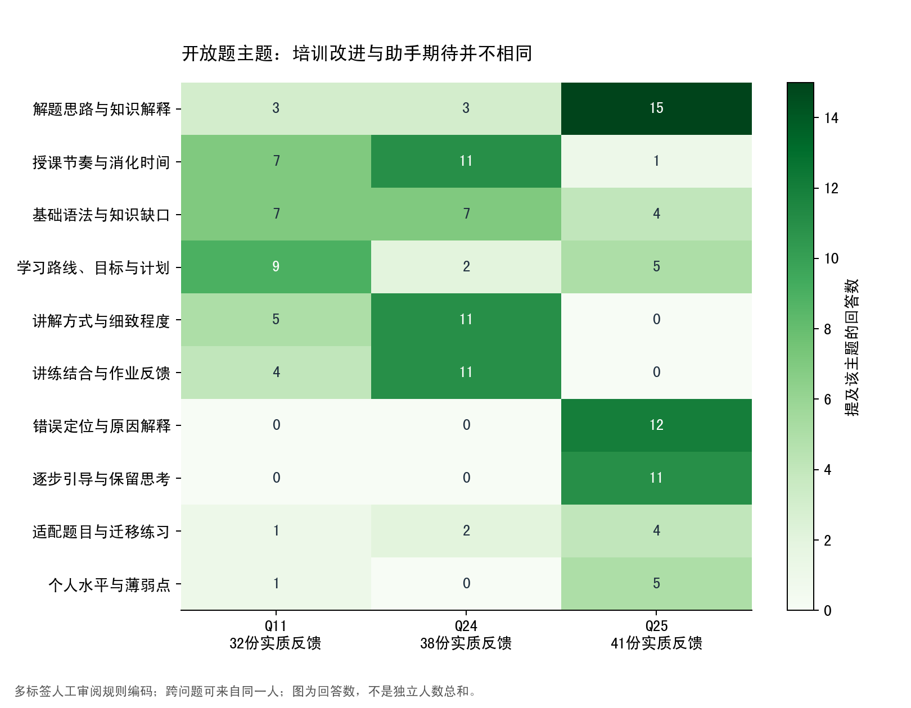
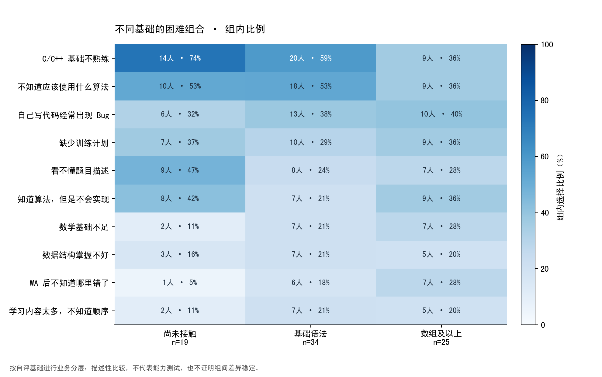
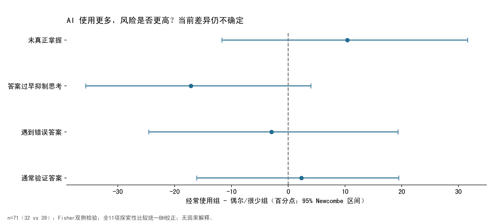
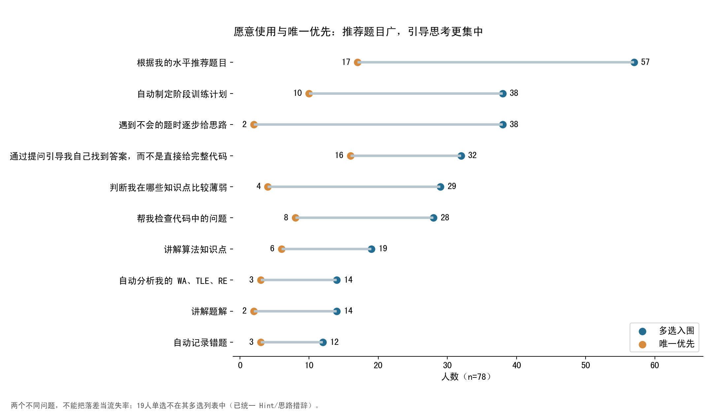

# ACM 新生培训与 AI 使用情况调研报告

分析日期：2026-09-27。研究对象：本次问卷覆盖的 78 名受访者。本文不据此推断全国新生、学校总体或产品市场规模。

## 1. 执行摘要

**优先验证：让入门学生在获得帮助后，能独立完成一道相近但没见过的题。** 问卷证明了困难和偏好，尚未证明 Agent 能改善学习。

- **基础与实现的断层比“更多答案”更突出。** 53/78（67.9%）自评处于尚未接触或基础语法阶段；53/78（67.9%）遇到“题解懂、自己写不出”。Q5前三项直接困难是基础、算法选择、代码Bug，去重覆盖68/78（87.2%）。
- **AI已经是主要求助入口，可靠性和掌握度却未被保证。** 63/78（80.8%）把AI列为卡题处理方式；在71名适用使用者中，30/71（42.3%）遇到错答，27/71（38.0%）做出了题却未掌握。
- **最值得做小实验的是题目适配、提问式提示、错误定位后的迁移复测。** 水平适配题目获57/78（73.1%）；提示或提问引导合计去重52/78。这是功能假设，不是功能有效性的证据。
- **培训组织必须同时改进。** 有效培训改进反馈中，讲解方式、授课节奏、讲练结合反复出现。先做基础分层、预习要点、作业讲评与课内练习，可能比新增AI模块便宜。
- **需要克制的结论。** 所有11项探索检验的BH校正q值均≥0.062；不能断言AI用得越多越学不会，也不能把试用意愿当留存或付费证据。

推荐阅读：[产品规划](../product/personal-acm-agent-plan.md)、[下一轮验证计划](next-research-plan.md)、[完整图表集](../../artifacts/survey/index.html)、[图表PDF](../../artifacts/survey/survey-charts.pdf)。

## 2. 数据来源、问卷结构与隐私

目标文件位于 `data/user-research/freshman-training-2026/386540716_按文本_新生培训情况与 AI 使用情况匿名调查问卷_79_78.xlsx`。仓库中仅发现一份精确同名文件，无重复导出待择优。本次读取所有Sheet：`Sheet1`，78行、31列，包括6个系统字段、25道题。没有把文件名的数字解释为人数或有效率。

25题中，单选13题，多选9题（Q5/7/9/10/13/14/17/18/22）、开放题3题（Q11/24/25）；无数值评分题。多选用 `┋` 分隔，“其他〖附言〗”仅保留“其他”类别。Q19的“逐步给Hint”与Q18的“逐步给思路”统一为同一项。题目与用途详见[字段字典](../../artifacts/survey/data_dictionary.csv)。

Q12回答“听说过但基本没有使用”或“从来没有使用”的7人，Q13–17全部为“(跳过)”，与跳题一致；不能把这7人编码成“从不验证”“从未遇到AI错误”。这是由答案模式推断的跳题规则，没有原始问卷配置文件。

系统字段存在原始序号、精确提交时间、来源、来源详情、IP及IP附带位置。开放题也出现了人物称呼、教学资源名称及地点。清洗输出删除身份相关系统字段，时长仅保留分档，开放题只保留主题和是否有实质内容；不发布逐字原文或“其他”附言。行顺序打散后生成独立分析编号，不输出原始行号映射。报告案例采用汇总改述，不对应具体学生。

清洗文件是**去标识的研究微数据**，并未声称达到k匿名：稀有答案组合仍有再识别风险，应限研究团队使用，对外只提供汇总报告与图表。未使用身份字段与其他数据匹配任何学生；原文只在本地分析，没有发送到外部模型。详细版本、源文件SHA-256和输出清单见[manifest.json](../../artifacts/survey/manifest.json)。

## 3. 数据质量与清洗

| 项目 | 结果 | 口径 |
| --- | --- | --- |
| 读取工作表 | Sheet1 | 已读取全部工作表；本文件仅一个答卷表 |
| 总答卷 | 78 | 按Excel行数计算，不解释文件名数字 |
| valid | 73 | 未触发本次互斥/跳题质量规则，不等于已证明真实 |
| suspected | 5 | 互斥选项并选，保留主分析 |
| invalid | 0 | 未发现足够强的整份剔除依据 |
| 主分析保留 | 78 | 保留率100%；严格valid占比为93.6% |
| AI细节题分母 | 71 | Q13–Q17；其余7份为结构性跳过 |
| 整行完全重复 | 0 | 包括系统字段 |
| 全部题目内容完全重复 | 0 | 排除系统字段 |
| Q19不在本人Q18所选列表 | 19 | 已统一Hint/思路措辞；只标记，不判无效 |

“有效”采用两种口径：主分析保留valid+suspected共78份；若仅计valid，则为73/78（93.6%）。没有理由将5份疑似答卷整份判废。五人各触发一处互斥矛盾：Q9“没有顾虑”与顾虑并选2人，Q17“无明显问题”与问题并选2人，Q22“不愿长期记录”与可记录项并选1人。Q10不存在“上述没有”与其他项并选。Q22分析保存原选择并提供“拒绝优先”的保守口径，绝不把矛盾选择当授权。

问卷题目没有真实空单元格；系统“来源详情”3个空单元格不参与分析。开放题的“(空)”分别为44、35、37份，另有无具体建议/暂不清楚/简单肯定的2、5、0份；这不等于乱填。每题缺失口径见[missingness.csv](../../artifacts/survey/missingness.csv)。

填写时长中位数357秒，范围61–1499秒。仅1人短于90秒，不单独判低质量；其答案仍有可解释性。无法从文本导出还原所有选项位置，因此没有伪造“直线作答检测”。Q5最多选5项，39人选满5项；Q18最多选5项，51人选满5项。**可能存在最多选5项的限制，但配置未获确认**；这些不是“异常全选”，低票项目也可能是被迫取舍。

同IP并非重复个体：校园网络可共享出口；即使52个IP/位置值对应78人，也不能按IP删人。全部题目内容完全重复为0，仍不能排除同一人不同回答等未观察重复。

敏感性分析排除5份suspected，以73人为全题分母、AI细节按其中适用者重算。全部闭合选项比例变动的最大绝对值为3.48个百分点；基础/算法/Bug仍为Q5前三项，题目适配仍为Q18第一项。细节见[sensitivity_analysis.csv](../../artifacts/survey/sensitivity_analysis.csv)。该稳健性只涉及质量筛选，不消除便利样本、问法或自报偏差。

## 4. 新生基础与当前训练方式

| 排名 | 选项 | 人数 | 分母 | 比例（%） |
| --- | --- | --- | --- | --- |
| 1 | 1个月以内 | 48 | 78 | 61.5 |
| 2 | 还没有正式开始学习 | 17 | 78 | 21.8 |
| 3 | 1～3个月 | 9 | 78 | 11.5 |
| 4 | 1年以上 | 3 | 78 | 3.8 |
| 5 | 3～6个月 | 1 | 78 | 1.3 |

尚未正式学习或接触不足一个月合计65/78。无程序设计竞赛经历为75/78（96.2%）。这批人更接近“从语法走向解题”的新生，不能用成熟竞赛选手需求替代他们。

每周2–5小时最多（23/78（29.5%））；13/78（16.7%）无固定时间。10小时以上共17人。无固定时间不是零投入，时间档位也不能被当成精确工时或学习效率。

不会做题时，52/78（66.7%）通常在15分钟以内求助；还有没有固定习惯者。长时间不会时，AI被选择63次，问学长43次，继续思考32次，搜索博客24次，问教练/老师8次。多选不表示先后顺序，不能据此画真实转化漏斗。

暂时跳过题目为12/78（15.4%），直接放弃为2/78（2.6%）。这些只说明采取过/通常会采取该方式，不知道何时放弃、发生几次，更不能推断退队率。

## 5. 直接困难与更深的学习断点

| 排名 | 选项 | 人数 | 分母 | 比例（%） |
| --- | --- | --- | --- | --- |
| 1 | C/C++ 基础不熟练 | 43 | 78 | 55.1 |
| 2 | 不知道应该使用什么算法 | 37 | 78 | 47.4 |
| 3 | 自己写代码经常出现 Bug | 29 | 78 | 37.2 |
| 4 | 缺少训练计划 | 26 | 78 | 33.3 |
| 5 | 看不懂题目描述 | 24 | 78 | 30.8 |
| 5 | 知道算法，但是不会实现 | 24 | 78 | 30.8 |
| 7 | 数学基础不足 | 16 | 78 | 20.5 |
| 8 | 数据结构掌握不好 | 15 | 78 | 19.2 |
| 9 | WA 后不知道哪里错了 | 14 | 78 | 17.9 |
| 9 | 学习内容太多，不知道顺序 | 14 | 78 | 17.9 |
| 11 | TLE 后不知道如何优化 | 12 | 78 | 15.4 |
| 12 | 不知道应该刷什么题 | 11 | 78 | 14.1 |
| 13 | 学过知识之后很快忘记 | 10 | 78 | 12.8 |
| 14 | 不知道自己的薄弱点在哪里 | 7 | 78 | 9.0 |
| 15 | 看不懂题解 | 6 | 78 | 7.7 |
| 16 | 看不懂别人的代码 | 5 | 78 | 6.4 |
| 17 | 容易因为长时间不会做题而放弃 | 3 | 78 | 3.8 |

前三项“C/C++基础不熟练、算法选择、自己写代码有Bug”共109票，但只有68个独立受访者，覆盖率87.2%。本报告使用按人去重的覆盖曲线，不把多选累计票数误当“覆盖80%学生”。覆盖也不表示这三项被解决后其他问题会消失。

Q10补充了过程断点：53/78（67.9%）看懂却写不出，39/78（50.0%）不知道卡点，25/78（32.1%）参考代码过题但未掌握。Q5“看不懂题解”只有6人；所以单纯把题解讲得更详细未必能解决最大断点。

**频率×影响矩阵（影响为产品判断，并未测量损失时长）**：高频阈值设为全样本30%，只帮助决策，不作为统计定律。

| 频率与影响 | 本次例子 | 当前补救与责任边界 |
| --- | --- | --- |
| 高频＋高影响（判断） | 基础、算法选择、Bug、计划、题意、实现困难 | 基础分层、短题单、提示、定位错误；课程和练习设计由教练负责 |
| 高频＋低影响 | 无足够证据归类 | 不因为“基础”就判低影响 |
| 低频＋高影响（判断） | 数学不足、特定WA/TLE、卡住后放弃、阶段目标不清 | 数学课程/真人诊断；限题库Debug；允许求助升级 |
| 低频＋较低即时影响（判断） | 忘记已学内容等，若未阻断当前任务 | 先人工复测，尚不能据频率判断长期影响小 |

不需要把每项硬塞进四格。影响未知的保留未知。痛点与AI适配不是一回事：基础教学、目标说明、排课和反馈机制都有非AI解法。

## 6. 求助行为：不是“害怕老师”这一种解释

经常或偶尔想问却没问的人共61/78（78.2%）；其中经常20、偶尔41，很少16、从来没有1。

| 排名 | 选项 | 人数 | 分母 | 比例（%） |
| --- | --- | --- | --- | --- |
| 1 | 觉得问题太基础，不好意思问 | 49 | 78 | 62.8 |
| 2 | 不知道应该怎么描述自己的问题 | 33 | 78 | 42.3 |
| 3 | 比起问别人，更习惯询问 AI | 26 | 78 | 33.3 |
| 4 | 担心别人觉得自己能力比较差 | 25 | 78 | 32.1 |
| 4 | 面对面交流有些紧张或尴尬 | 25 | 78 | 32.1 |
| 6 | 担心影响别人 | 22 | 78 | 28.2 |
| 6 | 有时候别人讲了之后仍然听不懂 | 22 | 78 | 28.2 |
| 8 | 比起问别人，更习惯自己搜索 | 20 | 78 | 25.6 |
| 9 | 不知道应该找谁问 | 11 | 78 | 14.1 |
| 10 | 我基本没有这方面顾虑 | 7 | 78 | 9.0 |
| 11 | 对方不一定有时间回复 | 6 | 78 | 7.7 |
| 12 | 其他 | 1 | 78 | 1.3 |

最常见的是觉得基础、不好意思问（49/78（62.8%）），其次是不知如何描述（33/78（42.3%））。担心能力被评价与面对面尴尬均25人；担心影响别人、别人讲了仍不懂均22人。反映的是问题表达、时间成本与解释可理解性，不是对某类老师态度的诊断。

产品机会是“先让我安全地问、再帮我把问题说清楚”：输入题目、尝试、预期、实际结果，生成用户可编辑的求助摘要，由用户主动提交给真人。重复卡住、题面歧义、学习路径/参与规则、AI答案无法验证时，应鼓励真人介入。系统不能擅自向教练分享原始对话或个体薄弱点。

## 7. AI使用：解释工具已普及，训练助手尚是待验证定位

经常/偶尔使用共61/78（78.2%），加上很少使用为71/78；其余7人不进入AI细节题分母。

| 排名 | 选项 | 人数 | 分母 | 比例（%） |
| --- | --- | --- | --- | --- |
| 1 | 豆包 | 50 | 71 | 70.4 |
| 2 | DeepSeek | 49 | 71 | 69.0 |
| 3 | 通义千问 | 18 | 71 | 25.4 |
| 4 | ChatGPT | 13 | 71 | 18.3 |
| 5 | Kimi | 7 | 71 | 9.9 |
| 6 | Gemini | 3 | 71 | 4.2 |
| 7 | Claude | 2 | 71 | 2.8 |
| 7 | GitHub Copilot | 2 | 71 | 2.8 |
| 7 | 其他 | 2 | 71 | 2.8 |
| 10 | Cursor | 1 | 71 | 1.4 |

豆包、DeepSeek在本样本比ChatGPT更常被提及。工具品牌是多选，不能用于计算市场份额，也不应围绕某单一品牌设计入口。

| 排名 | 选项 | 人数 | 分母 | 比例（%） |
| --- | --- | --- | --- | --- |
| 1 | 解释算法或知识点 | 44 | 71 | 62.0 |
| 2 | 解释题目 | 40 | 71 | 56.3 |
| 3 | 给出做题思路 | 36 | 71 | 50.7 |
| 4 | 分析 WA 原因 | 26 | 71 | 36.6 |
| 5 | 给提示 | 23 | 71 | 32.4 |
| 6 | 总结知识点 | 20 | 71 | 28.2 |
| 6 | 解释别人的代码 | 20 | 71 | 28.2 |
| 6 | 解释题解 | 20 | 71 | 28.2 |
| 9 | 分析 TLE 原因 | 15 | 71 | 21.1 |
| 10 | 优化代码 | 14 | 71 | 19.7 |
| 11 | Debug | 12 | 71 | 16.9 |
| 11 | 制定学习计划 | 12 | 71 | 16.9 |
| 13 | 推荐学习内容 | 10 | 71 | 14.1 |
| 14 | 直接生成完整代码 | 6 | 71 | 8.5 |
| 15 | 其他 | 2 | 71 | 2.8 |

解释知识点、题意与思路最常见，完整代码生成仅6/71（8.5%）。这更支持“即时讲解/解题支持”的角色；长期助手需要跨时段证据，本次没有测得。Debug有多种措辞：选“Debug”仅12人，但“分析WA”26人，不能只按英语功能名判断需求。各选项可能重叠，不能简单相加。

当AI给完整代码时，理解后重写42/71（59.2%），对照查错19/71（26.8%）；稍改提交或直接复制共4/71。该低比例可能含社会赞许偏差，不能宣布不存在依赖问题。

通常会验证共59/71（83.1%），不知道如何验证2/71（2.8%）。**验证答案与掌握能力是两个维度**：在通常验证的人里，仍有23/59（39.0%）选了“AI后未真正掌握”。这里的验证方式没有被问到，运行样例、看起来合理与独立证明都可能被称为验证。

| 排名 | 选项 | 人数 | 分母 | 比例（%） |
| --- | --- | --- | --- | --- |
| 1 | AI 给出了错误答案 | 30 | 71 | 42.3 |
| 2 | 使用 AI 后虽然题做出来了，但自己没有真正掌握 | 27 | 71 | 38.0 |
| 3 | 代码能够运行，但是思路并不正确 | 23 | 71 | 32.4 |
| 4 | AI 直接把完整答案告诉我，导致自己缺少思考 | 20 | 71 | 28.2 |
| 5 | AI 不了解我的真实学习水平 | 16 | 71 | 22.5 |
| 5 | 不知道 AI 的答案是否可信 | 16 | 71 | 22.5 |
| 7 | AI 无法长期记录我的训练情况 | 15 | 71 | 21.1 |
| 7 | AI 的解释太复杂 | 15 | 71 | 21.1 |
| 9 | 同一个问题多次询问得到不同答案 | 12 | 71 | 16.9 |
| 10 | AI 的解释太简单 | 11 | 71 | 15.5 |
| 11 | 暂时没有明显问题 | 10 | 71 | 14.1 |
| 12 | 不知道应该怎么向 AI 提问 | 9 | 71 | 12.7 |
| 13 | AI 不知道我以前学过什么 | 7 | 71 | 9.9 |
| 14 | AI 推荐的学习内容不适合自己 | 4 | 71 | 5.6 |
| 15 | 其他 | 1 | 71 | 1.4 |

“AI不了解我的真实水平”16/71（22.5%），“无法长期记录”15/71（21.1%）：确有迹象，却弱于错答和未掌握。不能用本问卷证明必须先做复杂长期记忆。

## 8. 开放题：组织改进与助手期待要分开

逐条读取3道开放题，实质文本分别为32、38、41份，共111个“人×题”回答；不能称111名学生。采用审阅后的领域短语规则进行多标签编码，不依赖外部embedding、词云或情感打分。已检查“逐步增加难度”不是解题Hint、“清晰目标”不是清晰讲解等歧义；无具体内容的回复单列。未按观点正负判问卷质量。

方法可复现，但只有一个分析者，没有第二编码者一致性检验；频率体现编码决定，不是客观测量真值。代码本见[topic_codebook.csv](../../artifacts/survey/topic_codebook.csv)，每份去标识清洗记录保存标签，可检查计数；原文未随清洗表发布。跨题去重人数另见[open_topics_unique_respondents.csv](../../artifacts/survey/open_topics_unique_respondents.csv)。

### 8.1 最想匿名提出的问题（Q11，32份实质文本）

| 主题 | 回答数 | 有效文本分母 | 提及率（%） |
| --- | --- | --- | --- |
| 学习路线、目标与计划 | 9 | 32 | 28.1 |
| 授课节奏与消化时间 | 7 | 32 | 21.9 |
| 基础语法与知识缺口 | 7 | 32 | 21.9 |
| 讲解方式与细致程度 | 5 | 32 | 15.6 |
| 讲练结合与作业反馈 | 4 | 32 | 12.5 |
| 解题思路与知识解释 | 3 | 32 | 9.4 |
| 时间地点与组织安排 | 2 | 32 | 6.2 |
| 更高难度与竞赛目标 | 2 | 32 | 6.2 |
| 适配题目与迁移练习 | 1 | 32 | 3.1 |
| 个人水平与薄弱点 | 1 | 32 | 3.1 |
| 题意理解与表达 | 1 | 32 | 3.1 |
| 信心、乐趣与参与动力 | 1 | 32 | 3.1 |
| AI 使用边界与资源 | 1 | 32 | 3.1 |

主线是学习路线/目标、基础缺口和消化时间。汇总改述：不知道怎样把课程和题单衔接、当前水平适合从哪里开始、上一轮作业能否得到讲解。这些不要求先上AI。

### 8.2 最想改变的集训方式（Q24，38份实质文本）

| 主题 | 回答数 | 有效文本分母 | 提及率（%） |
| --- | --- | --- | --- |
| 授课节奏与消化时间 | 11 | 38 | 28.9 |
| 讲解方式与细致程度 | 11 | 38 | 28.9 |
| 讲练结合与作业反馈 | 11 | 38 | 28.9 |
| 基础语法与知识缺口 | 7 | 38 | 18.4 |
| 时间地点与组织安排 | 4 | 38 | 10.5 |
| 解题思路与知识解释 | 3 | 38 | 7.9 |
| 学习路线、目标与计划 | 2 | 38 | 5.3 |
| 真人答疑与求助负担 | 2 | 38 | 5.3 |
| 适配题目与迁移练习 | 2 | 38 | 5.3 |
| 更高难度与竞赛目标 | 2 | 38 | 5.3 |
| 错题复习与巩固 | 1 | 38 | 2.6 |
| 信心、乐趣与参与动力 | 1 | 38 | 2.6 |
| 诉求不够具体 | 1 | 38 | 2.6 |

“讲慢、讲清、讲完后练、上次题目讲评”反复出现；也有希望更具挑战、更多竞赛经验的反馈。不能由多数入门者的反馈把全部培训统一放慢，宜提供分层路线与可自主选择的进度。地点/时间与资源可及性属于组织安排；报告只给主题，不引用可能识别学生的具体地点或人物。

### 8.3 理想ACM AI（Q25，41份实质文本）

| 主题 | 回答数 | 有效文本分母 | 提及率（%） |
| --- | --- | --- | --- |
| 解题思路与知识解释 | 15 | 41 | 36.6 |
| 错误定位与原因解释 | 12 | 41 | 29.3 |
| 逐步引导与保留思考 | 11 | 41 | 26.8 |
| 学习路线、目标与计划 | 5 | 41 | 12.2 |
| 个人水平与薄弱点 | 5 | 41 | 12.2 |
| 适配题目与迁移练习 | 4 | 41 | 9.8 |
| 基础语法与知识缺口 | 4 | 41 | 9.8 |
| 错题复习与巩固 | 4 | 41 | 9.8 |
| AI 使用边界与资源 | 2 | 41 | 4.9 |
| 授课节奏与消化时间 | 1 | 41 | 2.4 |
| 题意理解与表达 | 1 | 41 | 2.4 |
| 真人答疑与求助负担 | 1 | 41 | 2.4 |
| 信心、乐趣与参与动力 | 1 | 41 | 2.4 |
| 更高难度与竞赛目标 | 1 | 41 | 2.4 |
| 诉求不够具体 | 1 | 41 | 2.4 |

解题思路、逐步引导、错误原因成为具体期待。汇总改述：希望提示下一步、解释为什么错、再给相近练习；不是只给一段能运行的程序。“解决实际问题”等表达保留为不够具体，不推断成某项高级功能。复习虽不是功能投票热点，开放题存在“穿插以前错题”的主动建议，应做小验证。

不做词云的原因：每题只有32–41份有效文本，原词频容易被“AI、希望、问题”等词、同义措辞与长短回答左右。替代图11–13采用领域短语的文档频率，每份回答每类至多计一次，去除通用词。它们辅助观察，不承担需求排名的证明责任。

## 9. 关系分析与不确定性

按自评基础合并成3个可解释群体：尚未接触19人、基础语法34人、数组及以上25人。最后一组内部仍有明显异质性，不能等同“竞赛高手”。不在78份数据上强行聚类或绘制UMAP；未把有序选项当连续数值做PCA。

| 基础组 | 人数 | 比例（%） | 经常用AI | 无固定时间 | 每周≥10h | 题解懂但写不出 |
| --- | --- | --- | --- | --- | --- | --- |
| 尚未接触 | 19 | 24.4 | 5 | 6 | 0 | 16 |
| 基础语法 | 34 | 43.6 | 14 | 4 | 9 | 24 |
| 数组及以上 | 25 | 32.1 | 13 | 3 | 8 | 13 |

尚未接触组有16/19表示题解懂但写不出；基础语法组24/34，数组及以上13/25。可作为分层教学线索，不宜据小组百分比排序能力。尚未接触组没有人自报每周≥10小时，但时间档不能判断动机。≥10小时者也有7/17遇到题解后无法实现，**不能据此称他们低效率**，因为任务难度、训练目标和真实学习产出都未知。

探索检验共11项，每项原假设为两组事件比例相同，使用双侧Fisher精确检验；效应量为比例差（百分点），95%区间用Newcombe–Wilson方法，赔率比另存CSV。所有11项统一Benjamini–Hochberg校正。这些比较是在理解数据后确定的，**不是预注册验证**，其余交叉表仅描述，不挑选最小p值包装结论。

| 探索性比较（前者 vs 其余适用者） | 比较人数 | 效应：百分点差及95%区间 | p / BH q |
| --- | --- | --- | --- |
| 经常使用AI → 未真正掌握 | 14/32 vs 13/39 | +10.4 [-11.7, +31.6] | 0.4629 / 0.8486 |
| 经常使用AI → 答案过早抑制思考 | 6/32 vs 14/39 | -17.1 [-35.7, +4.0] | 0.1226 / 0.3372 |
| 经常使用AI → 遇到错误答案 | 13/32 vs 17/39 | -3.0 [-24.6, +19.3] | 0.8145 / 1.0000 |
| 经常使用AI → 通常验证答案 | 27/32 vs 32/39 | +2.3 [-16.1, +19.5] | 1.0000 / 1.0000 |
| 常有未提问 → 经常使用AI | 30/61 vs 2/17 | +37.4 [+11.8, +52.3] | 0.0056 / 0.0617 |
| 语法及以下 → 需要水平适配题目 | 38/53 vs 19/25 | -4.3 [-22.5, +17.7] | 0.7887 / 1.0000 |
| 语法及以下 → 题解懂但写不出 | 40/53 vs 13/25 | +23.5 [+1.3, +44.3] | 0.0672 / 0.2463 |
| 每周10小时以上 → 不懂卡在哪里 | 8/17 vs 23/48 | -0.9 [-25.9, +24.9] | 1.0000 / 1.0000 |
| 不知如何描述问题 → 不知如何问AI | 6/30 vs 3/41 | +12.7 [-3.3, +30.6] | 0.1540 / 0.3388 |
| 看懂题解写不出 → AI后未真正掌握 | 23/48 vs 4/23 | +30.5 [+6.6, +47.8] | 0.0183 / 0.1007 |
| 通常验证答案 → AI后未真正掌握 | 23/59 vs 4/12 | +5.6 [-24.2, +29.0] | 1.0000 / 1.0000 |

“常有问题没问”组经常使用AI为30/61，对照2/17，原始p约0.006，但BH q约0.062；这是值得访谈的关联线索，不足以宣布统计确认，更不证明不敢问导致用AI。使用更多与未掌握的差异为14/32 vs 13/39，区间跨0，不能断言风险增加或没有风险。没有显著性也不证明两组相同。

比例区间量化的是假定独立样本下的随机波动，不涵盖便利招募、问卷措辞、同一培训环境和自报偏差，不是对学校/全国总体比例的保证。

痛点共现表同时给人数、支持度、Jaccard和lift；低频对的lift容易不稳定，且潜在最多5选限制会挤压共现。展示前8项的矩阵即可，不把网络中心性当“根因”。不做Sankey，因为本问卷没有时序行为路径；不做雷达图，因为基础、偏好、经历没有可比量纲。

## 10. 意外发现 / Unexpected Findings

1. **“看懂”远比“看不懂”更值得核查。** Q10有53人看懂却写不出，Q5仅6人选看不懂题解。产品需要验证无答案迁移，而非只增加解释长度；两个题目口径不同，不能把53−6当差额用户数。
2. **推荐题目高票，并不代表用户最缺题库。** Q18有57人要适配推荐，但Q5“不知道刷什么题”仅11人。可能是在寻求难度适配、阶段目标或避免过难，而不是无限新题；也可能由正向措辞或选项上限造成，需任务访谈确认。
3. **提问引导与传统Hint不是同一种偏好。** 多选提示38人、提问引导32人；唯一优先提示仅2人、提问引导16人。应试验“问一个诊断问题”与“给下一条提示”的差异，不能用合并52人掩盖二者不同。
4. **基础羞耻感不等于购买基础问答功能。** 49人觉得问题基础不好意思问，其中39人没有选专门基础答疑功能。这适合成为所有学习流程的低压力交互原则，不必单独做聊天专区；投票也受可能的最多5选影响。
5. **数据偏好支持轻量记忆。** 65人愿记录错误知识点、19人愿留AI对话。优先保存经用户确认的错误主题与验证结果；“可解释、可删除的记录”比无限保存对话更有依据。问卷不是实际隐私授权。
6. **Q18/Q19不能构造真实偏好漏斗。** 19人的唯一优先项不在多选集合中，除问法转换外也可能有反悔、漏选或理解差异。不因此删19人；下一轮必须确认最终选择。
7. **“基本没用AI”与“会用AI处理卡题”存在一例并存。** Q7是惯常策略、Q12是频度，可能是措辞/时间窗口差异；保留跳题口径，不擅自填补被跳过的行为。
8. **最高频开放反馈的一部分可以不开发软件就改善。** 分层课程、课内练习、作业讲评和预习材料应与MVP共同试验。否则教学改善产生的效果容易被错归给AI。

## 11. 需求优先级与AI边界

采用透明决策表，不把任意权重合成为虚假的精确分数。频率来自问卷；训练价值、开发成本、风险、验证速度属于产品判断。优先级要求同时满足：能对准可观察学习断点、有限范围可验证、能控制答案泄露风险。频率只是其中一项。

| 能力 | 相关需求去重人数 | 级别 | 训练价值估计1–3 | 成本估计1–3 | 范围与理由 |
| --- | --- | --- | --- | --- | --- |
| 分级入门题单 | 57 | P0 | 3 | 1 | 先人工标注20–30题；规则匹配，短诊断，周内3题；不构建推荐模型 |
| 提问式渐进提示 | 52 | P0 | 3 | 2 | 固定题单专家提示为基线；LLM只调整解释；保留用户请求和跳过权 |
| 错误定位与迁移复测 | 35 | P0 | 3 | 2 | 有限题库与外部OJ/人工验证；错误原因结构化；无答案相邻题检测掌握 |
| 动态长期训练计划 | 38 | P1 | 2 | 2 | 先验证短题单；有连续表现证据后再调整阶段计划 |
| 自动薄弱点诊断 | 29 | P1 | 2 | 3 | 模型输出须与复测证据对齐；避免用自报或AC次数制造精确能力分 |
| 自动复习 | 4 | P1 | 2 | 1 | MVP只做一次人工指定迁移复测；验证遗忘后再安排多轮复习 |
| 完整能力画像 | 7 | P2 | 2 | 3 | 展示已验证证据；暂缓复杂可视化与多维评分 |
| 教练共同薄弱点后台 | 4 | P2 | 2 | 3 | 先交一页去标识汇总；另访谈教练，不从学生低票判断教练无需求 |

三项P0是**分级入门题单、提问式渐进提示、错误定位与迁移复测**。错题记录作为复测所需的最小数据，不额外建设“复杂画像中心”。完整训练计划虽然票高，第一版先用人工规则生成本周3题，避免日程自动化掩盖学习效果未验证。

AI适合解释题意、根据当前尝试调整提示、提出可验证的错误假设、整理求助摘要。题库难度/知识依赖、诊断题标准、迁移题、能力判定阈值由教练审定；提交结果由OJ/受控测试判断。教学节奏、参与规则、排课、报销/地点安排、学生评价与正式比赛规则由组织和真人负责。

## 12. 证据边界与下一步

**已验证（限自报样本内）**：这些困难、AI使用经历和功能选择在答卷中出现，存在5份局部互斥矛盾。**初步迹象**：学习迁移、低压力求助、分层题单、轻量错误记忆可能有价值。**尚未验证**：真实独立能力、题目完成后的长期保持、持续使用、教练采纳、跨校普适性、付费、收入或节省成本。

本次未询问客观得分、具体题难度、实际提示/提交日志、验证方法、同类错误重复次数、连续训练中断时间；没有招募母体与邀请人数，不能算应答率或样本代表性。没有对照组，没有训练前后测量。开放题自选回答可能更偏向有诉求者，功能题存在正向引导和潜在选择上限。群体未按身份字段验证，不尝试识别学生。

下一步先复核问卷配置、访谈近期训练案例、同步试验非AI教学改进；然后用小题库随机交叉试验比较普通AI、固定教练提示、Agent流程，主终点为无辅助迁移完成率，而非AC数和满意度。见[下一轮研究计划](next-research-plan.md)。

## 13. 最终十一问

**Q1：最大的三个训练问题？** 按Q5直接困难是C/C++基础不熟练43/78、不知道算法37/78、自己代码Bug29/78；更深过程问题是看懂题解却写不出53/78，不应与Q5混成同一排名。

**Q2：最值得Agent解决的三个问题？** 找到当前能学会的下一题；卡题时获得保留思考的引导；理解并修复错误且在新题中复用。每项仍需学习效果验证。

**Q3：哪些不应交给AI？** 培训节奏与管理规则的最终决定、参与/入队评价、未经验证的能力判定、无法确认的答案正确性，以及正式比赛中规则不允许的帮助。基础教育与真人指导不能只靠聊天代替。

**Q4：普通ChatGPT/DeepSeek等已解决什么？** 本样本把它们用于知识点/题意解释、思路、WA分析等；问卷证明“被使用”，没有客观证明完全解决问题，也没有按品牌测效果。

**Q5：普通AI还缺什么？** 自报的错答、学会与过题脱节、过早给答案较突出；水平适配与长期记录也有部分需求。并非所有通用AI都不具备记忆/工具能力，本次没有产品能力测评。

**Q6：为什么可能需要专门Agent？** 有机会把经审定题单、提示边界、可验证错误与无辅助复测连成学习流程。若该流程不优于普通AI＋好提示词/教练题单，则专用Agent价值尚不成立。

**Q7：只能做三个功能？** 分级入门题单；提问式渐进提示；错误定位与迁移复测。

**Q8：当前不值得做什么？** 全量多OJ抓取、自动参赛、万能自主Debug、自研模型、复杂排行榜/社交社区、全国推广和复杂教练后台。不是永久否定，而是当前无充分证据且会挤占验证资源。

**Q9：最需验证的三个假设？** 适配小题单是否更易进入有效练习；提问式提示是否提高无辅助迁移；错误原因记录＋相近复测是否减少同类错误。比较对象须含普通AI和非AI规则方案。

**Q10：下一批收什么？** 题目与知识点/难度、尝试与提示层级、答案解锁、受控提交结果、复测、同类错误、训练中断原因；补充学生案例访谈与教练观察。对话全文、代码保存单独征求同意。

**Q11：明天开发的MVP范围？** 只覆盖C++入门和20–30道教练审定题：10分钟以内入门检查、本周3题、按需提问/提示、外部OJ或人工核验、用户确认的一条错误记录、相近题无辅助复测。先支持约12–18人的可行性试点，证实可用后再安排更有统计把握的学习效果实验；不把模拟Demo直接当真实学习系统。
